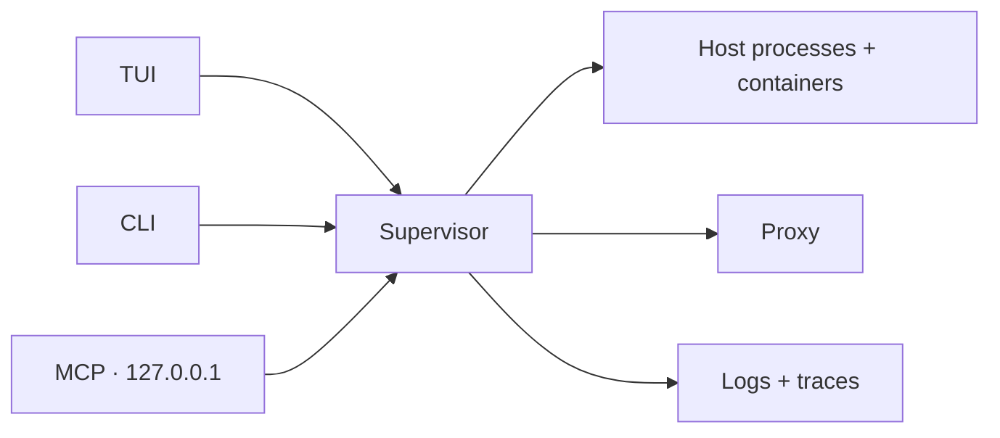

<div align="center">

# devctl

**One terminal for your local stack.**

Start services, follow logs, trace requests, and inject cloud auth — from a keyboard-first TUI, the CLI, or an AI agent over MCP.

[](https://www.npmjs.com/package/@amr-m-abdelgawad/devctl)
[](https://badge.socket.dev/npm/package/@amr-m-abdelgawad/devctl/0.7.0)
[](https://github.com/amr-m-abdelgawad/devctl/actions/workflows/ci.yml)
[](LICENSE)
[](https://bun.sh)
[](app/)
[](https://opentui.com/docs/)

<p>
  <a href="#quick-start"><strong>Quick start</strong></a>
  ·
  <a href="#features">Features</a>
  ·
  <a href="docs/README.md">Documentation</a>
  ·
  <a href="docs/mcp.md">MCP</a>
  ·
  <a href="examples/demo-platform/README.md">Demo</a>
</p>


</div>

---

## Contents

- [Why devctl](#why-devctl)
- [Features](#features)
- [Quick start](#quick-start)
- [Install](#install)
- [Set up your repo](#set-up-your-repo)
- [Architecture](#architecture)
- [Documentation](#documentation)
- [Security model](#security-model)
- [Project status](#project-status)

---

## Why devctl

A multi-service repo usually means five terminals, a forgotten `.env`, and a proxy nobody remembers how to start. `devctl` reads `.devctl/` and runs the whole environment as one session — and nothing in the app knows your services by name. **You add YAML, not code.**

What sets it apart:

- **Runs your real services, not images.** `npm`, `uv`, `python` start as native host processes — fast reloads, a debugger you can attach directly, no Dockerfile — with Docker/Podman services opt-in when a dependency needs them.
- **Handles the cloud auth you'd otherwise hand-roll.** A loopback proxy mints and injects Google / IAP tokens on both HTTP and gRPC, so local code reaches IAP-protected backends with no token logic of its own. Tokens never touch the logs.
- **Structured logs and traces, built in.** Every log is an OpenTelemetry-shaped record; an opt-in OTLP receiver and per-request tracing let you follow a request across services — and let an agent debug it.
- **One session, three ways in.** The TUI, the CLI, and an MCP endpoint for your agent all drive the same supervisor — not three tools that each half-know the state.

---

## Features

| Surface | What you get |
|---------|--------------|
| **TUI** | Dashboard, services, logs, traces, identity, credentials, proxy, doctor, settings |
| **CLI** | Start/stop, tasks, service-context exec, logs, Doctor, config provenance |
| **MCP** | Localhost endpoint so Claude, Cursor, Codex, or Kilo can operate and debug the stack |
| **Proxy** | Loopback routes that inject Google / IAP tokens over HTTP and gRPC — bind `127.0.0.1` only |
| **Telemetry** | OpenTelemetry-shaped logs, request traces, and an opt-in loopback OTLP receiver |
| **Runtime** | Host processes plus opt-in Docker/Podman services, hooks, and health-gated dependencies |
| **Plugins** | Versioned SDK and a generic OIDC client-credentials reference provider |
| **Doctor** | Ports, containers, tools, ADC, impersonation — reported, never auto-enabled |

Google Cloud is optional. The [demo platform](examples/demo-platform/README.md) starts locally without it and includes one opt-in route for testing service-account impersonation and IAP token minting.

---

## Quick start

Node.js 18 or later. The npm package installs its own Bun runtime; no `gcloud` is needed for the local demo.

```bash
git clone https://github.com/amr-m-abdelgawad/devctl.git
cd devctl/examples/demo-platform
npx @amr-m-abdelgawad/devctl@latest
```

In the TUI: `enter` starts a profile · `n` / `x` start or stop a row · `l` logs · `?` help · `q` quit.

Profiles: `minimal` · `backend` · `full` (includes the React console on [localhost:18003](http://127.0.0.1:18003)) · `data` (opt-in Docker/PostgreSQL).

---

## Install

Node.js is the only prerequisite — devctl bundles an official Bun runtime inside its npm package. For regular use, install it globally:

```bash
npm install --global @amr-m-abdelgawad/devctl
devctl version
```

Or run it without installing:

```bash
npx @amr-m-abdelgawad/devctl@latest
```

Unsigned standalone binaries and the repository's Homebrew formula remain available as alternative installation paths. Verify their published SHA-256 checksums; Apple and Microsoft do not identify those optional binaries as a verified publisher. Source installation still requires Bun. See [Installation](docs/installation.md).

`gcloud` is needed only if a service or route uses user identity, impersonation, or IAP.

---

## Set up your repo

```bash
cd your-repo
devctl setup
devctl doctor
devctl
```

1. `setup` writes `.devctl/config.yaml` (or use the TUI setup screen).
2. `doctor` names what is missing — ports, tools, ADC, container runtimes.
3. Empty dashboard: `enter` starts the first profile (alphabetically).
4. Leave the TUI and keep working: `devctl start --profile backend` then `devctl attach`. The daemon already outlives `start`; `--detach` is deprecated and does nothing.

TUI prefs live in `~/.devctl/tui.json` or `DEVCTL_TUI_CONFIG`. Built on [OpenTUI](https://opentui.com/docs/).

---

## Architecture



The **supervisor** owns host processes, optional Docker/Podman containers, the proxy, the log and trace buffers, and `~/.devctl/state/<repo>/`. The TUI is a client. Agents talk HTTP to the same process — a stdio child of the TUI would die on quit. MCP is **off by default**. See [how it fits together](docs/overview.md).

---

## Documentation

| Start | Use | Configure | Identity |
|-------|-----|-----------|----------|
| [Overview](docs/overview.md) | [TUI](docs/tui.md) | [Configuration](docs/configuration.md) | [Auth](docs/authentication.md) |
| [Install](docs/installation.md) | [CLI](docs/cli.md) | [Services](docs/services.md) | [Impersonation](docs/impersonation.md) |
| [Quick start](docs/quickstart.md) | [MCP](docs/mcp.md) | [Profiles](docs/profiles.md) | [IAP](docs/iap.md) |
| [Demo](examples/demo-platform/README.md) | [Logs](docs/logs.md) · [Telemetry](docs/telemetry.md) | [Environment](docs/environment.md) | [Proxy](docs/proxy.md) |
| [Agent skills](skills/README.md) | [Doctor](docs/doctor.md) · [Troubleshooting](docs/troubleshooting.md) | [Plugins](docs/plugins.md) | [Security](docs/security.md) |

The full documentation site is also published as a [GitHub Wiki](https://github.com/amr-m-abdelgawad/devctl/wiki).

---

## Security model

- No hard-coded services, ports, profiles, or service accounts.
- User identity and service identity are never silently swapped.
- Tokens stay out of the TUI, logs, traces, and MCP output.
- Proxy, token endpoint, OTLP receiver, and MCP bind **`127.0.0.1`** only; MCP and the OTLP receiver are **off by default**.
- Local services run with zero Google Cloud.

See [Security](docs/security.md) for the full model.

---

## Project status

devctl is pre-1.0 and under active development. A large portion of the codebase is AI-generated ("vibe-coded") rather than hand-written, so treat it as a work in progress. Reaching **v1.0.0** will mean the codebase has been personally reviewed, tested, and validated, and the project is considered stable for general use.

Issues and contributions are welcome — see [Contributing](CONTRIBUTING.md).

---

<div align="center">

[MIT](LICENSE) © 2026 Amr MOUSA · [Contributing](CONTRIBUTING.md) · [Security policy](SECURITY.md)

</div>
