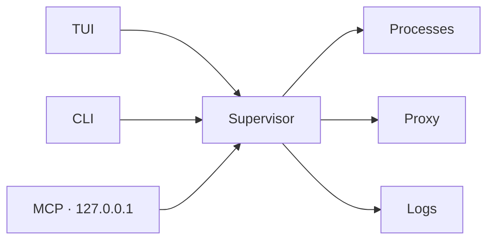

<div align="center">

# devctl

**One terminal for your local stack.**

Start services, watch logs, check identity, and drive the proxy — from a keyboard-first TUI, the CLI, or an agent over MCP.

Published on npm as **[`@amr-m-abdelgawad/devctl`](https://www.npmjs.com/package/@amr-m-abdelgawad/devctl)**. Node.js is the only prerequisite — the package brings its own official Bun runtime.

> **Disclaimer:** This project is ~90% vibe-coded, so a large portion of the code was AI-generated rather than written manually by me. 😄
>
> Until `devctl` reaches **v1.0.0**, consider it a work in progress. Reaching **v1.0.0** will mean that I have personally reviewed, tested, and validated the codebase and consider the project stable for general use.


```bash
npx @amr-m-abdelgawad/devctl@latest
```

[](https://www.npmjs.com/package/@amr-m-abdelgawad/devctl)
[](https://github.com/amr-m-abdelgawad/devctl/actions/workflows/ci.yml)
[](LICENSE)
[](https://bun.sh)
[](app/)
[](https://opentui.com/docs/)

<p>
  <a href="#install"><strong>Install</strong></a>
  ·
  <a href="#try-it">Try the demo</a>
  ·
  <a href="docs/README.md">Wiki</a>
  ·
  <a href="https://github.com/amr-m-abdelgawad/devctl/wiki">GitHub Wiki</a>
  ·
  <a href="docs/mcp.md">MCP</a>
</p>


</div>

---

## Why it exists

A multi-service repo usually means five terminals, a forgotten `.env`, and a proxy nobody remembers how to start. `devctl` reads `.devctl/` and runs the whole environment as one session.

Nothing in the app knows your services by name. Add YAML, not code.

| You get | What that means |
|---------|-----------------|
| **TUI** | Dashboard, services, logs, identity, credentials, proxy, doctor, settings |
| **CLI** | Start/stop, tasks, service-context exec, logs, Doctor, config provenance |
| **MCP** | Localhost URL so Claude, Cursor, Codex, or Kilo can operate the stack |
| **Proxy** | Loopback routes that inject Google / IAP tokens — bind `127.0.0.1` only |
| **Runtime** | Host processes plus opt-in Docker/Podman services, hooks, and health-gated dependencies |
| **Plugins** | Versioned SDK and a generic OIDC client-credentials reference provider |
| **Doctor** | Ports, containers, tools, ADC, impersonation — reported, never auto-enabled |

Google Cloud is optional. The [demo platform](examples/demo-platform/README.md) starts locally without it and includes one opt-in route for testing service-account impersonation and IAP token minting.

---

## Try it

Node.js 18 or later. The npm package installs its own Bun runtime; no `gcloud` is needed for the local demo.

```bash
git clone https://github.com/amr-m-abdelgawad/devctl.git
cd devctl/examples/demo-platform
npx @amr-m-abdelgawad/devctl@latest
```

In the TUI: `enter` starts a profile · `n` / `x` start or stop a row · `l` logs · `?` help · `q` quit.

Profiles: `minimal` · `backend` · `full` (includes the React console on [localhost:18003](http://127.0.0.1:18003)) · `data` (opt-in Docker/PostgreSQL).

---

## Install

For regular use, install the public npm package globally. Node.js is the only prerequisite; devctl installs an official Bun runtime inside its package.

```bash
npm install --global @amr-m-abdelgawad/devctl
devctl version
```

Try it without a global install:

```bash
npx @amr-m-abdelgawad/devctl@latest
```

Unsigned standalone binaries and the repository's Homebrew formula remain available as alternative installation paths. Verify their published SHA-256 checksums; Apple and Microsoft do not identify those optional binaries as a verified publisher. Source installation still requires Bun. See [Installation](docs/installation.md).

`gcloud` is needed only if a service or route uses user identity, impersonation, or IAP.

---

## Your repo, 60 seconds

```bash
cd your-repo
devctl setup
devctl doctor
devctl
```

1. `setup` writes `.devctl/config.yaml` (or use the TUI setup screen).
2. `doctor` names what is missing — ports, tools, ADC.
3. Empty dashboard: `enter` starts the first profile (alphabetically).
4. Detach instead of babysitting: `devctl start --profile backend --detach` then `devctl attach`.

TUI prefs: `~/.devctl/tui.json` or `DEVCTL_TUI_CONFIG`. Built on [OpenTUI](https://opentui.com/docs/).

---

## How the pieces fit



The **supervisor** owns processes, the proxy, the log buffer, and `~/.devctl/state/<repo>/`. The TUI is a client. Agents talk HTTP to the same process — a stdio child of the TUI would die on quit. Default MCP is **off**. See [how it fits together](docs/overview.md).

---

## Wiki

| Start | Use | Configure | Identity |
|-------|-----|-----------|----------|
| [Overview](docs/overview.md) | [TUI](docs/tui.md) | [Configuration](docs/configuration.md) | [Auth](docs/authentication.md) |
| [Install](docs/installation.md) | [CLI](docs/cli.md) | [Services](docs/services.md) | [Impersonation](docs/impersonation.md) |
| [Quick start](docs/quickstart.md) | [MCP](docs/mcp.md) | [Profiles](docs/profiles.md) | [IAP](docs/iap.md) |
| [Demo](examples/demo-platform/README.md) | [Logs](docs/logs.md) · [Doctor](docs/doctor.md) | [Environment](docs/environment.md) · [Plugins](docs/plugins.md) | [Security](docs/security.md) |

---

## Ground rules

- No hard-coded services, ports, profiles, or service accounts
- User identity and service identity are never silently swapped
- Tokens stay out of the TUI, logs, and MCP output
- Proxy, token endpoint, and MCP bind **127.0.0.1** only
- Local services run with zero Google Cloud

---

<div align="center">

[MIT](LICENSE) © 2026 Amr MOUSA

</div>
