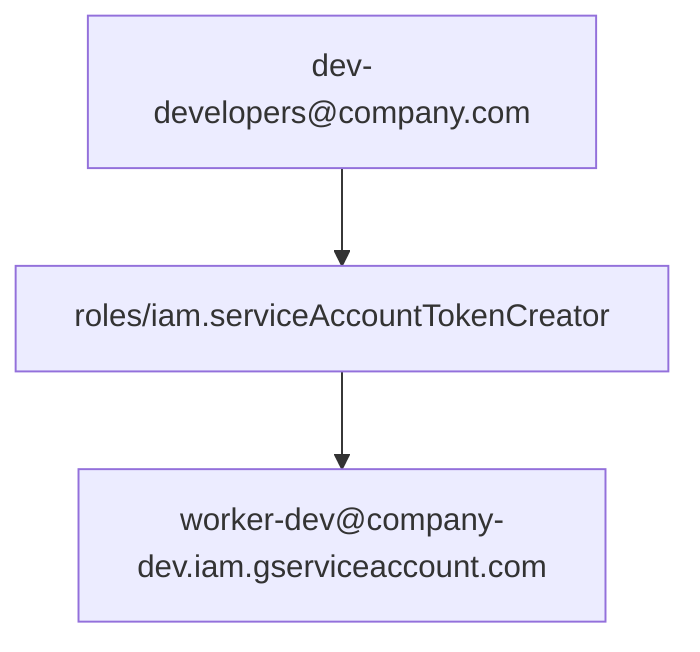

# Google Cloud administrator setup

Administrators own cloud access. Developers never need project-wide admin.

1. Create development service accounts (for example `worker-dev@PROJECT.iam.gserviceaccount.com`).
2. Enable APIs as needed: IAM Credentials, Cloud Resource Manager, Identity-Aware Proxy. Do not expect `devctl` to enable APIs — Doctor reports, never auto-enables.
3. Configure IAP on protected backends and record the audience for each route.
4. Create a Google Group such as `dev-developers@company.com`.
5. Bind `roles/iam.serviceAccountTokenCreator` **on each development service account** to that group (not project-wide unless policy requires it).
6. Confirm organization policies allow impersonation and ADC.
7. Validate with a test developer: `devctl doctor` should report impersonation success.

`devctl` source code must not contain those emails; they belong in repository configuration.

Organization policies that disable service-account impersonation or constrain ADC will make Doctor report UNAVAILABLE even when IAM bindings look correct. Confirm those policies before changing developer machines.

See [examples/admin-iam.yaml](../examples/admin-iam.yaml) for a permission-distribution sketch (documentation only; not loaded at runtime).

## Related

- [Developer setup](developer-setup.md)
- [Impersonation](impersonation.md)
- [IAP](iap.md)
- [Doctor](doctor.md)
