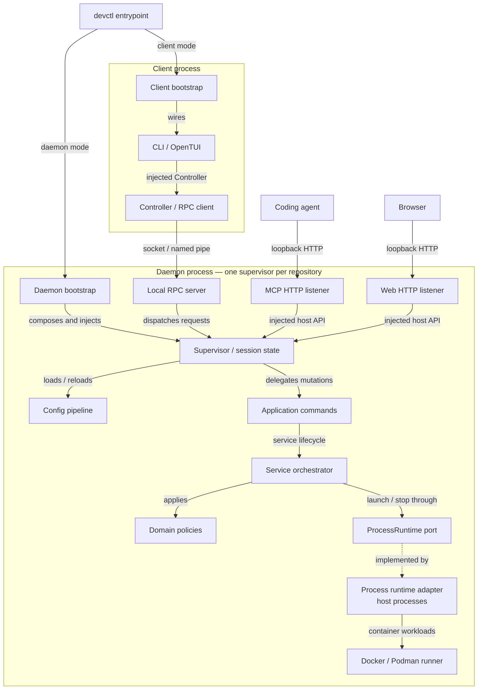
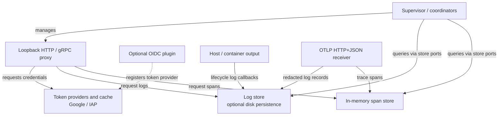

# Architecture

`devctl` is a modular monolith with ports-and-adapters layering. The process model is unchanged: the CLI and TUI talk to a long-lived supervisor over a local socket; MCP and the web UI use supervisor-managed HTTP listeners. This page is the living layer map. For the file-by-file source map, see [Internals](internals/index.md).

## System map

These diagrams show **runtime calls, composition, and data flow**, not permitted TypeScript imports. Solid arrows follow the labeled relationship; dotted arrows identify an implementation or optional provider. The [layer rules](#layers) below still govern source dependencies.

### Control and service lifecycle

The CLI and TUI reach the daemon over local RPC. MCP and the web console are HTTP listeners **inside the daemon**: they receive injected host APIs and do not make a second socket connection through the RPC server. Bootstrap constructs the implementations and injects the contracts.



The supervisor owns session state and delegates lifecycle actions through injected application commands. The orchestrator applies domain policies and calls the `ProcessRuntime` port; its adapter handles host processes and delegates container workloads to the Docker/Podman runner. The diagram's port-to-adapter arrow describes runtime wiring, not an import from the port into its implementation.

### Identity and observability



Log records and spans have separate stores. Process output reaches logging through lifecycle callbacks, while the OTLP receiver accepts logs and spans over HTTP+JSON. The proxy records request telemetry and requests credentials from the token subsystem; optional plugins can register additional token providers. Coordinators and ingestion paths are abbreviated here; see [Logs, telemetry, and LLM](internals/logs-telemetry.md) for the complete data path, including the separate LLM call store.

### Follow the map into the code

Linked diagram nodes open their source on GitHub. These guides provide the same navigation when viewing the diagram in a renderer that disables node links:

| Area | Read next |
|---|---|
| Entrypoint, client, and daemon composition | [Bootstrap](internals/bootstrap.md) and [Process model](internals/process-model.md) |
| CLI/TUI transport and daemon HTTP listeners | [RPC](internals/rpc.md) and [Presentation](internals/presentation.md) |
| Commands, domain policies, and runtime contracts | [Application](internals/application.md), [Domain](internals/domain.md), and [Ports](internals/ports.md) |
| Host processes and containers | [Runtime](internals/runtime.md) |
| Configuration loading and reload | [Config pipeline](internals/config-pipeline.md) |
| Credentials and proxy traffic | [Identity and proxy](internals/identity-proxy.md) |
| Logs, spans, persistence, and LLM calls | [Logs, telemetry, and LLM](internals/logs-telemetry.md) |
| npm wrapper and executable distribution | [Packaging](internals/packaging.md) |

Packaging happens before execution, so it is documented separately from the running session. Both diagrams use the site's light/dark theme instead of fixed node colors.

## Layers

```text
app/src/
  presentation/    cli, tui, mcp, web
  application/     commands, queries, orchestrator
  domain/          service, identity, health, config types, llm
  ports/           ProcessRuntime, Clock, FileSystem, HealthChecker, HttpRecipeRuntime, …
  adapters/        daemon, rpc, doctor, environment, plugins, net, secrets, system,
                   process, google, config, health, proxy, http, llm, storage, containers
  shared/          events, errors, retry, warnings
  bootstrap/       one composition root per process
```

Dependency direction points inward:

```text
presentation  → application, ports, shared, domain types
application   → domain, ports, shared
domain        → shared (and other domain)
ports         → domain, shared
adapters      → ports, domain, shared
bootstrap     → everything
test          → any layer
```

Forbidden: domain → adapters/application/presentation; application → adapters/presentation; adapters → presentation/application.

## Composition roots

There is exactly one composition root **per process**:

- `bootstrap/daemon.ts` — supervisor, orchestrator, adapters, MCP, proxy, web UI
- `bootstrap/client.ts` — CLI/TUI, Controller, offline commands

No DI container. Constructor injection only. Bootstrap is allowed to be ugly.

## Commands vs events

Commands are explicit calls (`StartService.execute`). Events on `Bus` are facts that already happened (`ServiceStarted`). Do not drive orchestration through the event bus.

## Enforcement

```bash
cd app && bun run check:architecture
```

CI runs the same script. Domain, application, and ports must not import `google-auth-library` or `@opentui/*`.
Presentation may import presentation, application, ports, shared, and domain modules.
Adapters cannot import presentation, application, or leftover root modules.
`*.test.ts` files are a `test` layer and may compose any layer, including
bootstrap fixtures. The production allowlist is empty: a new forbidden pair
fails, and a stale exception for a removed import also fails.

The checker parses TypeScript syntax, including type imports, re-exports, literal
dynamic imports, and `require()` calls. Comments and example strings do not count
as dependencies.

## Related

- [Internals (contributor guide)](internals/index.md) — file-by-file map of the running code
- [How it fits together](overview.md) — operator view of supervisor vs TUI vs CLI vs MCP
- [Building from source](typescript.md)
- Agent rules: `.cursor/rules/architecture.mdc`


## Migration progress

The service launch and health extraction is complete. `application/orchestrator.ts`
owns launch sequencing, hooks, health waits, and stop/restart plans.
`application/health-monitor.ts` owns health probes, lifecycle generations, restart
timers, and the shared crash/unhealthy retry budget. Process/container launch and
transient commands use `ProcessRuntime`; health probes use `HealthCheckerFactory`.
Supervisor coordinates service lifecycles. RPC accept, line framing, and dispatch
routing live in `adapters/rpc/server.ts` (paired with the existing controller
client). Identity cache, credential entries, and service-account probes live in
`adapters/daemon/identity-coordinator.ts`. Client/profile environment resolution
lives in `adapters/daemon/environment-bridge.ts`. Proxy and token-endpoint bind
live in `adapters/daemon/proxy-coordinator.ts`. LLM inspector polling lives in
`adapters/llm/` (LiteLLM driver, in-memory call store, coordinator). Traffic inspector
capture lives in `adapters/traffic/` (ring store + `ProxyTrafficSink` teed from HTTP and
gRPC proxies). Named outbound HTTP recipes
(`HttpRecipeRuntime`) live in `adapters/http/`; the supervisor constructs
`RecipeRuntime`, reuses `TokenManager`, and passes it into the environment
bridge and proxy. MCP listen and the tool deny-list
live in `adapters/daemon/mcp-coordinator.ts`. Host CPU/memory sampling lives in
`adapters/daemon/resource-sampler.ts`. Supervisor still owns persistence,
adoption, config watch, and the host facades that bind those slices.
Its public start/stop/restart methods continue to delegate to the application.

The legacy daemon, controller, doctor, environment, plugin registry, network-port,
secret-detector, and host-stat modules and their tests now live under `adapters/`.
The setup command and its tests live under `presentation/cli/`. `plugin-sdk.ts`
and `bin.ts` retain their public paths. Daemon command and MCP composition live
in `bootstrap/daemon.ts` and `bootstrap/test-supervisor.ts`, so adapters do not
import application or presentation. Integration tests compose through those
fixtures rather than architecture exceptions.

The stricter layer rules and doctor boundary are in place. `RunDoctor` depends on
`ports/doctor-runner.ts`; the adapter implements it with the existing diagnostics.
Doctor reports, progress, runtime context, and port-holder data live in `domain/`,
so application code and doctor screens do not import adapter types for these values.
Production CLI, TUI, and MCP modules now have no adapter or bootstrap import
exceptions. `bin.ts` supplies the client runtime and daemon launcher to the CLI;
the TUI workspace receives that same runtime. The application owns the
`ClientRuntime` and `Controller` contracts. Config, Google status, logs, session,
and preference view types live in domain modules. Preference persistence stays
in the config adapter, and MCP validation is supplied by its host. Integration
tests compose through bootstrap fixtures instead of layer exceptions.

The TUI decomposition is complete. `App.tsx` coordinates screen rendering and
state wiring. Hooks under `presentation/tui/hooks/` own log filtering/windowing
and paged queries, daemon event subscriptions, diagnostics, lifecycle commands,
environment inspection, config editing, MCP controls, preferences, command
dispatch, and keyboard/overlay dispatch (`use-app-keyboard.ts`). They receive
the client workspace or controller explicitly. Screen helpers live in focused
modules under `presentation/tui/helpers/`; production consumers import those
modules directly. The old `helpers.ts` is a compatibility barrel, also
exercised by the existing helper tests.

Hook regression tests cover stale diagnostic and environment results, pinned log
windows, failed lifecycle commands, config validation before writes, preference
preview/override behavior, and rendering App in setup mode.

The final dependency/ID phase is complete. Supervisor requires its token and
process runtimes, clock, filesystem, event bus, Google detector, health-checker
factory, orchestrator, log store, secret detector, session id, process
inspect/alive helpers, lock/socket functions, and an MCP listener factory.
`createDaemon` selects production defaults, shares the injected clock and bus,
builds `commandsForHost`, and attaches commands after construct. The explicit
test fixture mirrors that wiring. Supervisor does not import application or
presentation modules; it talks to `DaemonCommands`, `LifecycleSession`,
`McpHost`, and `McpListener` ports.

`StartProfile`, `ResolveStart`, and domain profile resolution use `ProfileId`.
Transport and UI entry points convert strings before calling those boundaries;
RPC/JSON fields stay strings. `ProcessManager implements ProcessRuntime` and
health-checker injection remain in place. Snapshot and RPC payload types live
in `domain/status.ts`; `types.ts` is the shared `Envelope` only. All six
phases in the remaining-work plan are complete. The follow-up leftover work
emptied the architecture allowlist: tests are a first-class layer, daemon
composition lives in bootstrap, and there are no production import exceptions.

Keep RPC names, JSON fields, `plugin-sdk.ts`, and `bin.ts` stable. Validate each
phase with `bun test`, `./node_modules/.bin/tsc --noEmit`,
`bun run check:architecture`, `bun run check:coverage`, `bun run check:dead`, and `bun run check:dup`
from `app/`.
