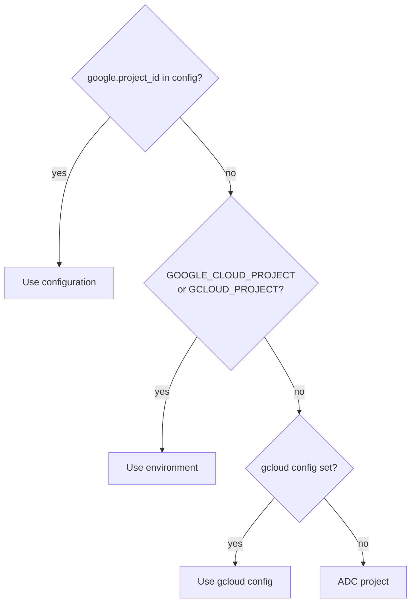

# Authentication

Google identity is optional. Local-only services start without `gcloud`.

```bash
devctl auth status
devctl auth login
devctl auth refresh
devctl auth logout
```

`login` runs `gcloud auth application-default login`. `devctl` prefers Application Default Credentials and does not invent a proprietary login protocol.

`--json` works on `status` and `refresh`. Refresh output includes identity and `expires_at`, never the token.

## Project resolution

The TUI Identity screen and `devctl auth status` always show the source:



## User vs service identity

User identity and service identity are separate. A service or proxy route must declare which one to use. A user ADC token is never substituted for a service-account route.

`devctl auth refresh` uses `auth.refresh_threshold_seconds` (default 300). Tokens live in the OS keychain when available, otherwise `~/.devctl/credentials` with mode `0600`. Metadata files never include the raw access token.

The TUI **identity** tab (`a`) shows user, project, source, ADC, gcloud, configured SAs, impersonation availability, and whether IAP routes exist. The **credentials** tab lists store backend and entry names only.

IAP routes with a service-account identity impersonate that account and then mint an IAP ID token. See [Impersonation](impersonation.md) and [IAP](iap.md).

## Related

- [Impersonation](impersonation.md)
- [IAP](iap.md)
- [Doctor](doctor.md)
- [Developer setup](developer-setup.md)
