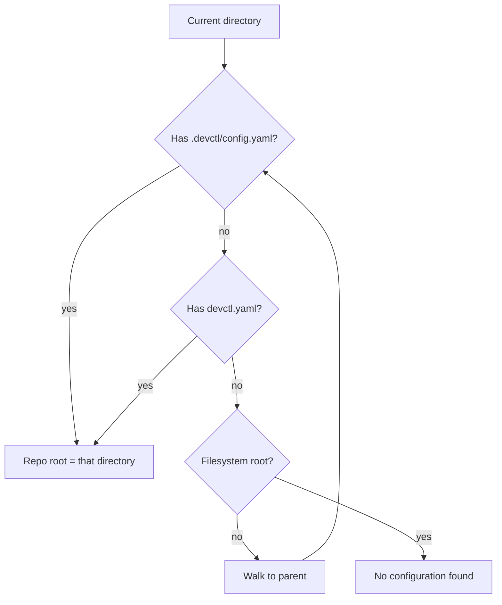
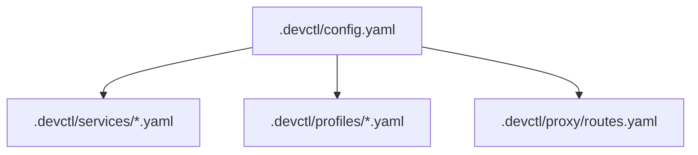
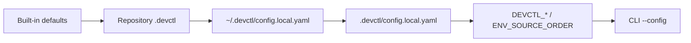

# Configuration

`devctl` is driven by YAML. Unknown fields are rejected. `version: 1` is required.

Editors and agents: point at the JSON Schema so field names complete.

```yaml
# yaml-language-server: $schema=https://raw.githubusercontent.com/amr-m-abdelgawad/devctl/main/schema/devctl.config.schema.json
version: 1
```

The schema file lives at [`schema/devctl.config.schema.json`](../schema/devctl.config.schema.json). The demo config uses a relative path so it works offline.

## Discovery

Walks from the current directory toward the filesystem root:



`--config` points at a file or a `.devctl` directory. Repository root is the directory that contains `.devctl` (or the parent of `devctl.yaml`).

When the main file lives in `.devctl/`, modular files merge in:



Service and profile filenames become keys (`identity.yaml` → service `identity`).
Files within each modular directory are loaded in sorted filename order, making
overrides deterministic even when both `.yaml` and `.yml` fragments resolve to
the same key.

## Overlays and precedence

Local overlays merge after the repo config. Each stage overrides the one before
it, so the rightmost source wins:



The repository's own `config.local.yaml` overrides the one in your home
directory, not the other way round: overlays are applied home-first so the
repo-specific file gets the last word.

TUI appearance is **not** this file. Theme, keys, mouse, and MCP listen live in `tui.json` — see [Building from source](typescript.md) and [TUI](tui.md).

## Top-level keys

| Key | Role |
|-----|------|
| `version` | Must be `1` |
| `project.name` | Shown in the TUI header |
| `google.project_id` / `region` | Cloud project (optional) |
| `templates` | Named service bases (`extends`) |
| `services` | Process definitions |
| `tasks` | Named transient commands run with `devctl run` |
| `profiles` | Named service sets + extra env |
| `proxy` | Listen address, token endpoint, routes |
| `logs` | In-memory cap and persistence |
| `auth.refresh_threshold_seconds` | Token refresh window (default 300) |
| `shutdown` | `stop_services_on_exit`, `grace_seconds` |
| `ui` | Optional theme / keymap hints in YAML (TUI prefs still win from `tui.json`) |
| `secrets` | Extra redaction markers and regexes |
| `doctor.tools` | Extra CLI binaries to probe |
| `plugins` | `{ path }` modules loaded when the supervisor starts |
| `environment.sources` / `secrets` | Env source order and named secrets |

## Templates

```yaml
templates:
  python-http:
    health: { type: http, interval_seconds: 2, timeout_seconds: 1 }
    logs: { stdout: true, stderr: true }
    restart: { policy: on_failure, max_retries: 2, backoff_seconds: 1 }

services:
  api:
    extends: python-http
    command: [python3, main.py]
```

## Tasks

Tasks accept `command`, `shell`, `working_dir`, `dependencies`, and `environment`. Dependencies name services and are made ready before the one-off command runs. Tasks have no ports, health checks, restart policy, or status entry; see [Services](services.md#hooks-and-one-off-tasks) for an example.

## Validation and reload

```bash
devctl config validate
devctl config validate --json
devctl config show
devctl config diff
devctl reload
```

`config diff` explains the resolved result instead of merely printing it. Each
entry includes the winning source file and layer (`main`, `modular_service`,
`modular_profile`, `modular_proxy`, `home_local`, `repo_local`, or
`synthesized`) and the ordered sources it shadowed. Use `--json` for structured
output.

Checks: YAML syntax, required fields, unknown fields, service references, dependency cycles, duplicate ports, identities, proxy routes (including per-service `proxy` fragments merged at load), environment references, profile references, and optional `plugins[].path`.

The TUI Config screen `v` / `/buffer` overlay validates this text before writing. Invalid YAML is not saved. `e` still opens `$EDITOR`.

The supervisor watches `.devctl/` (`fs.watch`, ~200ms debounce) and runs the same path as `/reload`. `devctl reload` and TUI `/reload` re-read configuration, publish `ConfigurationChanged`, and list services that must restart because command, environment, ports, or identity changed.

## Related

- [Services](services.md)
- [Profiles](profiles.md)
- [Environment](environment.md)
- [How it fits together](overview.md)
