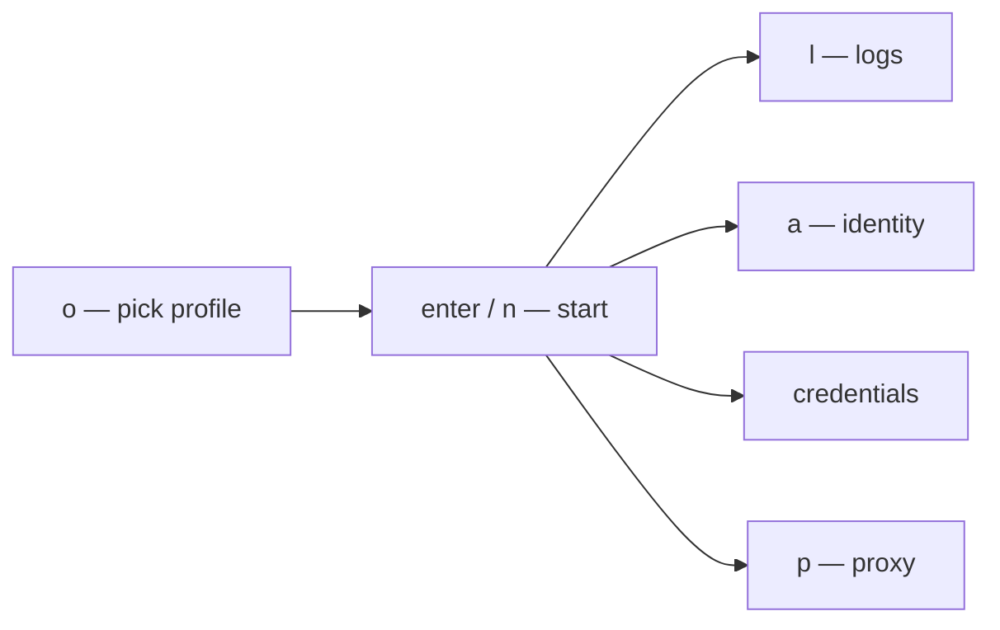

# Developer setup

You do not need project-wide Google admin. Administrators own IAM and APIs — see [Admin setup](admin-setup.md).

```bash
# 1. Install Bun and (if this repo needs Google) gcloud
# 2. Clone the service repository
cd your-repo

# 3. Authenticate only when identity, impersonation, or IAP is required
gcloud auth application-default login

# 4. Onboard
devctl setup
devctl doctor

# 5. Work
devctl
```

Typical TUI flow:



`devctl start` leaves the supervisor running; `devctl` or `devctl attach` reconnects. `devctl down` stops it again. (`--detach` on `start` is deprecated — the daemon already outlives the command without it.)

## Quit behavior

`shutdown.stop_services_on_exit` in config:

| Value | What happens on `q` |
|-------|---------------------|
| `true` | Stop managed services and exit |
| `false` | Detach; services keep running |
| unset | Confirm: `enter` stops, `d` detaches, `esc` stays |

The starter config writes `stop_services_on_exit: true`. `ctrl+c` twice uses the same rule.

## Related

- [Quick start](quickstart.md)
- [TUI](tui.md)
- [Authentication](authentication.md)
- [Troubleshooting](troubleshooting.md)
