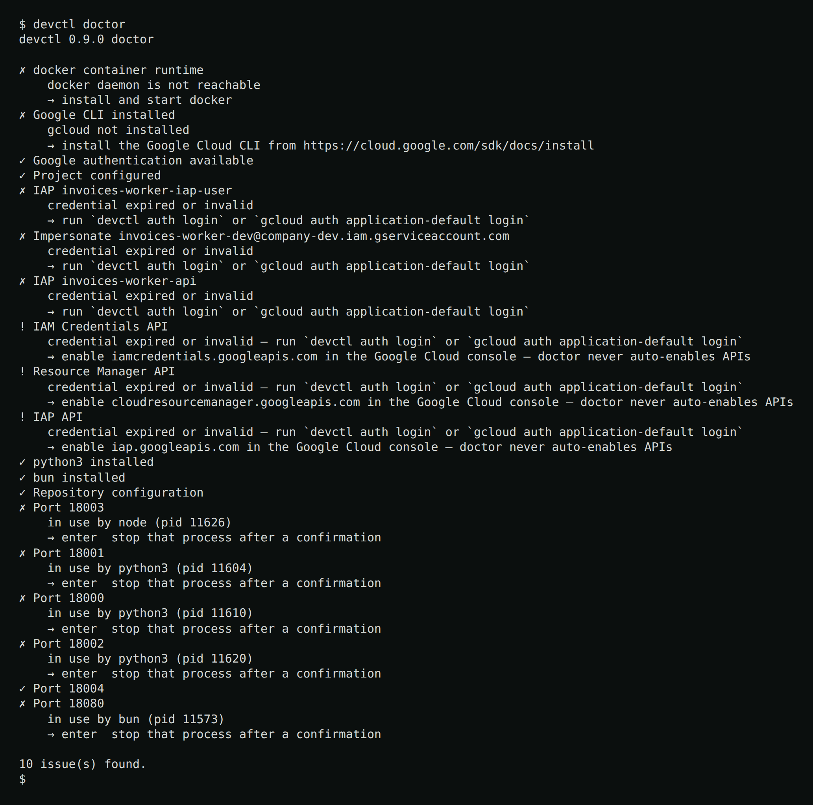
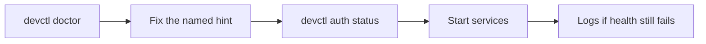

# Doctor

When one or more services declare `container`, doctor checks that each selected
Docker or Podman executable is installed and that its daemon is reachable. A
present CLI with a stopped or inaccessible daemon is reported separately from
a missing runtime.

```bash
devctl doctor
devctl doctor --json
```



Exit code **2** when any check is not ok (same code as configuration errors).

The TUI **Doctor** screen (`/doctor` or `d`) re-runs on every visit (`r` also refreshes). `j`/`k` move. `enter` on a busy port asks to SIGTERM that process (then SIGKILL if it still holds the port). Before each signal, devctl looks up the port again: if a different process holds it now (the row is stale and the pid may have been reused), nothing is stopped and the status line names the new holder. If nothing holds the port any more, it reports the port as already free. Either way, doctor then rechecks that port only — it does not run the rest of the checks again. Ports owned by a running container service are treated as healthy; `enter` never offers to kill the Docker or Podman daemon.

The [web console](web.md) **Doctor** page (`#/doctor`) runs the same checks on visit and on Refresh. It lists severity, message, and hint, including the busy-port holder. **Stop stays TUI/CLI-only** — the web page does not kill processes.


## What it checks

- Google CLI installed
- Application Default Credentials. An `authorized_user` file with no `account` field is a warning: re-run `gcloud auth application-default login` in an interactive terminal, or add `"account": "<your-email>"`. `gcloud config get-value account` prints the email. The warning does not fail doctor.
- Project (with source)
- Live IAM Credentials / Resource Manager / IAP API reachability via Service Usage (reported, **never** auto-enabled)
- Impersonation for each configured service account
- IAP audiences (including SA impersonation)
- IAP credentials file on each route that sets `auth.credentials` or folded `proxy.credentials` (exists, `authorized_user` JSON, `refresh_token`, `client_id` matches the route). The well-known ADC path hints `gcloud auth application-default login` with a client secret file that matches `client_id` (or omit `client_id`); TUI `/auth login` or `devctl auth login`. Any other path is named in the hint: regenerate that file. The gcloud ADC command writes a different file and does not update it.
- Configured `doctor.tools` binaries (demo: `python3`, `bun`)
- Docker or Podman CLI installed, and that daemon reachable, when any service declares `container` (every such service in config, not only the active profile — the demo probes Docker because `postgres` is always declared)
- Container image USER is not root (warns when inspect shows root; set `container.user`)
- Ports declared in config
- Repository configuration validity
- Google token mint rate (warns when one identity/audience pair is minted often in the last minute)

Doctor probes IAP / service-account identity when any route or service declares them, even if the rest of the repo looks local-only.

Failures include an actionable hint. Error classes: authentication, authorization, missing API, missing IAM role, wrong project, wrong service account, IAP, expired credential, network.

Ports held by **your own** running services — host processes or published container ports — show as “in use”. That is expected after `start`. Use the free-port action only for leftovers that are not this supervisor’s children.

Typical loop:



## Related

- [Authentication](authentication.md)
- [Troubleshooting](troubleshooting.md)
- [Services](services.md)
- [Admin setup](admin-setup.md)
- [TUI](tui.md)
- [Web console](web.md)
