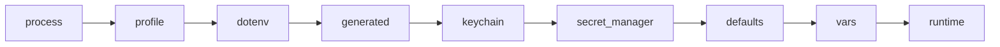

# Environment

Each service process gets a merged environment. Later sources override earlier ones. `devctl exec <service> --print-env` prints exactly what a service resolves to, with secret-like values redacted (`--reveal` to show them):


Default source order (`ENV_SOURCE_ORDER` / `environment.sources`):



`process`, `defaults`, `vars`, and `runtime` always run for host services. Container services deliberately omit `process` so the caller's whole shell is not stored in inspectable container metadata. If you set `environment.sources`, the listed optional sources (`profile`, `dotenv`, `generated`, `keychain`, `secret_manager`) are added to the always-on set.

| Source | What it loads |
|--------|----------------|
| `process` | The env of whichever CLI/TUI client most recently started or restarted this service (forwarded over the RPC as `client_env`), falling back to the supervisor's own environment if no client has done so yet — see below |
| `profile` | `profiles.<name>.environment` |
| `dotenv` | Repo-root then service working-dir: `.env`, `.env.development`, `.env.local`, `.env.<profile>` |
| `generated` | Built-in hook that always returns `{}`. A plugin may register `environmentSources` if you need generated values |
| `keychain` | Named secrets from `environment.secrets` / the credential store |
| `secret_manager` | Values that look like `projects/*/secrets/*` via the Google REST API |
| `defaults` | `services.<name>.environment.defaults` (and the selected `environments.<env>.defaults`) |
| `vars` | Explicit `services.<name>.environment` keys (and the selected `environments.<env>` keys, which win) |
| `runtime` | Values `devctl` injects at start |

`keychain` and `secret_manager` throw only when that source is listed and fetch fails.

### `process` and the daemon-replacement limitation

The daemon remembers each service's `client_env` only in memory, per service, never on disk. A crash/health-triggered auto-restart or an MCP-initiated `start`/`restart` reuses the last one a real client supplied; a service that has never been started/restarted by a real client this daemon's lifetime — e.g. one adopted from a prior session by `recoverSession()` — has none, and falls back to the daemon's own (possibly stale) environment.

This memory does not survive the daemon process itself being replaced (upgrade, crash, `devctl down` then a fresh start): a new daemon starts with no client history at all, so anything it restarts before a client issues a fresh `start`/`restart` runs on whatever environment that new daemon process itself inherited at spawn. If a service depends on env that changed since the daemon last started, restart it explicitly (`devctl restart <service>` or the TUI) rather than relying on an automatic restart to pick it up.

## Runtime-generated variables

Injected when applicable:

- `SERVICE_PORT`, `SERVICE_HOST`
- `DEVCTL_PROXY_URL`
- `DEVCTL_SERVICE_NAME`
- `DEVCTL_ENVIRONMENT`
- `DEVCTL_SERVICE_ENV` — the selected named overlay (`services.<name>.environments.<env>`), omitted when the service has none
- `DEVCTL_USER_EMAIL` — the developer's own detected Google identity (gcloud/ADC), so a service can key on who is running it without a hardcoded, team-unfriendly value. Omitted when no identity is detected.
- `DEVCTL_TOKEN_URL` and `DEVCTL_INTERNAL_TOKEN` for host services (never a raw access token); containers omit both because container loopback cannot reach the host loopback endpoint
- `DEVCTL_HTTP_<NAME>_URL` for each exposed `http` recipe (uppercase, hyphens → underscores), host services only — see [Custom HTTP APIs](http.md)

References such as `${services.identity.ports.http}` resolve before process start, including inside profile and dotenv values. `${identity.user}` resolves to the running developer's detected email — use it to map that identity onto a service's own variable in shared config, e.g. `LOCAL_USER_EMAIL: ${identity.user}` (empty when no identity is detected). `${http.<name>.<output>}` resolves from a recipe snapshot after the daemon has fetched that recipe; `${http.name.url}` is the local expose URL. `${env.NAME}` is rejected in service env. Recipe `url` / `headers` / `form` / `body` are the exception: `${NAME}` and `${env.NAME}` expand from the supervisor process environment at fetch time. IAP route `auth.client_secret` is the other exception: `${NAME}` and `${env.NAME}` are expanded from the process environment when the token is minted, not at config load.

`environment.required` on a service fails start if those keys are still empty after the merge.

## Per-service named overlays

`profiles.<name>.environment` is fleet-wide: every service started under that profile gets those extra keys. Named overlays on a **service** are independent of that, so one service can talk to a deployed identity while another stays fully local.

```yaml
services:
  invoices-api:
    environment:
      AUTH_URL: http://127.0.0.1:${services.identity.ports.http}
      required: [AUTH_URL]
      defaults:
        LOG_LEVEL: INFO
    environments:
      local:
        AUTH_URL: http://127.0.0.1:${services.identity.ports.http}
      deployed:
        AUTH_URL: https://identity.dev.example.com
        defaults:
          LOG_LEVEL: WARN
    default_environment: local
```

Each overlay is an `EnvConfig` (`vars` / `defaults` / `required`) merged onto the service's base `environment` — named keys win, `required` is the union. `default_environment` is the YAML default when nothing is selected for this session; if omitted, the first name alphabetically wins.

Selection is **session state** (`~/.devctl/state/<repo>/state.json` `service_environments`), not YAML. Switch one service at a time:

- TUI: `e` or `/env` on the dashboard, services, or detail screens
- CLI: `devctl env invoices-api deployed`
- MCP: `set_service_environment` with `service` and `name` (`restart: true` to apply immediately)

The next start, restart, exec, or print-env uses that overlay. A process already running keeps the overlay it started with (`started_env`) until you restart it. The TUI chip shows `env deployed · restart` in that case.

## TUI / CLI flag precedence


## File plugins

`plugins[].path` can register additional named environment sources. Unknown configured source names fail after plugins load instead of being silently skipped. See [Plugins](plugins.md) for the SDK contract, failure behavior, and examples. The built-in `generated` source stays empty unless a plugin registers an environment source with that name.

## Related

- [Services](services.md)
- [Custom HTTP APIs](http.md)
- [Configuration](configuration.md)
- [Security](security.md)
