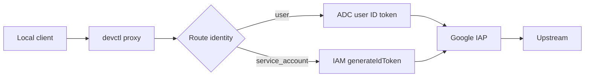

# Identity-Aware Proxy

IAP routes must set an audience (IAP OAuth client ID or IAP resource name) **and** an identity. A missing `identity.type` is a configuration error, not a silent default to the current user.

```yaml
auth:
  type: iap
  audience: "/projects/PROJECT_NUMBER/iap_web/..."
  identity:
    type: user
```

or

```yaml
auth:
  type: iap
  audience: "..."
  identity:
    type: service_account
    service_account: backend-dev@company-dev.iam.gserviceaccount.com
```



The local proxy mints the token and injects `Authorization: Bearer …`. Services do not implement IAP themselves.

Tokens refresh when `expires_at - now < auth.refresh_threshold_seconds` (default 300). Concurrent refreshes for the same identity + audience + scope share one in-flight request.

Doctor probes IAP audiences (including SA impersonation) even if the rest of the repo looks local-only.

Local demos can use `auth.type: none` so routes still appear in the proxy screen without calling real IAP.

## Related

- [Proxy](proxy.md)
- [Impersonation](impersonation.md)
- [Authentication](authentication.md)
- [Admin setup](admin-setup.md)
