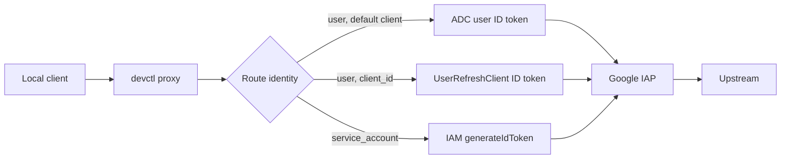

# Identity-Aware Proxy

IAP routes must set an audience (IAP OAuth client ID or IAP resource name) **and** an identity. A missing `identity.type` is a configuration error, not a silent default to the current user.

```yaml
auth:
  type: iap
  audience: "/projects/PROJECT_NUMBER/iap_web/..."
  identity:
    type: user
```

or

```yaml
auth:
  type: iap
  audience: "..."
  identity:
    type: service_account
    service_account: backend-dev@company-dev.iam.gserviceaccount.com
```

User identity mints an ID token with ADC's default OAuth client. To mint with a **specific** OAuth client instead (a Desktop client, or the IAP client's own ID), set `client_id` and `client_secret`. Put `${NAME}` or `${env.NAME}` in `client_secret` so the value is read from the environment at mint time — that is not the same as service-env `${services…}` interpolation, which does not run on route auth:

```yaml
auth:
  type: iap
  audience: "IAP_CLIENT_ID.apps.googleusercontent.com"
  identity:
    type: user
  client_id: "DESKTOP_CLIENT_ID.apps.googleusercontent.com"
  client_secret: "${IAP_OAUTH_CLIENT_SECRET}"
```

Omit `client_id` to keep the default ADC client. `client_id` is only valid on `auth.type: iap` with `identity.type: user`. Service-account IAP still uses IAM `generateIdToken` against `audience`.

The ADC refresh token must have been issued to that OAuth client. `gcloud auth application-default login` uses the Cloud SDK client by default; a mismatch fails as `unauthorized_client`. Login with a client secret file that matches `client_id`, or omit `client_id`.



The local proxy mints the token and injects `Authorization: Bearer …`. Services do not implement IAP themselves.

Tokens refresh when `expires_at - now < auth.refresh_threshold_seconds` (default 300). Concurrent refreshes for the same identity + audience + scope + OAuth client share one in-flight request.

Doctor probes IAP audiences (including SA impersonation and a configured OAuth client) even if the rest of the repo looks local-only.

Local demos can use `auth.type: none` so routes still appear in the proxy screen without calling real IAP.

## Related

- [Proxy](proxy.md)
- [Impersonation](impersonation.md)
- [Authentication](authentication.md)
- [Admin setup](admin-setup.md)
