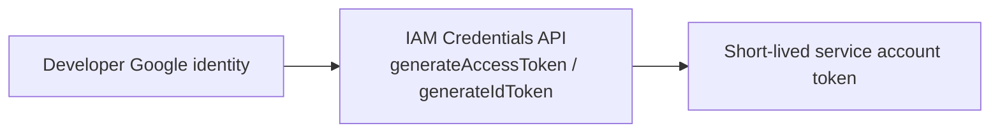

# Service account impersonation

Preferred flow:



Developers need `roles/iam.serviceAccountTokenCreator` on each target service account (preferably bound via a Google Group). `devctl` never downloads or stores service-account private keys.

```yaml
identity:
  type: service_account
  service_account: worker-dev@company-dev.iam.gserviceaccount.com
```

`type: service` is accepted as an alias for `service_account`.

If impersonation is unavailable, **that** service fails to start. Unrelated local services still run.

When a proxy route uses `auth.type: iap` and a service-account identity, `devctl` calls IAM Credentials `generateIdToken` for that account (never a user ID token). Access tokens without an audience still use `generateAccessToken`.

Doctor probes each configured SA and reports AVAILABLE / UNAVAILABLE. Organization policies that disable impersonation or constrain ADC look like IAM failures — confirm those before changing developer machines. See [Admin setup](admin-setup.md).

## Related

- [Authentication](authentication.md)
- [IAP](iap.md)
- [Proxy](proxy.md)
- [Security](security.md)
