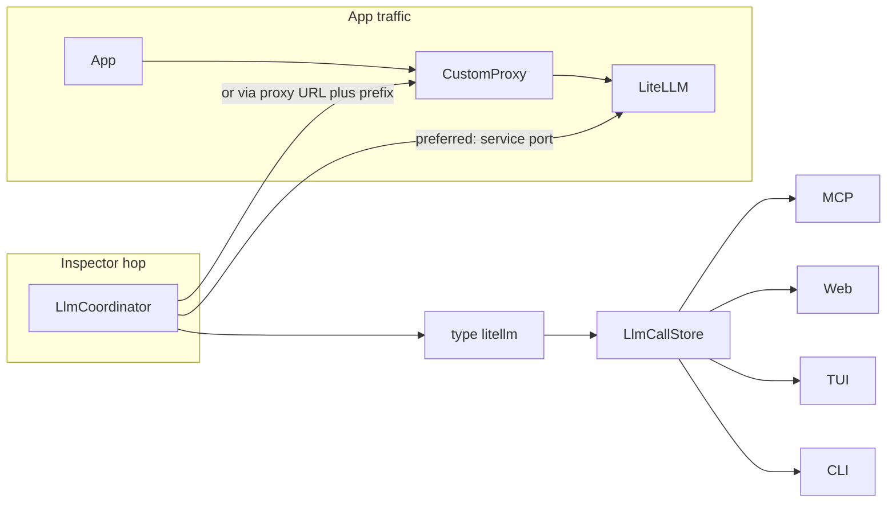

# LLM inspector

devctl can pull LLM traffic into the same inspector stack as logs and traces: an in-memory store, then MCP, web, TUI, and CLI. There is no new service kind. A source is a typed driver (`type: litellm` today) plus a **management hop** the daemon can reach.

The inspector is **off by default**. It does not sit on `telemetry` — this is a pull source, not OTLP ingest. Full prompts never go on the status snapshot.



## Config

Top-level `llm`. Unknown fields are rejected. Bearer tokens must come from the environment (`token_env`); never inline keys.

```yaml
llm:
  enabled: true
  sources:
    - name: platform
      type: litellm
      service: litellm
      port: http
      auth:
        type: bearer
        token_env: LITELLM_MASTER_KEY
      capture:
        prompts: true
      poll_seconds: 5
```

`type` must be a builtin (`litellm`) or a plugin `llmSources` name. When `llm.enabled` is true, `sources` must be non-empty. Each source needs a unique `name` and exactly one **management hop**: `management_endpoint` / `management_service`, or else exactly one of `service`, `endpoint`, or `via.route`. `via.route` may exist alongside `management_*` so apps can keep using a traffic proxy while the inspector talks to LiteLLM directly.

`path_prefix` is stripped of slashes; the LiteLLM driver always appends `/spend/logs`. Do not put that leaf in config.

`capture.prompts` defaults to **true**. Set `false` to drop request/response bodies at ingest. Bodies still need LiteLLM `store_prompts_in_spend_logs`; empty `"{}"` bodies are treated as missing. Redaction uses the same `secrets` detector as logs, at upsert, before any surface reads the store.

`poll_seconds` defaults to 5. `auth.header` defaults to `Authorization`. Set it to `x-api-key` or `x-litellm-api-key` when a gateway already owns `Authorization` (IAP, custom proxy). The coordinator applies route-minted identity headers first, then the LiteLLM key on the configured header.

## LiteLLM behind a custom proxy

A custom proxy in front of LiteLLM does **not** change `type`. The driver still speaks LiteLLM management APIs (`GET {prefix}/spend/logs?summarize=false`). What changes is how the daemon reaches that API.

**1. Apps use the custom proxy; inspector uses the LiteLLM process (preferred).** Typical when LiteLLM is a local `services.litellm` and nginx / IAP / the [devctl proxy](proxy.md) only sits on the app path. Use `service` + `port` as in the default above. No `via`.

**2. LiteLLM is only reachable through the custom proxy** (remote gateway, IAP, path mount):

```yaml
    - name: via-gateway
      type: litellm
      endpoint: https://gateway.internal.example
      path_prefix: /llm
      headers:
        X-Tenant: local
      auth:
        type: bearer
        token_env: LITELLM_MASTER_KEY
```

If that hop is already a named proxy route (IAP / service-account inject), reuse it so the inspector gets the same minted headers:

```yaml
    - name: via-devctl-proxy
      type: litellm
      via:
        route: litellm
      path_prefix: /llm
      auth:
        type: bearer
        token_env: LITELLM_MASTER_KEY
        header: x-litellm-api-key
```

`via.route` must match `proxy.routes[].name`. It resolves to that route’s upstream and applies the route’s identity middleware.

**3. Custom proxy only forwards OpenAI traffic (`/v1/chat/completions`) and does not expose `/spend/logs`.** Keep `type: litellm` only if you can still name a LiteLLM management hop:

```yaml
      via:
        route: llm-apps
      management_endpoint: http://127.0.0.1:4000
```

A 404/401/403 from `/spend/logs` is a **source error** in the UI (“this URL is not LiteLLM management; set path_prefix or management_endpoint”), not an empty list. If there is no management hop at all, this is not a LiteLLM source.

LiteLLM needs a DB plus a master key (or a key with `get_spend_routes`).

## Surfaces

Query stays on the store (RPC `llm_calls_page` / `get_llm_call`). Secrets are redacted again on MCP/web output.

| Surface | Entry |
|---------|--------|
| MCP | `get_llm_calls` (filter + cursor) and `get_llm_call` in **inspect**. List pages omit bodies; detail includes redacted payloads. |
| Web | `#/llm` and `#/llm/:id` — list (model, status, tokens, cost, latency) and detail (messages, usage, attributes, jump to trace). |
| TUI | `llm` nav tab, `/llm`, enter for detail; enter again jumps to a trace when `traceId` is present. |
| CLI | `devctl llm` (filters, `--json`, `--follow`) and `devctl llm show <id>`. |

v1 does not buffer chat bodies on the generic HTTP proxy (streaming/SSE is a different adapter). Future source types can plug in through `LlmSourceFactory` / plugin `llmSources` without a new port.

## Related

- [Configuration](configuration.md)
- [Proxy](proxy.md)
- [Telemetry](telemetry.md)
- [MCP](mcp.md)
- [CLI](cli.md)
- [TUI](tui.md)
- [Plugins](plugins.md)
