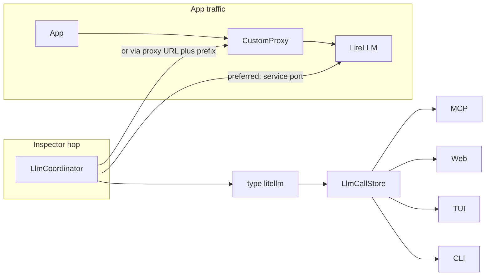

# LLM inspector

devctl brings LLM traffic into the same inspector stack as logs and traces: an in-memory store, then MCP, web, TUI, and CLI. There is no new service kind. A source is a typed driver. Two are built in: `litellm` **pulls** from a LiteLLM **management hop** (`/spend/logs`), and `proxy` **captures** completion bodies straight off a devctl [proxy](proxy.md) route — no management API needed (see [Proxy-capture source](#proxy-capture-source-type-proxy)).

The inspector is **off by default**. It does not sit on `telemetry` — this is a pull source, not OTLP ingest. Full prompts never go on the status snapshot.



## Config

Top-level `llm`. Unknown fields are rejected. Bearer tokens must come from the environment (`token_env`); never inline keys.

```yaml
llm:
  enabled: true
  sources:
    - name: platform
      type: litellm
      service: litellm
      port: http
      auth:
        type: bearer
        token_env: LITELLM_MASTER_KEY
      capture:
        prompts: true
      poll_seconds: 5
```

`type` must be a builtin (`litellm`, `proxy`) or a plugin `llmSources` name. When `llm.enabled` is true, `sources` must be non-empty and each source needs a unique `name`. A `litellm` source needs exactly one **management hop**: `management_endpoint` / `management_service`, or else exactly one of `service`, `endpoint`, or `via.route`. `via.route` may exist alongside `management_*` so apps can keep using a traffic proxy while the inspector talks to LiteLLM directly. A `proxy` source instead names the route to capture with `via.route` and has no management hop — see [Proxy-capture source](#proxy-capture-source-type-proxy).

`path_prefix` is stripped of slashes; the LiteLLM driver always appends `/spend/logs`. Do not put that leaf in config.

`capture.prompts` defaults to **true**. Set `false` to drop request/response bodies at ingest. Bodies still need LiteLLM `store_prompts_in_spend_logs`; empty `"{}"` bodies are treated as missing. Redaction uses the same `secrets` detector as logs, at upsert, before any surface reads the store.

`poll_seconds` defaults to 5. `auth.header` defaults to `Authorization`. Set it to `x-api-key` or `x-litellm-api-key` when a gateway already owns `Authorization` (IAP, custom proxy). The coordinator applies route-minted identity headers first, then the LiteLLM key on the configured header.

## LiteLLM behind a custom proxy

A custom proxy in front of LiteLLM does **not** change `type`. The driver still speaks LiteLLM management APIs (`GET {prefix}/spend/logs?summarize=false`). What changes is how the daemon reaches that API.

**1. Apps use the custom proxy; inspector uses the LiteLLM process (preferred).** Typical when LiteLLM is a local `services.litellm` and nginx / IAP / the [devctl proxy](proxy.md) only sits on the app path. Use `service` + `port` as in the default above. No `via`.

**2. LiteLLM is only reachable through the custom proxy** (remote gateway, IAP, path mount):

```yaml
    - name: via-gateway
      type: litellm
      endpoint: https://gateway.internal.example
      path_prefix: /llm
      headers:
        X-Tenant: local
      auth:
        type: bearer
        token_env: LITELLM_MASTER_KEY
```

If that hop is already a named proxy route (IAP / service-account inject), reuse it so the inspector gets the same minted headers:

```yaml
    - name: via-devctl-proxy
      type: litellm
      via:
        route: litellm
      path_prefix: /llm
      auth:
        type: bearer
        token_env: LITELLM_MASTER_KEY
        header: x-litellm-api-key
```

`via.route` must match `proxy.routes[].name`. It resolves to that route’s upstream and applies the route’s identity middleware.

**3. Custom proxy only forwards OpenAI traffic (`/v1/chat/completions`) and does not expose `/spend/logs`.** Keep `type: litellm` only if you can still name a LiteLLM management hop:

```yaml
      via:
        route: llm-apps
      management_endpoint: http://127.0.0.1:4000
```

A 404/401/403 from `/spend/logs` is a **source error** in the UI (“this URL is not LiteLLM management; set path_prefix or management_endpoint”), not an empty list. If there is no management hop at all, this is not a LiteLLM source.

LiteLLM needs a DB plus a master key (or a key with `get_spend_routes`).

## Proxy-capture source (`type: proxy`)

When LiteLLM sits behind a gateway that only exposes `/v1/chat/completions` and blocks `/spend/logs` (common with Apigee, IAP, or API Management), there is no management hop to poll. Instead, route the completion traffic through the devctl [proxy](proxy.md) and let devctl capture the bodies as they pass:

```yaml
proxy:
  enabled: true
  listen: { host: 127.0.0.1, port: 17400 }
  routes:
    - name: apigee-llm
      match: { path: /llm }
      upstream: { url: https://gateway.example/llm }
      auth: { type: none }        # workers inject their own gateway token

llm:
  enabled: true
  sources:
    - name: apigee-llm
      type: proxy
      via: { route: apigee-llm }  # the route to capture; no management hop
      capture:
        prompts: true             # false → keep metadata, drop bodies
        max_bytes: 1048576        # per-direction cap on the stored body (default 1 MiB)
```

Point workers at the route (e.g. `http://127.0.0.1:17400/llm/v1/chat/completions`) and every OpenAI-compatible completion, chat, embedding, or streamed (`text/event-stream`) call is parsed and fed into the same store as any other source. All surfaces below then work unchanged.

- **Only tagged routes are buffered.** `via.route` names the one route to capture; all other proxy traffic still streams untouched. The request is buffered only when its `content-length` is within `max_bytes`; otherwise it is streamed and its stored body marked omitted. The response is always streamed to the caller — never buffered-then-forwarded — so SSE keeps flowing.
- **Only OpenAI-compatible completions are captured.** Capture engages on a `POST` with a JSON request content-type on a completion-shaped path (`/chat/completions`, `/completions`, `/embeddings`); `GET /models`, `/model/info`, health checks, and CORS preflights are ignored. Anthropic-native `/messages` and the OpenAI Responses API (`/responses`) use different request/stream shapes and are not captured — route those through LiteLLM's OpenAI-compatible endpoint instead.
- **`proxy` has no management hop.** It captures from `via.route` and must not set `service`, `endpoint`, or `management_*`; config validation rejects those.
- **Redaction is unchanged** — the same `secrets` detector runs at upsert, and full prompts never go on the status snapshot. Usage keys (`prompt_tokens`, `completion_tokens`, `total_tokens`, `max_tokens`) are counts, not credentials, so they stay visible. Cost is unavailable from a `proxy` source, and a streamed response carries token usage only when the caller sets `stream_options.include_usage`. TUI `/reveal` unmasks service env only; it cannot restore a payload that was already redacted at ingest.

## Caller (which service made the call)

Each stored call has an optional `caller` — the **service that issued the request**, not the LLM source (`platform`, `apigee-llm`, …). On a `type: proxy` source the stored `source` name is the tagged route (often the Apigee/gateway route). Detail views label that **via**, so the gateway is not read as the caller. Attribution, in order:

1. **`X-Devctl-Service`** (or `X-Devctl-Service-Name`) on the inbound proxy request. Host processes already get `DEVCTL_SERVICE_NAME` in their environment; send it as this header from the OpenAI / LiteLLM client. The proxy **strips** the header before forwarding so it never reaches the vendor.
2. **`x-litellm-metadata`** JSON with `service` / `service_name` / `devctl_service`. Not stripped — LiteLLM already uses this header.
3. **Loopback TCP peer.** For traffic that hits a captured proxy route from `127.0.0.1` / `::1`, devctl maps the client port to a managed process (pid, parent, or process group) **when the request starts**, while the socket is still up. Looking up after the response races the client close and leaves `caller` empty. On Linux this reads `/proc` directly (`/proc/net/tcp[6]` for the socket owner, `/proc/<pid>/stat` for parent/group) so it works in a minimal container that ships neither `lsof` nor `ps`; macOS falls back to `lsof`/`ps`, Windows to `netstat`. Remote peers are not looked up, so a coincidental local pid cannot be blamed. A client that runs in a **different** container or network namespace than the daemon (its socket owner is the runtime, not a managed process), or any non-loopback client, is best-effort — send the header or `metadata.service`.
4. **Completion body** `metadata.service` / `metadata.service_name` / `metadata.devctl_service` (LiteLLM extra body), else a non-email OpenAI `user`.
5. **LiteLLM spend logs:** `metadata.service` / `metadata.service_name` / `metadata.devctl_service`, else `user` / `end_user` when it is not an email.

TUI list shows caller next to status; detail has `caller` then `via` (proxy) or `source` (LiteLLM). Filter by caller everywhere: CLI `devctl llm --caller worker`, the TUI `/caller worker` command, the web console caller dropdown, and MCP `get_llm_calls`'s `caller`. Pass `-` (CLI also accepts `none`) to show only calls with **no** known caller.

## Surfaces

Query stays on the store (RPC `llm_calls_page` / `get_llm_call`). Secrets are redacted again on MCP/web output.

| Surface | Entry |
|---------|--------|
| MCP | `get_llm_calls` (filter + cursor) and `get_llm_call` in **inspect**. List pages omit bodies; detail includes redacted payloads. |
| Web | `#/llm` and `#/llm/:id` — list (model, caller, status, tokens, cost, latency) and detail (messages, usage, attributes, jump to trace). |
| TUI | `llm` nav tab, `/llm`, enter for detail; enter again jumps to a trace when `traceId` is present. The list shows which service issued the call when known. |
| CLI | `devctl llm` (filters including `--caller`, `--json`, `--follow`) and `devctl llm show <id>`. |

The `proxy` source buffers completion bodies only on the routes it is told to capture; all other proxy traffic still streams without buffering. Additional pull-style source types can plug in through `LlmSourceFactory` / plugin `llmSources`; a push source (like `proxy`) feeds the store directly rather than being polled.

## Related

- [Configuration](configuration.md)
- [Proxy](proxy.md)
- [Telemetry](telemetry.md)
- [MCP](mcp.md)
- [CLI](cli.md)
- [TUI](tui.md)
- [Plugins](plugins.md)
