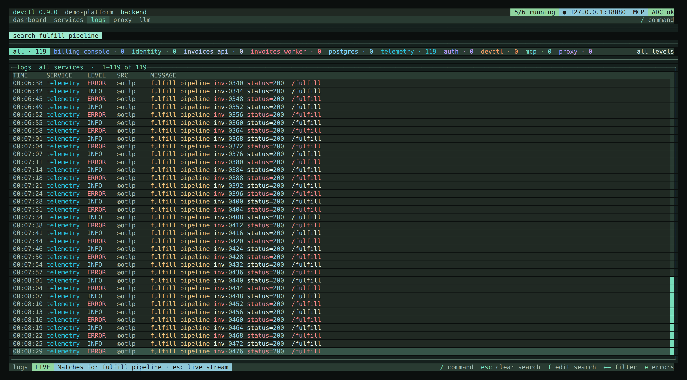
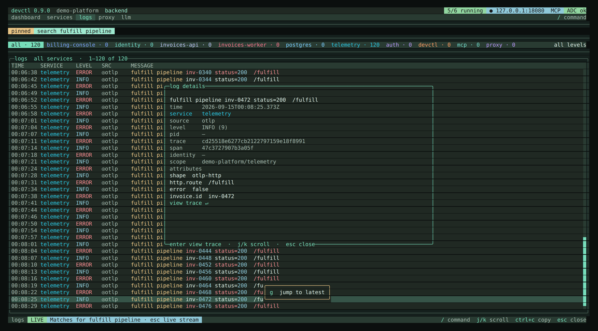

# Logs

All service stdout/stderr, proxy events, health checks, authentication events, and `devctl` internal lines go through one log manager on the supervisor.

Sources you will see: `stdout`, `stderr`, `health`, `auth`, `devctl`, `proxy`, and `otlp` (when `telemetry.otlp.enabled` is on).

Each line is stored as an OpenTelemetry-style record — body, attributes, severity, and optional `traceId`/`spanId` — so structured JSON (and Python `{'key': 'value'}` dicts) keep their fields and a line joins its trace. Enabling the OTLP receiver and viewing traces are covered in [Telemetry](telemetry.md).

ANSI color codes are stripped before severity classification and structured parse (`\x1b[31mERROR\x1b[0m` is ERROR). The stored `raw` field keeps the original bytes.

Process `stdout`/`stderr` can fold several physical lines into one event. Python tracebacks (`Traceback (most recent call last):` plus indented frames and the exception line) and a bare HTTP status continuation (`             200`) are always folded. Optional `services.<name>.logs.multiline` adds start/continuation regexes:

```yaml
services:
  api:
    logs:
      stdout: true
      multiline:
        start: "^\\d{4}-\\d{2}-\\d{2}"
        continuation: "^\\s+"
        max_wait_ms: 80    # default
        max_lines: 200     # default
```

The folded body is a single string with newlines. Severity is taken from the first line that classifies after ANSI strip, otherwise from the assembled body. Proxy, health, and OTLP records stay one line each. Pending folds flush on the idle timeout or when the log store is flushed. Folding goes by when each line was read, not when devctl got to it, so output that waited in the spool or behind a full pipeline folds the same as live output, and a record from another source does not cut a fold short.

Optional `services.<name>.logs.dedupe_access_line: true` (off by default) drops a plain uvicorn-style access line when the previous event from the same pid already has the same method, path, and status in attributes within 1ms. Always-on HTTP-status folding (`             200`) is unchanged.

Ingest also copies `devctl.request_id` from a proxy hop onto a nearby service stdout/stderr line that names the same gRPC method or HTTP method+path (50ms timestamp match, and 50ms between when the line was read and when the hop was logged, using the first line of a folded process event; a candidate is kept until every stream has moved 50ms past it, so a stream that was spooled still pairs, and an unrelated future timestamp cannot evict a pair). HTTP hops require a request-target (`/…`, `http(s)://…`, `host:port`, or `*`). If the service line arrived first, the tagged record is re-emitted and persisted so live views and session reload see the request id. A proxy `caller` attribute, when present, must match the service name. `--dedupe-request-id` (MCP `dedupe_request_id`) then collapses those pairs at query time, keeping the structured proxy attributes and the richer body.

## Buffer and persistence

- In-memory circular buffer: `logs.max_memory_events` (default 50,000). Retention stays O(1) per line even after the buffer fills. Status `logs.total` / `logs.errors` are how many of those lines are still in the ring; `logs.seen` / `logs.seenErrors` are lifetime ingest counts so dashboards do not freeze at the cap.
- The live ring lives in a Bun Worker behind `LogStore`, so parse and search do not stall the supervisor event loop. Source, npm, and compiled standalone binaries all run it: a compiled binary embeds the worker. The main thread only receives page/facet/export results (and a cached snapshot for `status`). If the worker fails to start, the daemon falls back to the in-process store rather than hanging, logs a WARN, and `status --json` reports `daemon.logStore: "in-process"`.
- Ingest truncates lines longer than 16 KiB and skips `JSON.parse` on payloads larger than 64 KiB. Regex search is already capped (pattern length, nested quantifiers).
- Optional persistence under `~/.devctl/logs/` (`persistence.enabled`, `directory`, `retention_days`, `max_session_logs`).
- Live updates reach attached clients in batches, at most one every 50 ms carrying the newest 500 records, so a noisy service cannot freeze the TUI or grow the daemon's memory for a client that has stopped reading. A batch says how many records it left out; once the stream is calm, the TUI pages those in. Older clients still get one event per record.
- The detached supervisor's own bootstrap stderr (before it has a config, so before any of the above even starts) is a separate file with its own rotation — the last 5 boot attempts are kept, each overwrite-proof against the next. See `devctl daemon logs` in the [CLI reference](cli.md).

## Pagination and facets

Queries (CLI, TUI, MCP, web) return a bounded, cursor-paged slice instead of the whole matching history: a page defaults to the latest 500 matching events, capped at 5,000 (MCP `get_logs` still defaults to 200 unless you pass `limit`). The cursor is opaque (carries the daemon session and an internal per-event sequence number) and pages both backward (older) and forward (newer) without duplicating or dropping events that share the same millisecond — a plain timestamp boundary can't make that guarantee once two events land in the same millisecond and a page cuts between them. `since`/`until` keep working as ordinary timestamp filters alongside the cursor. Exporting (`/export`, `devctl logs export`, web **Export**) still reads the entire matching history — page size never truncates an export.

A page also ends once its records pass about 8 MiB, so a page of very long lines can hold fewer records than its limit; its `hasPrev`/`hasNext` flags say there is more. `devctl logs --all` walks the window this way, oldest first, printing each page as it arrives, so neither the daemon nor the CLI holds the whole window. The older unpaged `logs` call answers with the newest matches up to about 32 MiB and sets `truncated` when it left older ones out.

Facets — the total matching count, plus per-service/level/source counts (each computed under every *other* active filter, not its own) — come from a separate, lightweight stats query with no event payload (`logs_stats` / MCP `get_log_stats` / `GET /api/logs/stats`). The TUI and web Logs page refresh them every two seconds while open, and immediately on a filter change, a clear, or reconnecting, so the filter chips' counts stay accurate even though the UI only ever renders a viewport into a bounded buffer.

## TUI (Logs tab)



- `f` focuses search **on the Logs tab** (`/` stays the command line). `esc` closes search, clears the query, and jumps to the live tail. `enter` keeps the current filter so you can browse matches; `esc` again (or `f` then `esc`) returns to the live stream. Matches are highlighted in the log line (plain or `/regex`). Dashboard tail uses the same search filter while it is applied.
- `e` / `/filter` — ERROR and above.
- `p` / `/pause` — freeze the live stream.
- `z` / `/fullscreen` — hide header and nav so the stream fills a small editor terminal. `z` or `esc` exits.
- `t` / `m` — timestamp and metadata columns (persist in `tui.json`).
- `w` / `/wrap` — wrap every line (default) → clip with ellipsis → unwrap only the selected row.
- `g` — jump to latest. Leaving the tail pins the view (`pinned · +N new`).
- `←`/`→` or click a chip — cycle service filters. Digits `1`–`5` jump nav tabs, not log sources.
- `\\` / `/split` — second pane on the same live stream, with its own service filter. Shared search. `|` focuses the other pane.
- `enter` — details overlay (body summary, attributes table, severity number, `traceId`/`spanId`).

  
 A ◎ marker on the list means the row has a trace; enter again (or **view trace**) opens a full-width waterfall. The solid block is the span; the dim track is unused time in the window. `j`/`k` selects a span; Enter or double-click opens that span's logs overlay (`esc` returns to the waterfall).
- `/trace <id>` — set search to that request/trace id. Enter in the details overlay on a row that has an id does the same.
- `command+c` (macOS) or `ctrl+c` (Linux/Windows) — copy the highlighted selection. Remap with `keybinds.copy`.
- `/export [path]` — write the **current** filters. Default file: `~/.devctl/exports/devctl-logs-<timestamp>.log`.
- `/exports` or the **open folder** chip — reveal that directory.
- `/history [id]` — load a persisted session (`LogManager.listSessions`).
- `/system` / `/internal` — show or hide internal `auth` / `mcp` / `devctl` / `proxy` lines.
- `/regex`, `/since`, `/until` — search and time range (`until` is exclusive of later lines).

Headlines wrap to the pane width with OpenTUI word wrap (`wrapMode="word"` on the message cell; chrome columns stay fixed). Clip mode uses native ellipsis. `j`/`k` moves the highlight.

## Web console (Logs)

The [web console](web.md) Logs page is the same ring and paging, not a 200-row table. It holds up to `logs.max_memory_events` (default 50,000), virtualizes the list, and follows with `cursor=next_cursor` (~100ms while the page is visible, live, and not paused; slower when idle or the tab is hidden). Scroll up loads older pages (`cursor=prev_cursor`, `direction=backward`). Overview “recent errors” stays a small ERROR page and does not feed the 50k buffer.

- Search (substring / regex), ERROR+, system-source toggle (`auth` / `mcp` / `devctl` / `proxy`)
- Pause / live, jump latest (`pinned · +N new`)
- Service chips from facets; timestamp/metadata columns from `log_timestamps` / `log_metadata`
- Clear (client-local `since=now`; daemon ring untouched), export NDJSON, history session picker
- Split: two panes, shared buffer and search, independent service filter and follow/pin
- Wrap cycle: clip → wrap selected → wrap all
- Keys: `j`/`k`, `f` search, `p` pause, `g` latest, `e` ERROR+, `\` split, `w` wrap

History loads a persisted session (same store as TUI `/history`). Export downloads JSONL for the current filters — the full match set, not one page.

## CLI

```bash
devctl logs [svc…] [--level] [--search] [--regex] [--source] [--since] [--until] [--trace] [--request-id] [--attribute key=value] [--dedupe-request-id] [--json]
devctl logs                        # latest page (same as MCP get_logs); pass --all for the full match set
devctl logs -f                     # keep printing new matching events until interrupted
devctl logs --output FILE          # same filters, write a file (full history, not just one page)
devctl logs export --output FILE   # explicit export subcommand
devctl logs --trace <id>           # spans plus correlated logs for that trace
devctl logs --request-id <id>      # filter by X-Devctl-Request-ID
devctl logs --dedupe-request-id    # collapse nearby events that share a request id
devctl daemon logs [-f]            # the supervisor's own bootstrap stderr, not service logs
```

## Resource limits

Every buffer has a byte budget. Overflow is queued, then written to an ordered spool, and only then does devctl stop reading a service — the service blocks in its write, the way it would on a slow terminal. Lines are not dropped.

| Key | Default |
|-----|---------|
| `logs.max_memory_events` | 50000 records in the live window |
| `logs.max_memory_bytes` | `0` — 8% of cgroup or host memory, clamped to 96–384 MiB |
| `logs.spool.max_bytes` | `0` — 1 GiB of not-yet-parsed output (mode 0600, deleted once consumed) |
| `logs.persistence.max_session_bytes` | `0` — 1 GiB per session |
| `logs.persistence.max_total_bytes` | `0` — 2 GiB across closed sessions |
| `logs.persistence.max_session_logs` | `0` — unlimited; when set, counts sessions **for this repository** |
| `llm.store_max_bytes` / `proxy.inspect_store_max_bytes` | `0` — 128 MiB of captured bodies. Metadata for the newest 2,000 calls stays; a missing body is marked evicted |
| `supervisor.reap_orphans` | `false`. Prefer a reaping PID 1 (`"init": true`) |

With persistence off, a very large line shrinks the in-memory window below 50,000 records instead of exhausting RAM. With persistence on, `logs` pages read session files when the byte budget has evicted records, so the last `logs.max_memory_events` lines stay reachable. Health probes log when status changes, plus a periodic reminder while a service stays unhealthy.

A session over `max_session_bytes` keeps its newest lines: each service's file rolls to numbered parts (`<service>.jsonl`, `<service>~1.jsonl`, …) and the oldest parts are deleted. While free space is under 1 GiB and 5% of the volume, or a write fails, lines are left out of the session files and counted (`status --json`, `daemon.logs.loss` and `daemon.logs.degraded`); the live window keeps them and writing resumes on its own. None of this stops reading service output. Closed sessions are deleted oldest first past `max_total_bytes` and by each session's own `retention_days`. A session whose daemon is still running is never deleted, whichever repository or container it belongs to.

Output a daemon had read but not parsed when it crashed stays in its spool. The next daemon parses it into the crashed daemon's session, then deletes it.

On Linux and macOS, each captured stdout and stderr of a long-running service goes through a FIFO that the service holds open for reading and writing, so a write never fails with a broken pipe. The daemon reads the FIFOs itself. When the daemon goes away and leaves services running (a crash, `kill -9`, or `devctl down --keep-services`), a small shell process it left behind starts one drainer. The drainer copies their output, with the time it was read, into a spool capped at `logs.spool.max_bytes`. Once that spool is full, services pause on their next write instead of failing. The next daemon stops the drainer, replays the spool in order, and reads the FIFOs again. Windows, and any host where FIFO setup fails, uses pipes. Spooled output is not redacted yet: it is kept in mode 0600 files, each deleted once it has been consumed, and its size counts against `logs.spool.max_bytes`.

`devctl down --force` stops a daemon that has no heartbeat, including one left running by an older devctl. It signals only a pid that is still that daemon: one whose lock stamp matches or, for an older lock, whose command line runs `_supervisor`. A busy daemon is not killed. A daemon is replaced only after the watchdog has recorded a 60 second wedge and released its lock. The client that replaces it sends SIGTERM, then SIGKILL two seconds later; a daemon that recovers in time hands its services over to the next one. `status` and `down` say when a live daemon is busy, paused, or left by an older build.

If the watchdog worker cannot run, the daemon keeps serving but a wedge goes undetected. It retries the worker after 1, 2, 4 … seconds, at most a minute apart. `status` prints a `DAEMON DEGRADED` line, `status --json` reports `daemon.watchdog: "degraded"` (and `daemon.logStore: "in-process"` when the log worker is down too), and `devctl doctor` warns.

## Related

- [TUI](tui.md)
- [Web console](web.md)
- [CLI](cli.md)
- [Security](security.md)
