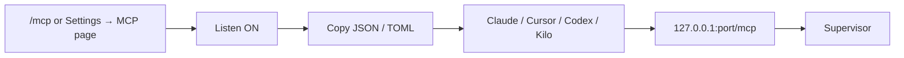

# MCP server for coding agents

`devctl` can expose a **localhost Streamable HTTP** MCP server so Claude, Cursor, Codex, and Kilo Code can read status, logs, and config, and start or stop services.

The listener lives on the **supervisor** (the same process that owns services and the proxy). The TUI only toggles it and copies config. Agents need a URL; a stdio child of the TUI would die when the TUI exits.

## Setting up a repository that has no `.devctl` yet

`devctl mcp --on` works in a repository with no configuration at all. The
daemon boots in **setup mode**: nothing is validated and no service can start,
but the MCP server is up, so you can point an agent at it and ask it to set
devctl up for the repository.

```bash
devctl mcp --on
```

The agent calls `get_setup_guide`, surveys the repo, drafts a config, checks it
with `validate_config` (which accepts candidate text, so it can check a draft
before writing it), writes the files, and calls `reload_config`. Setup mode
clears on the reload that finds a valid configuration, and `.devctl/` starts
being watched for changes from then on.

`get_status` reports `setup_mode: true` while this state is active, so an agent
can tell an empty service list apart from a daemon that failed to start
anything.

Default is **off** (`mcp_enabled` in `~/.devctl/tui.json`). Once on, the supervisor applies that preference itself at startup — whether it was spawned by the TUI or by a plain CLI command — so the listener comes back on the next `devctl start` too, not only while the TUI is attached.

## Enable it



MCP is **not** a nav tab. Flip **Listen** (`space` / `enter`). The header shows an **MCP** chip when it is running.

The default port is derived from the repo so checkouts do not collide:

`18700 + (parseInt(repoID.slice(0, 8), 16) % 600)` → **18700–19299**.

Change it with `←` / `→` or `devctl mcp --port`. An override is persisted as `mcp_port` only when it is not the derived default. If the preferred port is busy, the supervisor walks upward until it finds a free one.

The server binds **`127.0.0.1` only**. Mutating tools require `Authorization: Bearer` with a short session token. Copied snippets include that header. Tool output never includes tokens or raw secret env values. `get_status` reports MCP running/address/port, not the bearer token.

## CLI

```text
devctl mcp                 # URL + four snippets
devctl mcp --on [--port N]
devctl mcp --off
devctl mcp --json
```

`--on` starts a supervisor if needed. `--off` stops the listener only.

## Tools and resources

| Tool | Group | What it does |
|------|-------|----------------|
| `list_services` | inspect | Name, state, health, ports, pid, last error |
| `get_service` | inspect | One service plus command/cwd/ports (env redacted or left as `${…}` refs) |
| `get_status` | inspect | Profile, session, identity flags, proxy, log counts, MCP listen |
| `get_logs` | logs | Filtered logs, capped at 200 events per page, secrets redacted. Pass `cursor` from the previous `next_cursor` to page forward with no duplicate or same-millisecond-lost lines; `since`/`until` are plain timestamp filters for a fresh query |
| `list_profiles` | inspect | Config profiles and members |
| `get_config` | inspect | Merged summary: project, services, routes, proxy paths |
| `get_config_sources` | inspect | Effective values with winning and shadowed configuration sources; secret-like values are redacted |
| `run_doctor` | diagnostics | Doctor report |
| `start_services` | control | Named list, or a `profile`. Omitted names use `profile`, then the active session profile, then the first configured profile — never every service. No profile and no names fails closed |
| `stop_services` | control | Named list, or all started services when omitted. Also stops every transitive dependent of a named service — never its dependencies |
| `restart_services` | control | Named list; touches only those services, not dependents, unless `cascade: true`. Start still expands dependencies |
| `reload_config` | control | Reload `.devctl` |
| `exec_service` | control | Run an arbitrary command in a service's resolved environment/cwd, or inspect its redacted environment with `print_env` |
| `get_setup_guide` | setup | The onboarding guide for authoring a `.devctl`. `section`: `procedure` (default), `authoring`, `discovery`. Same text as [`skills/devctl-onboard`](../skills/devctl-onboard/SKILL.md), compiled into the binary so no skill install is needed |
| `validate_config` | setup | Validate configuration and return the loader's exact issues. No arguments validates what is on disk; `text` validates a candidate `config.yaml` through the real load pipeline before it is written |

No tool writes files. An agent authors `.devctl` with its own editing tools and uses `validate_config` to check the result.

## Enabling and disabling tools

Every tool is on by default. The TUI's **MCP** page lists them grouped by the
`Group` column above, each marked `read` or `write`, and `space` toggles the
highlighted one. The common case is turning off the whole `control` group —
`start_services`, `stop_services`, `restart_services`, `reload_config`, `exec_service` — so an
agent can read status and logs but not start or stop anything.

A disabled tool is left out of `tools/list` **and** refused if called anyway,
since an agent may still hold a tool list from before it was turned off. The
refusal names the tool and says it is disabled, rather than reporting it as
unknown.

The setting is a deny-list stored as `mcp_disabled_tools` in `tui.json`, so a
tool added by a later devctl version is available without editing anything.
The daemon applies it at boot the same way it applies `mcp_enabled`, and a TUI
toggle takes effect immediately without restarting the listener.

An agent cannot change this: `mcp_set_tools` is a local RPC and is deliberately
absent from the MCP host surface, so a connected client cannot re-enable a tool
its operator turned off.

Resources (always-fresh reads): `devctl://status`, `devctl://services`, `devctl://logs`, `devctl://config`, `devctl://doctor`.

Doctor may report ports “in use” while your own services hold them — that is expected after a successful start.

## Related

- [TUI](tui.md)
- [CLI](cli.md)
- [How it fits together](overview.md)
- [Agent skills](../skills/README.md)
- [Security](security.md)
