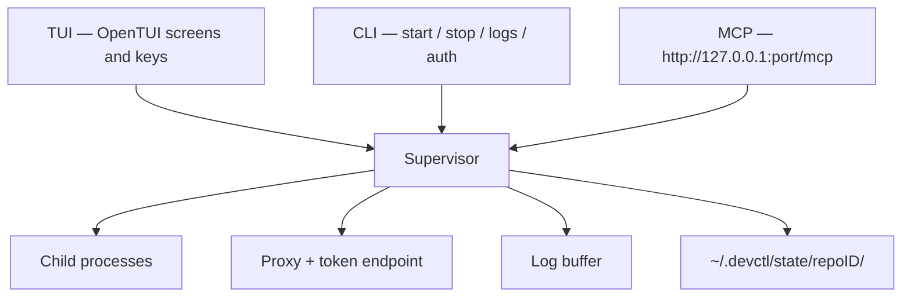
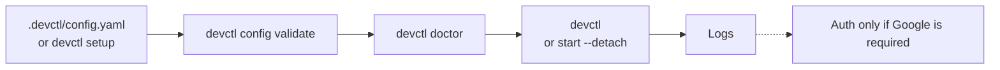

# How it fits together

`devctl` is one product with four faces on the same supervisor.

Nothing in the application knows your services by name. The supervisor reads `.devctl/`, starts argv (or explicit shell) processes, injects resolved env, and reports health.

## Supervisor

The supervisor is the long-lived process. It:

- Starts, stops, and restarts services in dependency waves
- Optionally starts the proxy and the MCP listener
- Ingests stdout/stderr, health, auth, and proxy events into one log buffer
- Persists session state under `~/.devctl/state/<repoID>/` (`state.json`, `devctl.lock`, and on Unix `devctl.sock`)

`repoID` is the first 16 hex characters of `sha256(absolute repo root)`. Two checkouts get two state directories. A leftover `~/.devctl/sessions/<id>/` is migrated once.

`devctl start --detach` leaves the supervisor running. `devctl` (no args) and `devctl attach` dial the session socket: `devctl.sock` on macOS/Linux, `\\.\pipe\devctl-<repoID>` on Windows. Attach never starts a supervisor; the default TUI may.

Override the home directory with `DEVCTL_HOME` (default `~/.devctl`).

## TUI

The TUI is an OpenTUI React app. It attaches to a supervisor and paints status, logs, identity, doctor, config, and settings. It does not own child processes. Closing the TUI can stop services or detach, depending on `shutdown.stop_services_on_exit` — see [TUI](tui.md).

## CLI

The CLI is the same controller over the same socket. Use it for scripts, CI, and one-shot status. See [CLI](cli.md).

## MCP

Coding agents cannot keep a TUI child alive, so MCP is a **localhost Streamable HTTP** server on the supervisor. Default off. See [MCP](mcp.md).

## Configuration vs preferences

| What | Where |
|------|--------|
| Services, profiles, proxy, Google project | `.devctl/config.yaml` and modular YAML |
| Machine overlay (gitignored) | `.devctl/config.local.yaml` and `~/.devctl/config.local.yaml` |
| TUI theme, keys, MCP listen flag | `~/.devctl/tui.json` (or `DEVCTL_TUI_CONFIG`) |
| Session / lock / socket | `~/.devctl/state/<repoID>/` |
| Persisted logs | `~/.devctl/logs/` |
| Log exports | `~/.devctl/exports/` |
| Credential files (if no keychain) | `~/.devctl/credentials/` (mode `0600`) |

## Typical loop

Local-only services (the [demo platform](../examples/demo-platform/README.md)) run without `gcloud`.

## Related

- [Installation](installation.md)
- [Configuration](configuration.md)
- [TUI](tui.md)
- [CLI](cli.md)
- [MCP](mcp.md)
