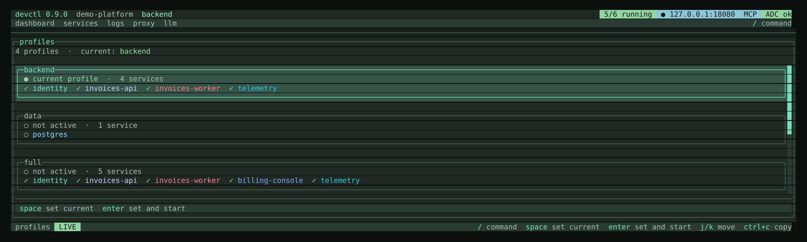

# Profiles

A profile is a named list of services plus optional extra environment. Starting
a profile starts **exactly those members**. Dependencies you omitted stay
remote — so a UI-only profile can talk to deployed identity instead of spawning
it locally.

```yaml
profiles:
  data:
    services: [postgres]
  minimal:
    services: [identity, invoices-api]
  backend:
    services: [identity, invoices-api, invoices-worker]
    environment:
      LOG_LEVEL: DEBUG
  full:
    services: [identity, invoices-api, invoices-worker, billing-console]
  console:
    services: [billing-console]
    environments:
      billing-console: deployed
```

```bash
devctl start --profile backend
devctl start --profile console
```

`devctl start invoices-api` with **no** profile still expands the local
dependency closure (identity comes up too). `devctl start --profile backend invoices-api`
starts invoices-api plus only those of its dependencies that are also in
`backend`.

The TUI **profiles** screen (`o` or `/profiles`) lists configured profiles. `enter` selects one and offers start. None are hard-coded.

## Environment on a profile

`profiles.<name>.environment` is fleet-wide extra keys for every member. Those
keys still lose to each service's own `environment:` map, so they cannot
retarget `AUTH_URL`. Use one or both of:

- `environments.<svc>: <overlay>` — bind `services.<svc>.environments.<overlay>`
  for launches under this profile (the TUI env chip and `DEVCTL_SERVICE_ENV`
  match). Unknown service or overlay names fail `devctl config validate`.
- `service_environment.<svc>` — an `EnvConfig` (vars / defaults / required)
  applied **after** that service's vars, so `AUTH_URL: https://identity.example`
  actually wins.

If a member still interpolates `${services.X.url}` (or an HTTP recipe that
needs X) and X is not in the start set, start fails that member with a blocker
telling you to add X, bind an overlay without those refs, or set
`service_environment`.

See [Environment](environment.md#per-service-named-overlays).



Empty-dashboard `enter` uses the first profile name **alphabetically** when no session profile is set — YAML key order does not matter. In the [demo platform](../examples/demo-platform/README.md) that is `backend`, not `console` or `data`.

`devctl start` / MCP `start_services` with **no** profile and **no** names starts the active session profile, or the first configured profile (alphabetically). With no profiles it fails closed. Pass `--profile` or explicit names to stay on a subset. It never expands to every service just because the list was empty.

The demo also defines `data` (opt-in Docker/PostgreSQL) and `console` (billing UI against the `deployed` overlay). They are not default profiles; start them with `--profile data` / `--profile console`.

## Sessions

Per-repo state lives under `~/.devctl/state/<repoID>/`:

| File | Role |
|------|------|
| `state.json` | session id, profile, pid / command / cwd / startTime / ports |
| `devctl.lock` | supervisor lock (stale locks from dead PIDs are replaced) |
| `devctl.sock` | JSON-RPC socket for TUI, CLI, and attach (Unix) |
| `rpc-token` | Per-checkout secret on every RPC frame (Windows named-pipe mitigation; also used on Unix) |
| `\\.\pipe\devctl-<repoID>` | Named pipe used instead of the socket on Windows |

A leftover `~/.devctl/sessions/<repoID>/` is migrated once.

A new supervisor **adopts** leftover processes only when pid + command + cwd + startTime still match. An empty cwd on either side is ignored. It never signals an unrelated PID. `SessionRecovered` is published when anything is adopted. Adopted processes keep health polling; stdout/stderr from before adopt are not captured. A port-only leftover is logged and shown in Doctor; it is not attached.

Override the home directory with `DEVCTL_HOME`.

## Related

- [Services](services.md)
- [How it fits together](overview.md)
- [CLI](cli.md)
