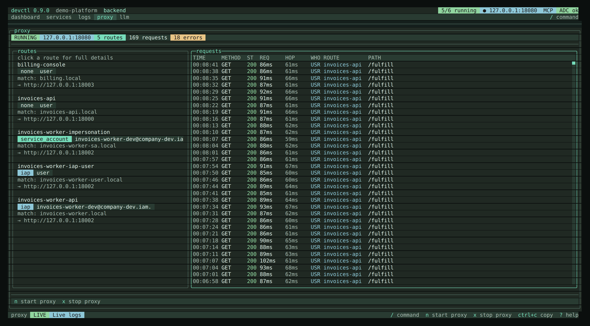
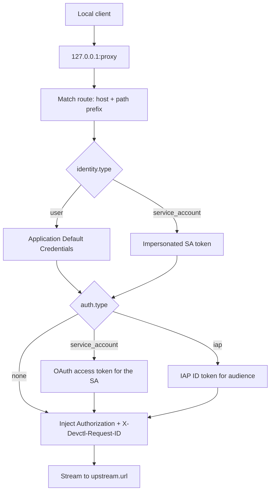

# Proxy

The local proxy injects authentication so services do not each implement Google/IAP logic. It runs **inside the supervisor**.

There is no implicit listen port. `proxy.listen.port` is **required** when `proxy.enabled` is true — `devctl config validate` and any load fail with `proxy.listen.port is required when proxy.enabled is true` (exit **2**). `devctl setup` writes `127.0.0.1:8080` as a starter; the demo uses `127.0.0.1:18080`. Binding to `0.0.0.0` or `::` is rejected.

`devctl proxy start`, TUI `n` on the proxy screen, and MCP `start_proxy` still refuse a `0` port even when the proxy is not enabled: same wording, CLI exit **7**.

```bash
devctl proxy start
devctl proxy status
devctl proxy stop
```

The TUI **proxy** tab (`p`) shows status, routes, and a live inspector of hops captured on `inspect.enabled` routes. `n` starts, `x` stops. `r` toggles pretty JSON vs raw. SA email is shown when a route uses one.



Each request gets `X-Devctl-Request-ID` — propagated from the caller if it sent one, generated otherwise — and it's echoed back on the response so a caller can find its own request in the log below. Proxy logs never include `Authorization` headers. Bodies are streamed unless a route opts into [inspect](#inspect-bodies) or a [request-body transform](#rewrite-the-request-body).

WebSocket upgrades use the same route matching, identity injection, middleware, request logging, and statistics as ordinary HTTP traffic (HMR and other upgraded connections behind a route). Active upgraded sockets are closed during proxy shutdown so `devctl down` cannot hang.

If `proxy.enabled` is true, `devctl start` also starts the proxy.

A configuration reload that only changes routes (match, upstream, inspect, auth, `strip_prefix`, `transform`, log) **hot-swaps** the live table. The HTTP listener, token endpoint, and each gRPC h2c socket stay bound when their `listen` host/port (and the token endpoint's enabled flag) are unchanged. Listeners are recreated only when that bind changes, or the proxy is disabled while running. A stopped proxy stays stopped — `proxy stop` suppression is not cleared. In-flight requests keep the route they already matched; new requests see the new table.

### When the proxy cannot bind

The first `devctl start` binds the proxy's HTTP listener, the [token endpoint](#token-endpoint), and each gRPC listener. If any of them fails, for example because another checkout's proxy or another program already holds the port, none stay bound. The services in that start are then **blocked**: they go to `FAILED` with `proxy failed to start (unable to listen on 127.0.0.1:8080 (EADDRINUSE))` and are not launched. Services that are already running keep running.

Before, those services started anyway with `DEVCTL_PROXY_URL` and `DEVCTL_TOKEN_URL` pointing at the configured port, so their traffic and `DEVCTL_INTERNAL_TOKEN` went to whatever process held it.

To recover, free the port (`devctl doctor` names the holder), give this checkout a different `proxy.listen.port` in `.devctl/config.local.yaml`, or run `devctl proxy stop` to start services without the proxy. A stopped proxy means services get no `DEVCTL_PROXY_URL`, `DEVCTL_TOKEN_URL`, or `DEVCTL_HTTP_<NAME>_URL`.

## Routes

```yaml
proxy:
  enabled: true
  listen:
    host: 127.0.0.1
    port: 8080
  routes:
    - name: invoices-api
      match:
        host: invoices-api.local
        path: ""
      upstream:
        url: http://127.0.0.1:18000
      auth:
        type: none          # none | iap | service_account
        identity: user      # or { type: service_account, service_account: email }
        # IAP only: audience is required. Optional client_id + client_secret
        # mint the ID token with that OAuth client instead of ADC's default.
        # client_secret may be a literal or ${NAME} / ${env.NAME}.
        # On auth.type none only: log_identity: true copies inbound
        # X-Goog-Authenticated-User-Email onto the traffic record as caller_email.
```

On `auth.type: none` (or an omitted type, which means none), optional `auth.log_identity: true` copies the inbound `X-Goog-Authenticated-User-Email` header onto the traffic record as `callerEmail` / `caller_email` when that header is present. This does not mint tokens. It is an opt-in label for routes that already sit behind an IAP-style edge and receive that header. The flag is rejected on `iap`, `service_account`, and other minting types. Service attribution via `X-Devctl-Service` (`caller`) is separate and always recorded when present.

Match is host + optional path prefix.

### Strip a path prefix

`strip_prefix: true` removes `match.path` from the pathname **when forwarding**. Traffic inspector hops and proxy request logs keep the inbound path. Empty `match.path` is a no-op — host-based `expose` / `gateway` routes do not need this.

```yaml
    - name: my-service
      match:
        path: /my-service
      strip_prefix: true     # /my-service → / ; /my-service/foo → /foo ; query string kept
      upstream:
        url: http://127.0.0.1:18000
```

### Rewrite the request body

> **Experimental.** `transform.request_body` may change without a deprecation period. See [Experimental features](roadmap.md#experimental-features).

`transform.request_body` rewrites the request body before forwarding. Rules run in order. Each one replaces every occurrence of `replace` with `with`. Without `regex: true`, `replace` is a literal string (dots are not wildcards). With `regex: true`, `replace` is a JavaScript regular expression. `with` is inserted literally in both cases — `$` is not a capture reference.

`${NAME}` and `${env.NAME}` expand in both `replace` and `with` at request time, from the supervisor process environment plus `.devctl/secrets.env`, the same way as `upstream.url`. `devctl config validate` accepts the template before the variable is set. An empty value fails that hop (**502**). On an `iap` or `service_account` route, `${token}` in `replace` or `with` is the same minted, cached token used for `Authorization` and `auth.headers`, resolved per request. On `auth.type: none` it is a validate error (`${token} requires auth.type iap or service_account`). In a regex `replace`, `${token}` is substituted before the pattern is compiled. `with` stays literal, including when `regex: true`. `${identity.user}` stays literal; validate warns if `${identity.` appears. Other references are rejected.

The proxy buffers the body, up to 16 MiB, then forwards the rewritten bytes with a matching `Content-Length`. GET and HEAD are unchanged. A content-encoded body (anything other than `identity`) or a body that is not UTF-8 fails the hop instead of forwarding the local addresses unchanged. gRPC routes and recipe `expose` routes cannot set `transform`.

When the route also has [inspect](#inspect-bodies) enabled, the stored request body is the rewritten one (what the upstream receives), still capped by `inspect.max_bytes`. A substituted `${token}` is redacted at ingest the same way an `Authorization` bearer is.

```yaml
    - name: remote-agent-api
      match:
        path: /api/agents
      upstream:
        url: https://remote.example.com/api/agents
      transform:
        request_body:
          - replace: "http://127.0.0.1:${env.PROXY_PORT}"
            with: "https://remote.example.com"
          - replace: "http://127\\.0\\.0\\.1:\\d+"
            with: "https://remote.example.com"
            regex: true
          - replace: "Bearer PLACEHOLDER"
            with: "Bearer ${token}"   # iap / service_account only; same mint as Authorization
```

### Route timeouts

Timeouts are **opt-in per route**. There is no global default — a 47–65s CopilotKit / SSE stream that works today must keep working. `0`, omitted keys, or a missing `timeout` block are unlimited.

```yaml
    - name: invoices-api
      timeout:
        idle_ms: 120000    # abort if no request/response chunk for 2 minutes
        total_ms: 300000   # abort if the hop lasts longer than 5 minutes
```

HTTP `fetch` / pipe uses an `AbortController` for `total_ms` and an idle timer reset on each request-body or response-body chunk. On timeout the proxy aborts the upstream, returns **504** (`gateway timeout`) when headers have not been sent, increments `stats().errors`, and writes a proxy error log (`proxy idle timeout` / `proxy total timeout`). A client that already received headers is disconnected rather than left hanging.

WebSocket upgrades apply the same `total_ms` and `idle_ms`. Idle resets on each data chunk either direction (and when the upgrade handshake completes). Timeout destroys both sockets; if the handshake has not finished, the client gets `HTTP/1.1 504 Gateway Timeout`.

gRPC applies `total_ms` as a stream deadline and resets idle on DATA frames either direction. Timeout produces gRPC status **4 DEADLINE_EXCEEDED**. If the upstream response has not started, the client receives a trailers-only response.

Negative or non-finite `idle_ms` / `total_ms` fail `devctl config validate`. Per-service `proxy:` fragments keep `timeout` with the rest of `RouteConfig`.

### Custom OAuth client credentials (separate from ADC)

A route can mint IAP tokens with a **custom OAuth client** via `auth.client_id` /
`auth.client_secret`. By default the refresh token comes from gcloud ADC
(`~/.config/gcloud/application_default_credentials.json`), which only works when
ADC was itself logged in with that same client — otherwise Google rejects the
mint as `unauthorized_client` ("client mismatch").

To use a custom client without clobbering ADC (which GCS/Firestore and other
Google SDKs depend on), point the route — or the whole proxy — at a **separate**
gcloud *authorized_user* credentials file:

```yaml
proxy:
  credentials: ~/.devctl/iap-credentials.json   # default for every IAP route
  routes:
    - name: orchestrator-api
      auth:
        type: iap
        audience: 507686272917-0dpd...
        client_id: 507686272917-4j6f...
        # client_secret optional here — the file can supply it
        credentials: ~/.devctl/iap-credentials.json   # per-route override
        identity: { type: user }
```

The file is a standard gcloud authorized_user JSON (the same shape as ADC):

```json
{ "type": "authorized_user", "client_id": "…", "client_secret": "…", "refresh_token": "…" }
```

Generate it with a scoped `gcloud auth application-default login` written to a
custom path (not the default ADC location). Notes:

- The file's `refresh_token` must have been issued by the same `client_id` as the
  route — a mismatched `client_id` in the file is rejected.
- `auth.credentials` wins over `proxy.credentials`; the path may start with `~`,
  be absolute, or be relative to the repository root.
- The `client_secret` comes from the route when set, otherwise from the file.
- ADC is **never read** for a file-backed route, so gcloud's default client stays
  usable for GCS/Firestore and everything else.
- The file is read locally at mint time; its contents are never logged. It holds
  a long-lived refresh token and client secret — keep it private (`chmod 600`).
- `devctl status` (and the status snapshot) sets `credentials_valid` on each IAP
  route that has a credentials file: `true` when the file exists, is
  `authorized_user` JSON with `refresh_token` and a `client_id` that matches the
  route, otherwise `false`. Routes that are not IAP or have no credentials file
  omit the field. `devctl doctor` reports the same inspect as
  `IAP credentials <route>`. When the file is the well-known ADC path, a
  missing or mismatched file hints `gcloud auth application-default login`
  with a client secret file that matches `client_id` (or omit `client_id`).
  When the path is any other file, the hint names that path: regenerate it
  with the flow that created it. `gcloud auth application-default login`
  writes `~/.config/gcloud/application_default_credentials.json` and does
  not update the custom file.

### Extra token headers

Some IAP-protected upstreams want the minted token under an additional header, not just `Authorization: Bearer …`. `auth.headers` injects extra request headers on a token-minting route; `${token}` in a value is replaced with the same token used for the bearer at request time. `${NAME}` / `${env.NAME}` in those headers (and in `response_headers`, `upstream.url`, `auth.audience`, `auth.credentials`, and `transform.request_body` `replace` / `with`) expand from process env plus `.devctl/secrets.env` at request/mint time. `${identity.user}` stays literal — `devctl config validate` warns if `${identity.` appears in a header value. Applied on `iap` / `service_account` routes for `${token}`; env-ref headers also apply on `auth.type: none`. The same `${token}` is substituted in [`transform.request_body`](#rewrite-the-request-body) on those minting routes:

```yaml
      auth:
        type: iap
        audience: 507686272917-0dpd...
        headers:
          identity-token: "${token}"      # same token, second header
          x-forwarded-client: gateway     # a plain literal is passed through
```

Applied only on `iap` / `service_account` routes (there is no token on a `none` route). This lets the proxy fully satisfy an upstream's auth expectations without changing the upstream or the calling service.

> **Experimental.** `suppress_authorization` may change without a deprecation period. See [Experimental features](roadmap.md#experimental-features).

When the backend **also** needs the caller's `Authorization` (Google Workspace OAuth, a user-level API token) and IAP must see the ID token in `Proxy-Authorization` instead, set `suppress_authorization: true`. The route still mints (`audience`, `identity`, `client_id` / `client_secret`, `credentials` unchanged) and still applies `auth.headers`; it does **not** write `Authorization: Bearer`. `${token}` is the raw JWT — include the `Bearer ` prefix in the header value when the upstream expects it. `auth.headers` is required so the minted token is sent somewhere. Invalid on `auth.type: none`.

```yaml
      auth:
        type: iap
        audience: "IAP_CLIENT_ID.apps.googleusercontent.com"
        identity: { type: user }
        client_id: "DESKTOP_CLIENT_ID.apps.googleusercontent.com"
        client_secret: "${IAP_OAUTH_CLIENT_SECRET}"
        suppress_authorization: true
        headers:
          Proxy-Authorization: "Bearer ${token}"
```

Inbound `Proxy-Authorization` is still stripped as hop-by-hop (callers cannot spoof IAP). The proxy injects it after that strip. The caller's `Authorization` is forwarded unmodified.

### Response headers and CORS

`route.response_headers` adds headers to every response on the route, overriding whatever the upstream sent — most often CORS headers for a browser that loads a micro-frontend, Module Federation remote, or iframe from another origin and then calls back through the proxy:

```yaml
      response_headers:
        Access-Control-Allow-Origin: "*"
        Access-Control-Allow-Methods: "GET, POST, PUT, DELETE, OPTIONS"
        Access-Control-Allow-Headers: "Authorization, Content-Type, X-Devctl-Request-ID"
```

A CORS **preflight** (an `OPTIONS` carrying `Access-Control-Request-Method`) is answered directly with these headers and a `204` — it is **not** forwarded, since the upstream may not handle `OPTIONS` and IAP would reject an unauthenticated preflight. Any other `OPTIONS` is proxied normally, and the headers are still applied. This makes the proxy the single entry point for both CORS and auth, instead of a separate CORS sidecar that can't inject IAP tokens.

### Per-service routes

Optional `proxy` on a service is one route fragment or a list. At load they append to the **same** global `proxy.routes` list with stable names (`<service>` or `<service>-<n>`), copying the full route (including `inspect`, `strip_prefix`, `log`, `transport`, `timeout`, `transform`, and `response_headers`). Duplicate names fail validation. Runtime stays one listener.

```yaml
services:
  api:
    command: python main.py
    proxy:
      - match:
          path: /api
        upstream:
          url: http://127.0.0.1:8000
```

## Expose — the proxy as a stable entry point

Instead of hand-writing a route, a service can be **exposed** through the proxy at a stable, logical address. The synthesized route addresses its target by service name, so the proxy resolves the service's **current** port at request time — a service that restarts on a different auto-assigned port is followed with no proxy reload and no consumer change.

```yaml
proxy:
  enabled: true              # expose requires an enabled proxy
  listen: { host: 127.0.0.1, port: 8080 }
services:
  invoices-api:
    command: python main.py
    ports: { http: 18000 }
    expose: true             # → route "invoices-api", match host invoices-api.local
```

`expose: true` matches host `<service>.local` and forwards to the service's `http` port. Exposure is host-based: the request path is forwarded verbatim, so a path prefix belongs on a hand-written route, not here. Use the object form to override the host or port:

```yaml
    expose:
      host: api.internal     # default: <service>.local
      port: grpc             # named port to forward to (default: http)
```

Set `proxy.gateway: true` to expose **every** HTTP-capable service (one with a port named `http`) at once — sugar over per-service `expose`. For selective exposure, leave `gateway` off and mark services individually.

A hand-written route or `proxy:` fragment of the same name always wins over a synthesized one, so you can override any auto route (for example to attach auth).

**Auth is always `none` on synthesized routes.** An internal service-to-service hop never silently acquires a service's identity token — injecting credentials stays an explicit choice you make with a hand-written route.

### HTTP recipe endpoints

`http.<name>.expose` synthesizes a **recipe** route (`upstream.recipe`, inbound auth `none`). It does not forward the caller's body. Any non-preflight request returns the cached outbound recipe response (status, content-type, body). CORS preflight is answered locally and does not trigger the outbound call — see [Custom HTTP APIs](http.md).

### Referencing an exposed service — `${services.<name>.url}`

`${services.<name>.url}` and `${services.<name>.host}` give a service a stable logical address in another service's environment:

```yaml
services:
  billing-console:
    environment:
      API_URL: ${services.invoices-api.url}
```

- **Direct** (target not exposed): resolves to `http://127.0.0.1:<port>` — a startup snapshot, like `${services.<name>.port}`.
- **Hub** (target exposed and proxy enabled): resolves to the proxy entry address, e.g. `http://invoices-api.local:8080`. This is stable — the consumer keeps working even when the target moves to a new port.

Host-based addressing is for **host** clients: `<service>.local` must resolve to `127.0.0.1` on the machine that makes the request — add it to `/etc/hosts` or your resolver. A container's loopback is isolated from the host proxy, and the container schema has no host-network or extra-hosts mode, so do not point a container at `<service>.local`.

## gRPC routes (Temporal, and other h2 clients behind IAP)

A `grpc` route is a dedicated loopback HTTP/2 (h2c) listener that forwards every gRPC stream to one upstream over HTTP/2 + TLS, injecting the route's IAP token per RPC. It's for clients that speak gRPC and can't go through the HTTP proxy — a Temporal worker, say — so they stay entirely token-free.

```yaml
proxy:
  enabled: true
  listen: { host: 127.0.0.1, port: 8080 }     # the HTTP proxy (still required when enabled)
  routes:
    - name: temporal
      transport: grpc
      listen: { host: 127.0.0.1, port: 7233 }  # the local address the client dials
      upstream: { url: "https://temporal.internal.example.com:443" }
      auth:
        type: iap
        audience: 507686272917-0dpd...
        client_id: 507686272917-4j6f...
        credentials: ~/.devctl/iap-credentials.json
```

The client connects plaintext to the local port and does nothing else — no token, no refresh:

```python
client = await Client.connect("127.0.0.1:7233", namespace="prod", tls=False)
```

devctl adds `Authorization: Bearer <fresh id-token>` (plus any `auth.headers`) to each RPC's HTTP/2 headers, mints and refreshes it with the same machinery as HTTP routes (`audience` / `client_id` / `credentials`), and relays the response and gRPC trailers. `suppress_authorization: true` skips that Bearer write and keeps the caller's `Authorization`, same as HTTP. Because every RPC carries the current token, expiry is handled with no timer in the app.

Notes:

- Each grpc route needs its own loopback `listen.port`, distinct from the HTTP proxy and every other grpc route, and an `https://` upstream (the IAP leg is TLS).
- Injection only happens on an `iap` / `service_account` route; a `none` grpc route is a plain forwarder.
- This targets a **self-hosted Temporal behind a GCP IAP HTTPS load balancer**. Temporal Cloud (mTLS + API key) is not covered by this route type.

### gRPC status policy

A non-zero `grpc-status` is a proxy error by default (WARN log and `stats().errors`). Temporal long-poll (`14`) and `RespondWorkflowTaskCompleted` (`3`) are expected on a healthy worker and should not count. List them on `log.grpc.ok`:

```yaml
    - name: temporal-grpc
      transport: grpc
      log:
        grpc:
          ok:
            - status: 14
              methods: [PollWorkflowTaskQueue, PollActivityTaskQueue]
              log: silent
              inspect: false   # do not store this method+status in the traffic ring
            - status: 0
              methods: [PollWorkflowTaskQueue, PollActivityTaskQueue]
              log: silent
              inspect: false   # successful polls are already non-errors; this only quiets them
            - status: 3
              methods: [RespondWorkflowTaskCompleted]
              log: info          # info (default) | silent
```

Omit `methods` to apply the status to every method on that route. `status` is an integer from 0 to 16. A listed name matches the exact `:path` or a suffix that starts with `/` (so `PollWorkflowTaskQueue` matches `/temporal.api…/PollWorkflowTaskQueue`, not `…/NotPollWorkflowTaskQueue`). A matching hop with status 1–16 is not a proxy error: no `requestErrors++`, and the log is INFO — or omitted when `log: silent`. Status 0 is already a success; listing it only changes the log line and inspect capture. Unlisted non-zero statuses stay WARN. `inspect: false` drops that method and status from the traffic inspector ring (TUI, web, CLI, MCP). Omitted or `true` still captures when the route has `inspect.enabled`. A proxy error (client cancel, timeout) is not matched, so those hops stay in the ring. The metadata request log (last 100 hops) still records every call.

## Token endpoint

Optional `GET /token` (`proxy.token_endpoint`) binds to loopback (never `0.0.0.0` or `::`), requires `X-Devctl-Internal-Token`, and only accepts loopback peers. Query `identity` and `audience` must match a pair declared on a proxy route or a service identity — unknown values return 403 without minting. Google mints are capped at 10 per identity/audience per minute; over the cap, a still-valid cached token is reused, otherwise the endpoint returns 429.

```json
{
  "access_token": "…",
  "token_type": "Bearer",
  "expires_at": "2026-08-30T00:05:00.000Z",
  "identity": "user"
}
```

Managed processes receive `DEVCTL_TOKEN_URL` (rewritten to the bound port after listen) and `DEVCTL_INTERNAL_TOKEN`, not raw tokens in the environment. `DEVCTL_TOKEN_URL` is omitted while the endpoint is not listening, never pointed at the configured port.

## Live request log

The proxy keeps the last 100 requests in memory — method, path, matched route (blank for a request that matched no route, still logged as a 404), identity key used, status, duration, and request id — and reports a running total/error count alongside them. This is part of the regular status snapshot, so it updates the same way everything else in the TUI does: the moment a request refreshes a token or hits a route, the **proxy** tab reflects it without pressing `r` or restarting anything.

Paths in this log are redacted, since a query string can carry secrets. Response headers are forwarded to the client unchanged. Nothing here is persisted — it's an in-memory ring buffer, reset on daemon restart. This ring is **metadata-only**; request and response bodies are not stored here.

## Inspect bodies

devctl is a reverse proxy, not a transparent interceptor. Request and response bodies exist only on hops that already traverse a listener we own: HTTP `proxy.listen` routes and `transport: grpc` dedicated ports. A service calling `http://127.0.0.1:<peer-port>` directly never hits the proxy. There is no iptables/pf redirect or HTTPS MITM.

To inspect traffic *between* services in this stack, expose those services (`expose` / `proxy.gateway`) and have callers use `${services.<name>.url}` so the call is a proxy hop. gRPC already must dial the route's `listen` port.

Capture is **per-route and off by default**:

```yaml
proxy:
  routes:
    - name: invoices-api
      inspect:
        enabled: true
        max_bytes: 1048576   # default proxy.inspect_max_bytes, then 1 MiB, when omitted or 0
        capture_sse: true    # optional; default false
    - name: temporal
      transport: grpc
      inspect:
        enabled: true
        grpc:
          decoder: temporal   # optional plugin trafficDecoders name
```

> **Experimental.** gRPC body decoding (`inspect.grpc`) may change without a deprecation period. See [Experimental features](roadmap.md#experimental-features).

`inspect: true` is the same as `enabled: true` with the default cap (no `grpc` block, no `capture_sse`). Unknown keys are rejected. `max_bytes` uses the same ceiling rules as LLM `capture.max_bytes`. Set `proxy.inspect_max_bytes` (or Settings → Inspect body cap) when most routes should keep more than 1 MiB; a route that sets `max_bytes > 0` still wins. Inspect is ignored when the proxy is off. Recipe `expose` routes (cached GET snapshots) are never captured as live RPCs. `inspect.grpc.decoder` names a plugin `trafficDecoders` entry; omit it to pretty-print JSON frames (`application/grpc+json` or JSON-looking payloads) and otherwise proto3 `decode_raw` field numbers (fixed-width wire values as `0x` hex). Multi-message streams become a JSON array. A named decoder that no plugin registers fails `config validate` when `plugins:` is empty.

`inspect.capture_sse` (default **false**) changes only how a teed **response** is stored when `Content-Type` is exactly `text/event-stream` (parameters such as charset are ignored). The proxy still forwards the stream immediately; the inspector copy is parsed after the hop. Generic SSE is stored as a **JSON array of blank-line-delimited event strings** (one frame per array element) so the inspector is readable. OpenAI-shaped chat/completion streams (`data:` JSON with a `choices` array) are reassembled into pretty `chat.completion` JSON. Flag false or omitted keeps the raw event-stream text. Non-SSE content-types and request bodies ignore the flag. `max_bytes` / `truncated` still apply to the teed bytes. Redaction runs on the decoded `text`.

Bodies go to a separate in-memory ring (cap 2000), not the status snapshot. List pages (MCP `get_traffic_calls`, web `/api/traffic`) strip bodies; one-id fetch (`get_traffic_call`, `devctl traffic show`, TUI overlay, web `#/traffic/:id`) returns redacted payloads. Secrets are redacted at ingest with the same detector as logs/LLM; `/reveal` cannot unmask them. Capture is best-effort and never fails the proxied hop. Content-encoded requests and bodies over the cap are marked omitted/truncated while the stream still forwards. WebSocket upgrades are not captured. gRPC DATA is stored as `application/grpc` base64 of the captured bytes (length prefixes kept). Request and response frames are split, gzip-compressed messages inflated in the capture adapter, then decoded to pretty `text` (JSON, plugin, or `decode_raw`). A failed gunzip leaves `data` only. Redaction runs on decoded bytes and on that `text`, not on the base64 alphabet, so the raw `data` view cannot recover a secret the `text` view already masked.

Caller attribution reuses the LLM path: `X-Devctl-Service` or a loopback peer lookup, so the inspector can label which service issued the call. Filter that label everywhere: TUI `/caller worker` on the proxy screen, CLI `devctl traffic --caller worker`, the web console caller dropdown, and MCP `get_traffic_calls`'s `caller`. Pass `-` (CLI also accepts `none`) to show only hops with **no** known caller. On the LLM screen the same `/caller` command still filters LLM calls.

Search is a substring of the hop (path, caller, status, redacted body). A leading `!` excludes that substring (`!Poll` hides Poll methods). A leading `!!` is a literal search for the rest of the string, including one `!` (`!!` matches a bang, `!!Poll` matches `!Poll`). A bare `!` does not exclude everything. The same string works in TUI proxy search (`f`), the web traffic search box, `devctl traffic --search`, and MCP `get_traffic_calls` `search`.

| Surface | What you get |
|---------|----------------|
| TUI proxy screen | List + live inspector (syntax-colored pretty JSON / raw). `r` toggles. `f` searches (`!Poll` excludes). `/caller` filters by originating service. Enter opens the overlay tree; enter again jumps to a trace when `traceId` is present. |
| Web | `#/traffic` and `#/traffic/:id`. Caller dropdown plus search (`!` excludes). Overview request paths link here when a captured body exists. |
| MCP | `get_traffic_calls` (inspect, bodies omitted) and `get_traffic_call` (bodies included). `search` supports a leading `!`. |
| CLI | `devctl traffic` / `devctl traffic show <id>`. `--caller` filters by originating service. `--search` supports a leading `!`. `--follow` polls. |

## Tracing

Each proxied request (HTTP and gRPC) is also recorded as an OpenTelemetry **span** — method, route, status, duration, identity — and the proxy propagates a `traceparent` and `X-Devctl-Request-ID` to the upstream, so a service's own spans and logs share the request's trace. An incoming `traceparent` is honored; a bare request-id header is not adopted as the trace id. Open the trace from a log row in the TUI, `devctl logs --trace <id>`, or the MCP `get_trace` / `trace_request` tools. See [Telemetry](telemetry.md). The proxy request ring is metadata-only; LLM prompts, tokens, and cost live on the [LLM inspector](llm.md). HTTP and gRPC bodies on inspect-enabled routes live on the [traffic inspector](#inspect-bodies). A route that carries OpenAI-compatible completion traffic can additionally be captured into the LLM inspector — bodies and all — without a management API; see [Proxy-capture source](llm.md#proxy-capture-source-type-proxy).

## Request flow



A missing `identity.type` on an IAP route is a configuration error.

## Related

- [IAP](iap.md)
- [Impersonation](impersonation.md)
- [Security](security.md)
- [Custom HTTP APIs](http.md)
- [TUI](tui.md)
