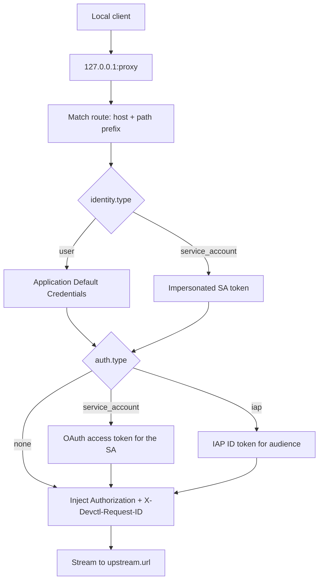

# Proxy

The local proxy injects authentication so services do not each implement Google/IAP logic. It runs **inside the supervisor**.

There is no implicit listen port. `proxy.listen.port` is **required** when `proxy.enabled` is true — `devctl config validate` and any load fail with `proxy.listen.port is required when proxy.enabled is true` (exit **2**). `devctl setup` writes `127.0.0.1:8080` as a starter; the demo uses `127.0.0.1:18080`. Binding to `0.0.0.0` or `::` is rejected.

`devctl proxy start`, TUI `n` on the proxy screen, and MCP `start_proxy` still refuse a `0` port even when the proxy is not enabled: same wording, CLI exit **7**.

```bash
devctl proxy start
devctl proxy status
devctl proxy stop
```

The TUI **proxy** tab (`p`) shows status, routes, and a live log of recent requests. `n` starts, `x` stops. SA email is shown when a route uses one.

Each request gets `X-Devctl-Request-ID` — propagated from the caller if it sent one, generated otherwise — and it's echoed back on the response so a caller can find its own request in the log below. Proxy logs never include `Authorization` headers. Bodies are streamed.

WebSocket upgrades use the same route matching, identity injection, middleware, request logging, and statistics as ordinary HTTP traffic (HMR and other upgraded connections behind a route). Active upgraded sockets are closed during proxy shutdown so `devctl down` cannot hang.

If `proxy.enabled` is true, `devctl start` also starts the proxy.

## Routes

```yaml
proxy:
  enabled: true
  listen:
    host: 127.0.0.1
    port: 8080
  routes:
    - name: invoices-api
      match:
        host: invoices-api.local
        path: ""
      upstream:
        url: http://127.0.0.1:18000
      auth:
        type: none          # none | iap | service_account
        identity: user      # or { type: service_account, service_account: email }
        # IAP only: audience is required. Optional client_id + client_secret
        # mint the ID token with that OAuth client instead of ADC's default.
        # client_secret may be a literal or ${NAME} / ${env.NAME}.
```

Match is host + optional path prefix.

### Per-service routes

Optional `proxy` on a service is one route fragment or a list. At load they append to the **same** global `proxy.routes` list with stable names (`<service>` or `<service>-<n>`). Duplicate names fail validation. Runtime stays one listener.

```yaml
services:
  api:
    command: python main.py
    proxy:
      - match:
          path: /api
        upstream:
          url: http://127.0.0.1:8000
```

## Expose — the proxy as a stable entry point

Instead of hand-writing a route, a service can be **exposed** through the proxy at a stable, logical address. The synthesized route addresses its target by service name, so the proxy resolves the service's **current** port at request time — a service that restarts on a different auto-assigned port is followed with no proxy reload and no consumer change.

```yaml
proxy:
  enabled: true              # expose requires an enabled proxy
  listen: { host: 127.0.0.1, port: 8080 }
services:
  invoices-api:
    command: python main.py
    ports: { http: 18000 }
    expose: true             # → route "invoices-api", match host invoices-api.local
```

`expose: true` matches host `<service>.local` and forwards to the service's `http` port. Exposure is host-based: the request path is forwarded verbatim, so a path prefix belongs on a hand-written route, not here. Use the object form to override the host or port:

```yaml
    expose:
      host: api.internal     # default: <service>.local
      port: grpc             # named port to forward to (default: http)
```

Set `proxy.gateway: true` to expose **every** HTTP-capable service (one with a port named `http`) at once — sugar over per-service `expose`. For selective exposure, leave `gateway` off and mark services individually.

A hand-written route or `proxy:` fragment of the same name always wins over a synthesized one, so you can override any auto route (for example to attach auth).

**Auth is always `none` on synthesized routes.** An internal service-to-service hop never silently acquires a service's identity token — injecting credentials stays an explicit choice you make with a hand-written route.

### Referencing an exposed service — `${services.<name>.url}`

`${services.<name>.url}` and `${services.<name>.host}` give a service a stable logical address in another service's environment:

```yaml
services:
  billing-console:
    environment:
      API_URL: ${services.invoices-api.url}
```

- **Direct** (target not exposed): resolves to `http://127.0.0.1:<port>` — a startup snapshot, like `${services.<name>.port}`.
- **Hub** (target exposed and proxy enabled): resolves to the proxy entry address, e.g. `http://invoices-api.local:8080`. This is stable — the consumer keeps working even when the target moves to a new port.

Host-based addressing means `<service>.local` must resolve to `127.0.0.1` on the machine (and inside any container) that makes the request — add it to `/etc/hosts` or your resolver.

## Token endpoint

Optional `GET /token` (`proxy.token_endpoint`) binds to loopback (never `0.0.0.0` or `::`), requires `X-Devctl-Internal-Token`, and only accepts loopback peers.

```json
{
  "access_token": "…",
  "token_type": "Bearer",
  "expires_at": "2026-08-30T00:05:00.000Z",
  "identity": "user"
}
```

Managed processes receive `DEVCTL_TOKEN_URL` (rewritten to the bound port after listen) and `DEVCTL_INTERNAL_TOKEN`, not raw tokens in the environment.

## Live request log

The proxy keeps the last 100 requests in memory — method, path, matched route (blank for a request that matched no route, still logged as a 404), identity key used, status, duration, and request id — and reports a running total/error count alongside them. This is part of the regular status snapshot, so it updates the same way everything else in the TUI does: the moment a request refreshes a token or hits a route, the **proxy** tab reflects it without pressing `r` or restarting anything.

Paths are redacted the same way response header values already are, since a query string can carry secrets. Nothing here is persisted — it's an in-memory ring buffer, reset on daemon restart.

## Request flow



A missing `identity.type` on an IAP route is a configuration error.

## Related

- [IAP](iap.md)
- [Impersonation](impersonation.md)
- [Security](security.md)
- [TUI](tui.md)
