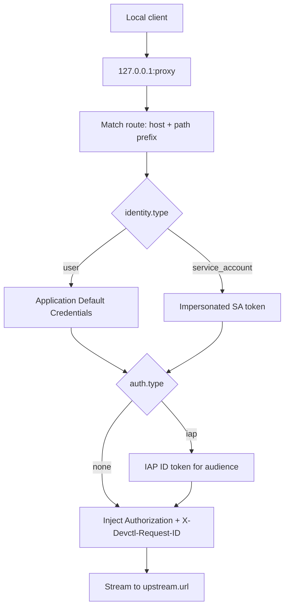

# Proxy

The local proxy injects authentication so services do not each implement Google/IAP logic. It runs **inside the supervisor**.

Default listen address when enabled: `127.0.0.1:8080`. Binding to `0.0.0.0` is rejected. The demo platform uses `127.0.0.1:18080`.

```bash
devctl proxy start
devctl proxy status
devctl proxy stop
```

The TUI **proxy** tab (`p`) shows status and routes. `n` starts, `x` stops. SA email is shown when a route uses one.

Each request gets `X-Devctl-Request-ID` (generated or propagated). Proxy logs never include `Authorization` headers. Bodies are streamed.

If `proxy.enabled` is true, `devctl start` also starts the proxy.

## Routes

```yaml
proxy:
  enabled: true
  listen:
    host: 127.0.0.1
    port: 8080
  routes:
    - name: invoices-api
      match:
        host: invoices-api.local
        path: ""
      upstream:
        url: http://127.0.0.1:18000
      auth:
        type: none          # none | iap
        identity: user      # or service_account + email
```

Match is host + optional path prefix.

### Per-service routes

Optional `proxy` on a service is one route fragment or a list. At load they append to the **same** global `proxy.routes` list with stable names (`<service>` or `<service>-<n>`). Duplicate names fail validation. Runtime stays one listener.

```yaml
services:
  api:
    command: python main.py
    proxy:
      - match:
          path: /api
        upstream:
          url: http://127.0.0.1:8000
```

## Token endpoint

Optional `GET /token` (`proxy.token_endpoint`) binds to `127.0.0.1` (never `0.0.0.0`), requires `X-Devctl-Internal-Token`, and only accepts loopback peers.

```json
{
  "access_token": "…",
  "token_type": "Bearer",
  "expires_at": "2026-08-30T00:05:00.000Z",
  "identity": "user"
}
```

Managed processes receive `DEVCTL_TOKEN_URL` (rewritten to the bound port after listen) and `DEVCTL_INTERNAL_TOKEN`, not raw tokens in the environment.

## Request flow



A missing `identity.type` on an IAP route is a configuration error.

## Related

- [IAP](iap.md)
- [Impersonation](impersonation.md)
- [Security](security.md)
- [TUI](tui.md)
