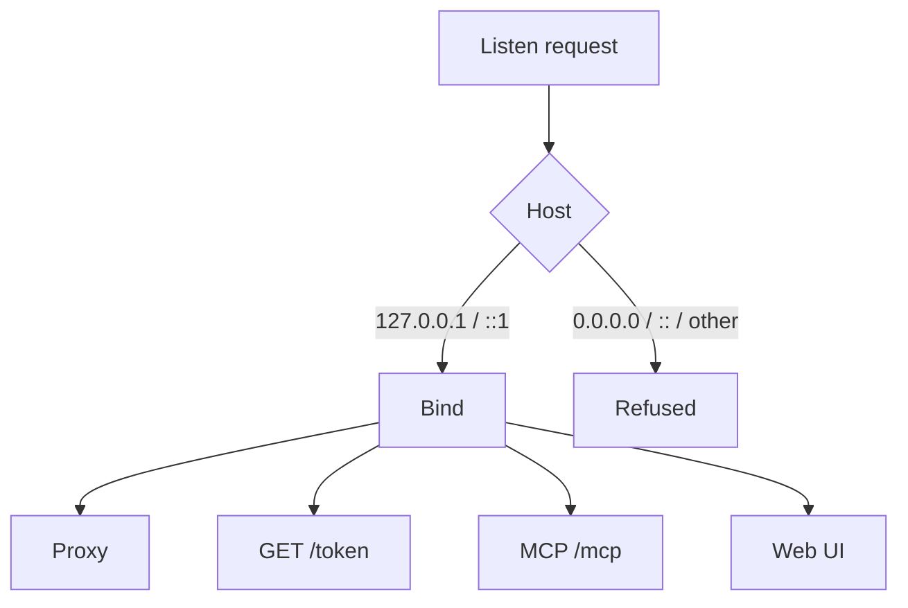
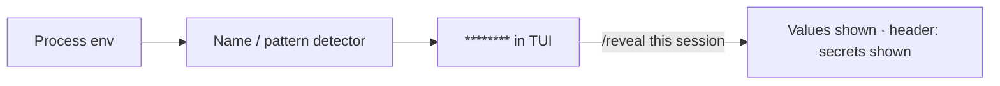
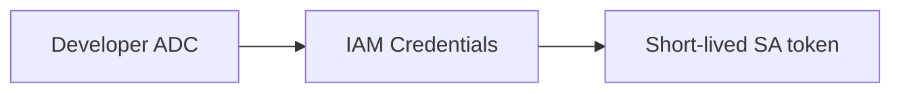

<div align="center">

# Security

**Loopback, redaction, no private keys.**

Tokens never sit in the TUI, logs, LLM inspector, traffic inspector, or MCP output. Listeners bind `127.0.0.1`. Service-account keys are never created.

<p>
  <a href="#what-we-guarantee"><strong>Guarantees</strong></a>
  ·
  <a href="#bind-rules">Bind rules</a>
  ·
  <a href="#secrets-and-reveal">Secrets</a>
  ·
  <a href="#identity">Identity</a>
  ·
  <a href="#on-disk">On disk</a>
  ·
  <a href="#disclaimer">Disclaimer</a>
</p>

</div>

---

## What we guarantee

| Rule | What you see |
|------|----------------|
| **No tokens on screen** | TUI, `devctl status`, and MCP tool results never print access tokens |
| **Redacted env** | Credential names (`password`, `secret`, `api_key`, `access_token`, `authorization`, `cookie`, …) and names containing TOKEN, SECRET, PASSWORD, … → `********`. Metadata such as `token_type`, `page_token`, `secret_name`, and `DEVCTL_TOKEN_URL` stays visible. A field named exactly `token` is masked only when the value looks like a credential |
| **Loopback only** | Proxy, token endpoint, and MCP refuse `0.0.0.0`, `::`, and other non-loopback binds. Managed containers publish ports on `127.0.0.1` and default to 1g RAM, 1 CPU, and 256 PIDs |
| **Argv by default** | Shell metacharacters fail validation unless `shell: true` |
| **No SA keys** | Impersonation uses IAM Credentials APIs, never a downloaded JSON key |
| **Config is not a secret store** | Working dirs join the repo root. Put secrets in `.devctl/secrets.env` (gitignored), overlays, keychain, Secret Manager, or a SOPS-encrypted file. `sops` decrypts that file in memory at daemon start and reload and does not write the plaintext. There is no `${secret:}` template syntax |

Extra redaction: `secrets.extra_markers` and `secrets.extra_patterns` in `.devctl`. Set `secrets.redact: false` to turn redaction off for newly captured logs, spans, traffic, LLM payloads, env output, and MCP results. Already stored `********` values are not restored, and with redaction off those secrets can be written to `~/.devctl/logs`. The default is `true`.

Free-text log lines strip credential-shaped `Bearer` tokens (not the next word of prose, and not `Bearer realm=`), JWT-shaped strings with three long segments (`eyJ…`), Google access tokens (`ya29.`), and `id_token=` / `access_token=` assignments. Objects and arrays are walked; a secret key masks its string value and does not blank the rest of the object. Numbers, booleans, and null stay. LLM inspector payloads (prompts, responses, attributes) and traffic inspector bodies use the same detector at ingest and again on MCP/web output. Traffic `data` is decoded before redaction so a base64/raw view cannot recover a secret the pretty `text` already masked. Response headers are forwarded to the client unchanged; redaction applies to stored inspector copies. LiteLLM keys stay in the environment (`auth.token_env`); never inline them in config. `X-Devctl-Service` is used only to label the local caller and is stripped before the proxy forwards to the vendor.

---

## Bind rules



Four listeners, same bind rule. The web UI also checks that `Host` is a loopback name (`127.0.0.0/8`, `localhost`, `::1`) — the port may differ, so WSL / Dev Container forwarding still works — and `POST /api/control` needs a loopback `http` or `https` Origin or Referer plus a session bearer token.

| Listener | Auth at the door |
|----------|------------------|
| **Proxy** | Route identity (user ADC or impersonated SA). Logs never include `Authorization` |
| **Token endpoint** | `X-Devctl-Internal-Token` + loopback peer. Query `identity`/`audience` must match a declared route or service identity. Google mints are rate-limited. Returns `access_token` to that caller |
| **MCP** | Off by default. Loopback `Host` (port may differ for WSL / Dev Container forwarding) + loopback peer, no CORS. Mutating tools need `Authorization: Bearer` (session token, 7-day TTL, `devctl mcp --rotate`). `exec_service` is off until opted in. Copied snippets include the token; `get_status` does not |
| **Web UI** | Off by default. Loopback Host (port may differ for WSL / Dev Container forwarding). Every `/api/*` route needs `Authorization: Bearer` (session token, 7-day TTL, `~/.devctl/state/<repoID>/web-token`; the SPA keeps it in localStorage after the first `#token=` visit) plus a loopback `http` or `https` `Origin`/`Referer` on `POST /api/control`. HTML is not framed. `get_status` does not include the token |

Host child processes always get `DEVCTL_INTERNAL_TOKEN`. They only get `DEVCTL_TOKEN_URL` when `proxy.token_endpoint.enabled` is turned on (off by default) — never a raw Google token in the environment. Containers get neither value: the loopback token endpoint is not reachable as container loopback, and embedding the internal token in inspectable container metadata would add exposure without providing access. With the token endpoint off, a service that needs its own Google credential (rather than relying on the proxy to inject one on inbound requests) must get it another way, e.g. its own ADC discovery.

---

## Secrets and `/reveal`



`/reveal` lasts for this TUI session only. The header says **secrets shown** so it cannot stay silent. It only unmasks **service environment** values (and `/diff` / `--print-env`). Log lines, LLM inspector payloads, and traffic inspector bodies are redacted at ingest; `/reveal` cannot restore them.

Redaction is the default everywhere a value is shown. For example, `devctl exec <service> --print-env` masks secret-like names before printing:


Proxy log lines include method, path, route, identity, status, duration — never the bearer header.

---

## Identity

User identity and service identity are never swapped. A route or service must declare which one to use. A user ADC token is not substituted for `service_account`.



Developers need `roles/iam.serviceAccountTokenCreator` on each target SA (group binding preferred). Doctor reports AVAILABLE / UNAVAILABLE. See [Impersonation](impersonation.md) and [Admin setup](admin-setup.md).

---

## Commands

String commands that contain `|`, `||`, `&&`, `;`, `>`, `>>`, `<`, or `&` fail `config validate` unless the service sets `shell: true`. Prefer argv lists:

```yaml
command: [python3, main.py]
shell: false
```

---

## On disk

Two checkouts do not share a lock. `repoID` is `sha256(canonical repo root)` (16 hex chars).

| Path | Mode / note |
|------|-------------|
| `~/.devctl/state/<repoID>/` | `state.json`, `devctl.lock`, `rpc-token`, `mcp-token`, `web-token`, and on Unix `devctl.sock`. Windows attach uses `\\.\pipe\devctl-<repoID>` plus the same `rpc-token`. MCP and web bearers last 7 days (mode `0600`) |
| leftover `~/.devctl/sessions/` | Migrated once |
| Stale lock from a dead PID | Replaced |
| `~/.devctl/credentials/` | Directory `0700`, files `0600` (Unix mode bits; Windows uses ACLs). OS keychain holds tokens; the file fallback stores metadata only (no access token). Cache keys are sanitized so they are valid filenames on Windows. Restart remints via ADC |
| `.devctl/config.local.yaml` | Gitignore-friendly overlay — still do not commit secrets |
| `.devctl/secrets.env` | Always-on dotenv file (gitignored). Weaker layer: `~/.devctl/secrets.env`. Process env still wins. Used for `${env.NAME}` in service env, HTTP recipes, and proxy routes (including `routes.yaml`). `devctl setup` writes `secrets.env.example` (keys only) and a `.gitignore` entry |

On Unix, the owner-only state directory restricts access to the supervisor RPC socket. On Windows the named pipe `\\.\pipe\devctl-<repoID>` cannot take a current-user DACL (Bun does not expose that API), so every RPC frame also carries a token from `~/.devctl/state/<repoID>/rpc-token` (mode `0600`, inside the user's profile). Connecting without that token is unauthorized. The file is never printed in status, logs, or MCP output.

Override the home directory with `DEVCTL_HOME`.

---

## Threat model (local)

`devctl` is a **localhost** orchestrator. It is not a multi-tenant server.

- Anyone who can reach your user account can reach `127.0.0.1` listeners.
- Supervisor RPC requires the per-checkout `rpc-token` (Unix socket mode `0700` plus the token; Windows named pipe plus the token).
- MCP is off until you flip it. Treat the copied bearer token like a session secret; it lasts 7 days or until `devctl mcp --rotate`.
- Web UI is off until you flip it. Treat the control token like a session secret; it lasts 7 days (file plus browser `localStorage`) after the first `#token=` visit.
- `/reveal` and log export write what you can already see on that machine.
- Doctor never enables Google APIs or grants IAM.

---

## Disclaimer

devctl is provided as-is. You use it at your own risk. It starts the processes in your configuration, reads the environment and secrets you point it at, and can mint cloud tokens or decrypt a SOPS file on your machine. You are responsible for that configuration, those credentials, and the commands it runs. The authors and contributors accept no liability for loss, damage, or unauthorized access that results from using it. See the [MIT license](../LICENSE).

## Related

| Page | Why |
|------|-----|
| [Authentication](authentication.md) | ADC, project source, `devctl auth` |
| [Impersonation](impersonation.md) | SA tokens without keys |
| [IAP](iap.md) | Audience + identity on each route |
| [Proxy](proxy.md) | Request flow and token endpoint |
| [MCP](mcp.md) | Loopback Streamable HTTP |
| [Environment](environment.md) | Source order, keychain, Secret Manager |
| [Security policy](../SECURITY.md) | How to report a vulnerability |
