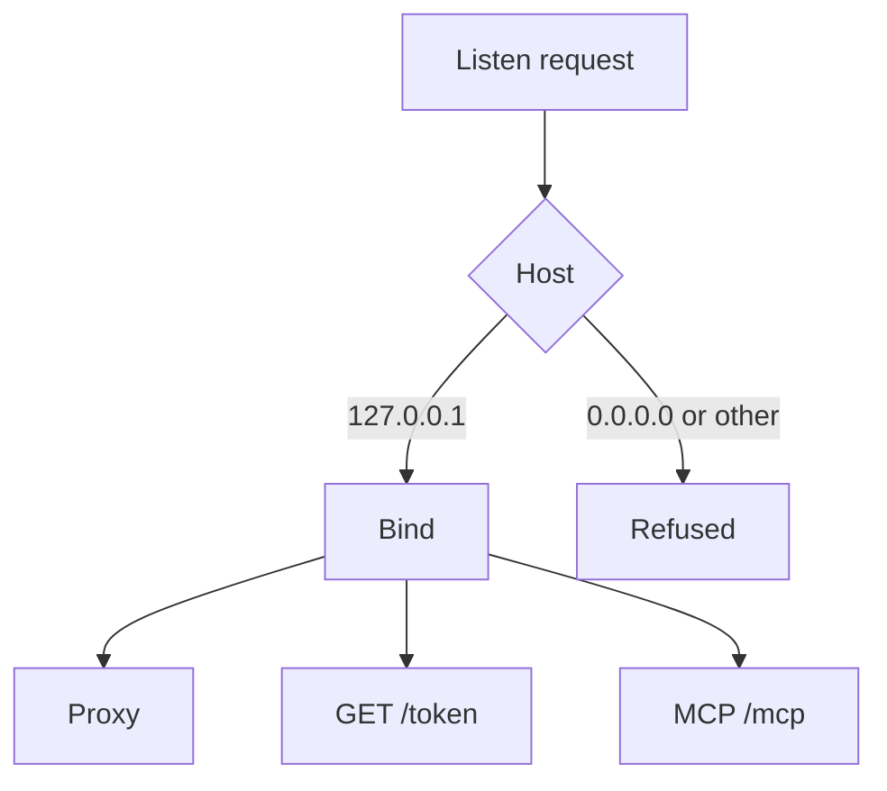
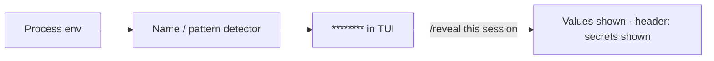
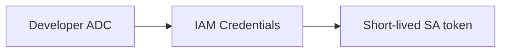

<div align="center">

# Security

**Loopback, redaction, no private keys.**

Tokens never sit in the TUI, logs, or MCP output. Listeners bind `127.0.0.1`. Service-account keys are never created.

<p>
  <a href="#what-we-guarantee"><strong>Guarantees</strong></a>
  ·
  <a href="#bind-rules">Bind rules</a>
  ·
  <a href="#secrets-and-reveal">Secrets</a>
  ·
  <a href="#identity">Identity</a>
  ·
  <a href="#on-disk">On disk</a>
</p>

</div>

---

## What we guarantee

| Rule | What you see |
|------|----------------|
| **No tokens on screen** | TUI, `devctl status`, and MCP tool results never print access tokens |
| **Redacted env** | Names matching PASSWORD, SECRET, TOKEN, PRIVATE_KEY, CLIENT_SECRET, API_KEY, CREDENTIAL, ACCESS_KEY, AUTH_KEY → `********` |
| **Loopback only** | Proxy, token endpoint, and MCP refuse `0.0.0.0` |
| **Argv by default** | Shell metacharacters fail validation unless `shell: true` |
| **No SA keys** | Impersonation uses IAM Credentials APIs, never a downloaded JSON key |
| **Config is not a secret store** | Working dirs join the repo root. Put secrets in overlays, keychain, or Secret Manager |

Extra redaction: `secrets.extra_markers` and `secrets.extra_patterns` in `.devctl`.

---

## Bind rules



Three listeners, same rule:

| Listener | Auth at the door |
|----------|------------------|
| **Proxy** | Route identity (user ADC or impersonated SA). Logs never include `Authorization` |
| **Token endpoint** | `X-Devctl-Internal-Token` + loopback peer only. Returns `access_token` to that caller |
| **MCP** | Off by default. Mutating tools need `Authorization: Bearer` (session token). Copied snippets include it; `get_status` does not |

Child processes get `DEVCTL_TOKEN_URL` and `DEVCTL_INTERNAL_TOKEN` — not a raw Google token in the environment.

---

## Secrets and `/reveal`



`/reveal` lasts for this TUI session only. The header says **secrets shown** so it cannot stay silent.

Proxy log lines include method, path, route, identity, status, duration — never the bearer header.

---

## Identity

User identity and service identity are never swapped. A route or service must declare which one to use. A user ADC token is not substituted for `service_account`.



Developers need `roles/iam.serviceAccountTokenCreator` on each target SA (group binding preferred). Doctor reports AVAILABLE / UNAVAILABLE. See [Impersonation](impersonation.md) and [Admin setup](admin-setup.md).

---

## Commands

String commands that contain `|`, `||`, `&&`, `;`, `>`, `>>`, `<`, or `&` fail `config validate` unless the service sets `shell: true`. Prefer argv lists:

```yaml
command: [python3, main.py]
shell: false
```

---

## On disk

Two checkouts do not share a lock. `repoID` is `sha256(repo root)` (16 hex chars).

| Path | Mode / note |
|------|-------------|
| `~/.devctl/state/<repoID>/` | `state.json`, `devctl.lock`, and on Unix `devctl.sock`. Windows attach uses `\\.\pipe\devctl-<repoID>` |
| leftover `~/.devctl/sessions/` | Migrated once |
| Stale lock from a dead PID | Replaced |
| `~/.devctl/credentials/` | Directory `0700`, files `0600` — used if the OS keychain is unavailable |
| `.devctl/config.local.yaml` | Gitignore-friendly overlay — still do not commit secrets |

Override the home directory with `DEVCTL_HOME`.

---

## Threat model (local)

`devctl` is a **localhost** orchestrator. It is not a multi-tenant server.

- Anyone who can reach your user account can reach `127.0.0.1` listeners.
- MCP is off until you flip it. Treat the copied bearer token like a session secret.
- `/reveal` and log export write what you can already see on that machine.
- Doctor never enables Google APIs or grants IAM.

---

## Related

| Page | Why |
|------|-----|
| [Authentication](authentication.md) | ADC, project source, `devctl auth` |
| [Impersonation](impersonation.md) | SA tokens without keys |
| [IAP](iap.md) | Audience + identity on each route |
| [Proxy](proxy.md) | Request flow and token endpoint |
| [MCP](mcp.md) | Loopback Streamable HTTP |
| [Environment](environment.md) | Source order, keychain, Secret Manager |
