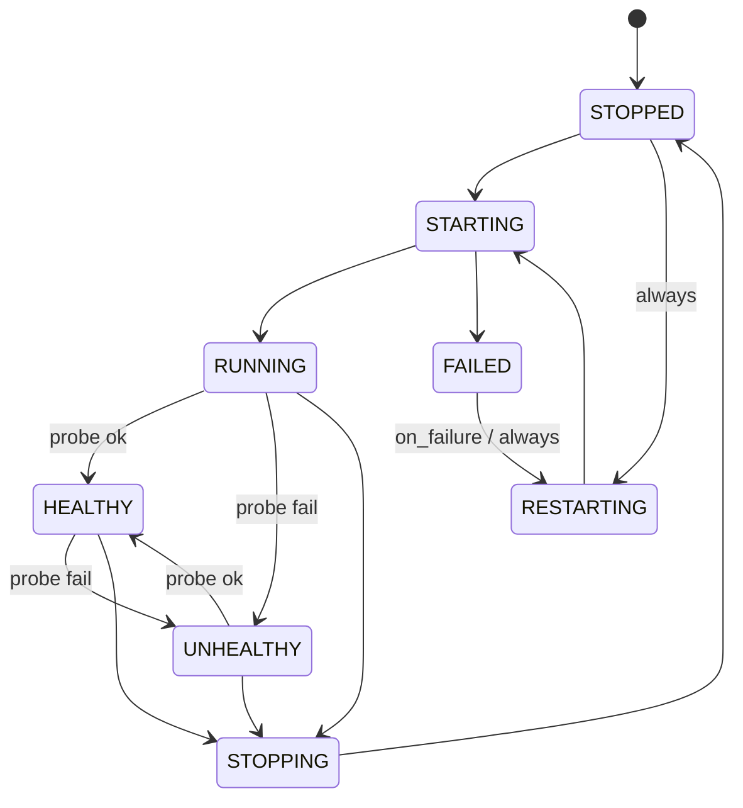

# Services

Services are configuration objects. `devctl` never hard-codes names, ports, or commands.

```yaml
services:
  api:
    description: Invoices API
    command: [python3, main.py]   # argv preferred
    shell: false                 # set true only when a shell is required
    working_dir: invoices-api    # relative to repository root
    dependencies: [identity]
    ports:
      http: 8000                 # or auto
    environment:
      AUTH_URL: http://127.0.0.1:${services.identity.ports.http}
      required: [AUTH_URL]
      defaults:
        LOG_LEVEL: INFO
    health:
      type: http                 # http | tcp | process | command
      url: http://127.0.0.1:8000/health
      interval_seconds: 2
      timeout_seconds: 1
      start_period_seconds: 10  # early failures remain STARTING
      unhealthy_threshold: 3   # consecutive failures before restart
      healthy_reset_threshold: 10 # healthy checks before retry budget resets
    identity:
      type: user                 # or service_account
    proxy:                       # optional; merged into the global proxy at load
      match: { path: /api }
      upstream: { url: http://127.0.0.1:8000 }
    restart:
      policy: on_failure         # never | on_failure | always
      max_retries: 3
      backoff_seconds: 2
    startup:
      wait_for_healthy: true
      timeout_seconds: 20
    capabilities: [local_http]
    logs:
      stdout: true
      stderr: true
    hooks:
      pre_start: [python3, migrate.py]
      post_start: [python3, warm_cache.py]
```

Working directories resolve from the repository root (the directory that contains `.devctl`), not the process cwd.

String commands that contain `|`, `||`, `&&`, `;`, `>`, `>>`, `<`, or `&` fail validation unless `shell: true`.

## Hooks and one-off tasks

`pre_start` runs to completion before an explicitly started service is spawned. A non-zero exit fails the service and prevents launch. `post_start` runs after a successful spawn; failure stops and marks the service failed. Hooks use the service's resolved environment, working directory, and `shell` setting. They do not run during automatic crash or health restarts.

Top-level tasks are transient commands: they are not retained as services and do not restart. Declared service dependencies are started first, and the task uses the same layered environment resolution as services.

```yaml
tasks:
  migrate:
    command: [python3, migrate.py]
    working_dir: invoices-api
    dependencies: [postgres]
    environment:
      MODE: development
```

Run one with `devctl run migrate`. Its exit code determines command success, and its stdout/stderr are also captured in supervisor logs under `task:migrate`.

Use `devctl exec api -- python3 check.py` to run an ad-hoc command in a service's same resolved context without starting it. `devctl exec api --print-env` inspects that context with secrets redacted by default.

## Container services

Set `container.image` to let devctl own a Docker or Podman container with the
same dependency, health, logging, restart, and shutdown lifecycle as a host
service. `runtime` defaults to Docker. A service `command`, when present,
overrides the image command.

```yaml
services:
  postgres:
    ports:
      db: 15432
    container:
      image: postgres:16
      runtime: docker
      ports:
        db: 5432       # service port name → port inside the container
      env:
        POSTGRES_PASSWORD: local
      volumes:
        - pgdata:/var/lib/postgresql/data
    health:
      type: tcp
      address: 127.0.0.1:15432
```

Container names are deterministic and scoped to the repository, allowing a
new devctl daemon to adopt containers left running by its predecessor. Secret
environment values are supplied through the runtime process environment and
are not placed in command-line arguments. Published ports bind to
`127.0.0.1` by default rather than every network interface. Containers do not
inherit the caller's entire shell environment; profile, dotenv, keychain,
secret-manager, defaults, explicit service/container variables, plugin sources,
and non-secret runtime metadata still apply. `devctl down` stops and removes
managed containers; container exit codes feed the normal restart policy.

## Lifecycle



The TUI and CLI display `HEALTHY` / `UNHEALTHY` when the process is running and the health probe has an answer.

Independent services in the same wave start and stop in parallel. Dependents wait. Cycles are configuration errors.

Dependencies accept either the original string form or a condition:

```yaml
dependencies:
  - identity
  - service: postgres
    condition: service_healthy
```

`service_started` is the default and allows the dependent to launch once its dependency process has spawned. `service_healthy` waits for the dependency's health check. A dependency using `service_healthy` must define a health check; startup fails on its normal startup timeout if it never becomes healthy.

## Start, stop, restart

Named start expands **up** the dependency graph (`startupPlan`): starting `invoices-worker` also starts `identity` and `invoices-api`, in that order.

> **Breaking change:** stop no longer mirrors start. `devctl stop x` stops `x` and everything that (transitively) **depends on** `x` — never `x`'s own dependencies, which other running services may still need (`shutdownPlan`). Previously, stopping a leaf also stopped the dependencies it had pulled in; that direction was backwards and is not preserved.


Stopping `identity` also stops `invoices-api` and `invoices-worker` (both depend on it, transitively). Stopping `invoices-api` also stops `invoices-worker`, but leaves `identity` running — it's `invoices-api`'s dependency, not its dependent. Empty `stop` stops every started service but leaves the daemon itself running.

`devctl restart x` restarts only `x` — never its dependents. Pass `--cascade` to also restart everything that depends on `x` (the same set a `stop x` would affect). Either way, a restarted service's own dependencies are started first if they aren't already running, exactly like a plain `start` would. Waves run left to right on start; stop and cascading restart run them right to left, restricted to whichever services are actually in scope.

A service's restart count (against `max_retries`) resets to zero on a manual `stop` or `start` — including the stop/start half of a `restart` a client asks for — and also forgives itself once the service has run healthily for long enough. Only an automatic, health-triggered restart preserves the count across its own stop/start cycle; that's what makes `max_retries` actually a limit instead of resetting itself every cycle.

`devctl start` with **no** profile and **no** service names starts the active session profile, or the first configured profile — the same contract as MCP `start_services`. Use `--profile` or explicit names. With no profiles, start fails closed.

Default TUI profile (empty dashboard `enter`) is the first profile name **alphabetically**.

## Health

| `type` | Probe |
|--------|--------|
| `http` | GET `url`; 2xx is healthy (default interval 2s, timeout 2s) |
| `tcp` | Connect to `address` or a named port |
| `command` | Run `health.command`; exit 0 is healthy |
| `process` or empty | PID still alive |

During `health.start_period_seconds`, failing probes leave the service in its startup state and do not contribute to restart streaks. Afterward, `health.unhealthy_threshold` consecutive failures trigger the configured restart policy (default 3). `health.healthy_reset_threshold` consecutive successes forgive prior restart attempts (default 10).

`devctl` watches `.devctl/` and offers reload. It does not restart a service when its source files change. Put `air`, `bun --watch`, or your language’s reloader in the service `command`.

A service a reload adds shows up immediately, stopped — not just once it's first started. One a reload removes is forgotten immediately if it was already stopped; if it's still running, it becomes **orphaned**: still visible and stoppable by name (`devctl stop <name>`), but no longer restartable or reachable by a cascade, since there's no configuration left to describe how. Stopping it drops it from status entirely. A reload that references a health or identity type nothing provides — a plugin type from a service just added or edited — is rejected outright, the same as an unparseable config file, and the daemon keeps running on its last-known-good configuration.

Plugins can register extra health types. `capabilities` document intent (`local_http`, `google`, `iap`, …) for doctor; they do not start processes.

## Related

- [Profiles](profiles.md)
- [Environment](environment.md)
- [Configuration](configuration.md)
- [Logs](logs.md)
