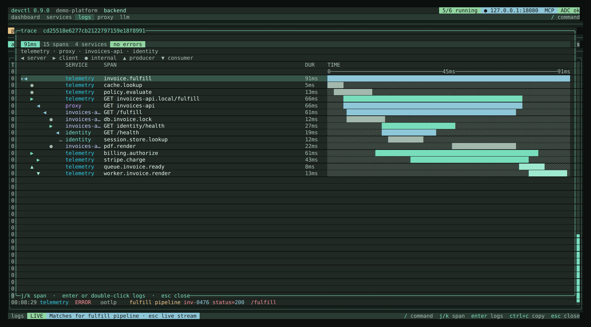

# Telemetry

devctl models logs, and now **traces**, on the OpenTelemetry data model, and can
receive OTLP directly. This gives every log a structured shape, correlates a
request across the proxy and your services, and lets a coding agent debug the
running stack over MCP instead of grepping text. It is local-first: the receiver
binds loopback only and is **off by default**.

## The record model

Every log is an OpenTelemetry-style record, not a flat string:

- **body** — the message; a string, or a structured object when the source emits one.
- **attributes** — the structured fields, preserved as key/values (never flattened away).
- **severityNumber** (1–24) + **severityText** — the level; filtering and coloring use the number.
- **traceId / spanId** — set when the line carries them, so a log joins its trace.
- **resource** — `service.name` (the devctl service) plus `process.pid` and any OTLP resource attributes.

Two ingestion lanes feed one model:

- **stdout / stderr (best-effort).** Plain text becomes the body; JSON from pino,
  bunyan, zap, logrus, structlog, ECS, GELF, or an OTLP-shaped line is mapped
  into body + attributes + severity + ids. Python `str(dict)` / `repr(mapping)`
  lines (`{'key': 'value', ...}`) are parsed the same way. A leading timestamp
  or log prefix before the object is stripped and retried. An unrecognized
  object is kept as structured data and shown as a `key=value` summary — never
  as raw braces.
- **OTLP (lossless).** Anything sent to the receiver maps 1:1.

In the TUI, `enter` on a log opens the details overlay: the body, an
**attributes table**, the severity, and `traceId`/`spanId`. See [Logs](logs.md).

## OTLP receiver

An opt-in loopback endpoint that accepts **OTLP/HTTP** logs and traces, as
JSON or protobuf. It is off until you enable it, and rejects any non-loopback bind (both
at `devctl config validate` and at listen time).

```yaml
telemetry:
  otlp:
    enabled: true                 # default: false
    listen:
      host: 127.0.0.1             # loopback only; 0.0.0.0 / :: are rejected
      port: 4318                  # default 4318 (standard OTLP/HTTP)
```

It serves `POST /v1/logs` and `POST /v1/traces`; other methods and paths are
rejected. The body may be `Content-Type: application/json` (OTLP/JSON, also
assumed when the header is missing) or `application/x-protobuf`
(`Export*ServiceRequest`), optionally with `Content-Encoding: gzip`
(`OTEL_EXPORTER_OTLP_COMPRESSION=gzip`). A protobuf request gets a protobuf
response. Any other content type or encoding gets `415` naming the accepted
ones; a body that does not decode gets `400`; a body over 4 MiB, before or
after decompression, gets `413`. Its port must differ from the proxy, token-endpoint, and
any gRPC route port — a collision is reported at config-validation time.

When the receiver is enabled, devctl injects the standard exporter variables
into every managed **host process** (not containers, whose loopback is
isolated), and never overrides one you set yourself:

```
OTEL_EXPORTER_OTLP_ENDPOINT   http://127.0.0.1:<port>
OTEL_EXPORTER_OTLP_PROTOCOL   http/json
OTEL_SERVICE_NAME             <service>
```

So a service instrumented with an OpenTelemetry SDK exports to devctl with no
per-service configuration. That includes exporters that send protobuf whatever
`OTEL_EXPORTER_OTLP_PROTOCOL` says, such as Python's
`opentelemetry-exporter-otlp-proto-http`. OTLP over gRPC (port 4317) and
`/v1/metrics` are not served.

## Traces and correlation

devctl's own signals are telemetry too. The proxy emits one **span per request**
(method, route, status, duration, identity), and propagates a `traceparent` plus
`X-Devctl-Request-ID` to the upstream — so a service's own spans and logs share
the request's trace. A `traceparent` on an incoming request is honored; a bare
request-id header is **not** adopted as the trace id, so unrelated requests are
never merged into one trace.

View a trace three ways:

- **TUI** — a ◎ marker on a log row means it has a trace; `enter` (or **view
  trace**) opens a full-width waterfall. `j`/`k` selects a span; Enter opens that
  span's logs.
- **CLI** — `devctl logs --trace <id>` prints the span tree plus the correlated
  logs; add `--json` for JSONL. See [CLI](cli.md).
- **Web UI** — an opt-in loopback explorer (below) with a waterfall, correlated
  logs, dependency graph, and rate/latency charts.


The same trace in the TUI: a ◎ marker on a log row opens a full-width waterfall; `j`/`k` selects a span and `enter` opens that span's logs.



## Web UI

The [Web console](web.md) provides service controls, a dependency graph, structured logs, and a trace waterfall for the same supervisor session. It is off by default. Start it and print the access link with:

```bash
devctl web start --print-url
```

Open the printed link to authorize lifecycle controls. The browser keeps that token after the first visit (7-day TTL). Plain `devctl web start` prints only the origin, without the control token. See the [web console guide](web.md) for persistent configuration, screenshots, access details, and troubleshooting.

## Redaction

Records and spans are redacted at **ingestion**, before anything is stored,
persisted, or served — the walk recurses into nested body/attributes, span
events, and status messages, using the same markers as the rest of devctl (add
your own under `secrets`). MCP output redacts again on top. So OTLP-received or
structured stdout data cannot carry a secret into the TUI, CLI, MCP, or the
on-disk log files. See [Security](security.md).

## Debugging with an agent (MCP)

The model is what makes "debug, don't grep" possible over [MCP](mcp.md):

- `get_logs` — filter by `trace_id`, `request_id`, or an `attribute` key/value, and receive body + attributes + severity.
- `get_trace <trace_id>` / `trace_request <request_id>` — the span tree plus the correlated logs.
- `get_requests` — the proxy's recent requests (with ids), and `recent_errors` — the latest error/fatal records.
- `get_llm_calls` / `get_llm_call` — LLM traffic from configured sources (LiteLLM spend logs first). Each call includes `caller` when the originating service is known. See [LLM inspector](llm.md).
- `get_traffic_calls` / `get_traffic_call` — HTTP and gRPC hops captured on `inspect.enabled` proxy routes. List pages omit bodies. See [Proxy](proxy.md#inspect-bodies).

An agent can ask "why did this request fail", resolve the request id to its
trace, and read the responsible service's span and logs — all redacted.

## Notes

- `*UnixNano` timestamps are held as JS numbers, so precision is **millisecond**
  granular (fine for display, ordering, and durations ≥ ~1 ms); do not rely on
  exact-nanosecond equality.
- No new runtime dependency: the OTLP/JSON and protobuf decode and the model
  are built in.

## Related

- [Logs](logs.md)
- [MCP](mcp.md)
- [Proxy](proxy.md)
- [Configuration](configuration.md)
- [Security](security.md)
