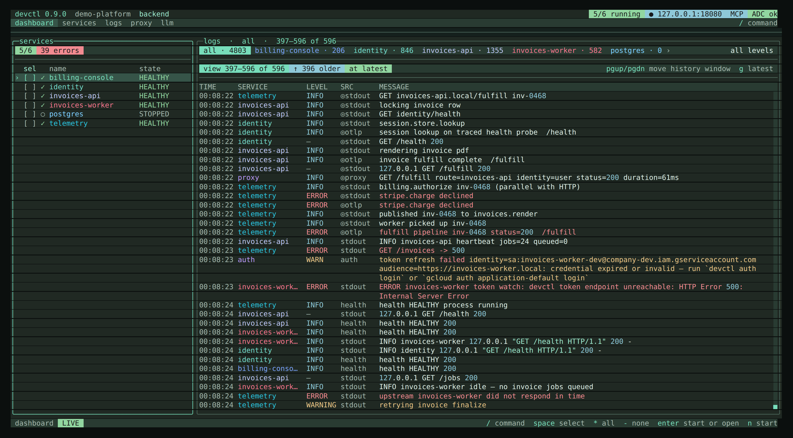
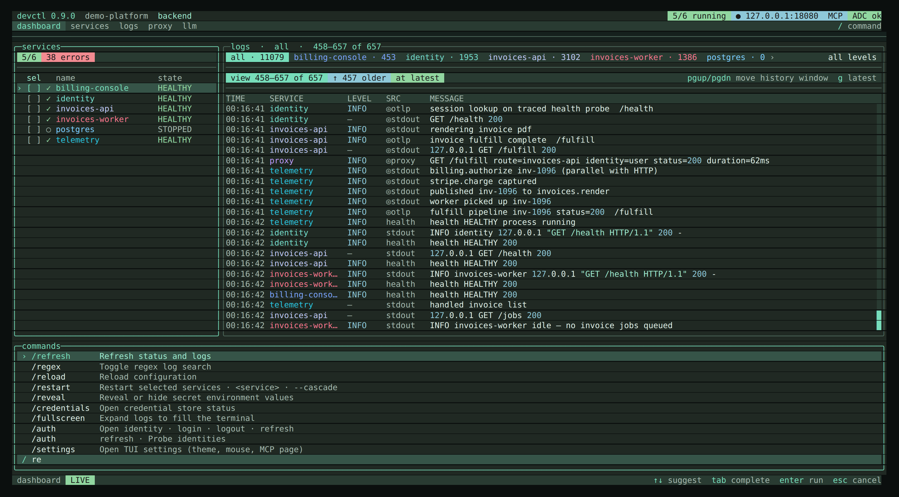
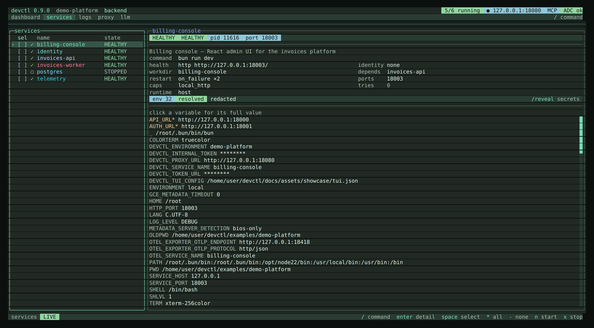
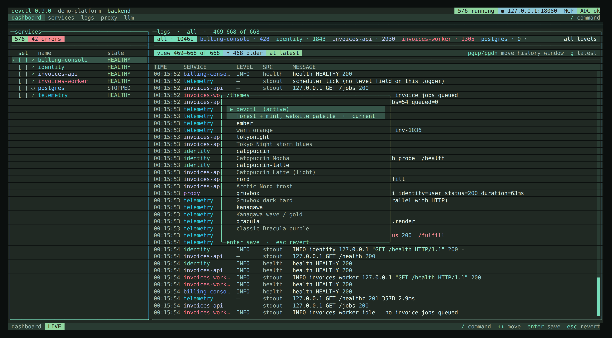

# TUI

The TUI is [OpenTUI](https://opentui.com/docs/) (`@opentui/core` + `@opentui/react`). It attaches to the supervisor and never owns child processes.

```bash
cd examples/demo-platform
npx @amr-m-abdelgawad/devctl@latest
```

From a source checkout (`bun` on PATH):

```bash
cd examples/demo-platform
bun run ../../app/src/bin.ts
```

If a supervisor session already exists, the TUI attaches to it. Preferences: `tui.json` / `DEVCTL_TUI_CONFIG` — see [Building from source](typescript.md).



## First run

With no `.devctl` configuration the TUI opens **setup**: “No configuration found. Would you like to run setup? **[Enter] Setup [Esc] Exit**”. Enter starts the same 9-step wizard as `devctl setup` (OpenTUI fields, then write and attach the daemon — no process restart). Invalid existing YAML still refuses overwrite.

If a `.devctl/config.yaml` exists but fails to parse or validate, the TUI shows **Configuration error** with the actual error instead — pressing Enter here does not run setup, since that would silently overwrite the file the error is about. Fix the file and restart devctl, or run `devctl config validate` for the same error from the CLI.

When services exist but none are running, the dashboard empty state:

- `enter` starts the default profile (first profile name alphabetically) after a plan overlay
- `n` / `x` start or stop the highlighted row (or the space-selected set)
- a **lifecycle panel** shows start and stop waves; later start waves wait for health and do not run if a wave fails
- the panel stays open until `esc` so you can read the result
- `o` picks a profile, then confirms start

## Quit

`q` / `/exit` / `esc` twice:

| `shutdown.stop_services_on_exit` | Behavior |
|----------------------------------|----------|
| `true` | Stop managed services and leave |
| `false` | Detach immediately |
| unset | Confirm: `enter` stops services, `d` detaches (daemon stays), `k` stops the daemon and leaves services (`devctl down --keep-services`), `esc` stays |

**Detach** (`d`) leaves the supervisor running. **`/down --keep-services`** (or quit `k`) stops the supervisor and persists PIDs so a later start can adopt them. **`/down`** stops services and the supervisor. `/stop` only stops selected services.

## Interaction model

Keyboard-first. Chords use **command** on macOS and **ctrl** on Linux and Windows. Help, the status bar, and empty-state hints label the modifier for the OS you are on.

| Input | What it does |
|-------|----------------|
| `/` | Command overlay — ranked as you type (name, alias, fuzzy, then description). `/start api` still lists `start`. `↑`/`↓` to move, `enter` to run |
| `command+p` / `ctrl+p` | Same command overlay as `/` |
| `command+x` / `ctrl+x` | Leader key (2s), then a shortcut — keymap overlay |
| `?` | Grouped help — `j`/`k` scroll when the list is taller than the terminal |
| `tab` / `shift+tab` / `1`–`5` | Cycle or jump the **five nav tabs**. Other screens are `/auth`, `/credentials`, `/doctor`, `/config`, `/profiles`, `/setup`, `/stats`, `/topology`, `/tokens`, `/settings`, `/mcp`. On a secondary screen, `tab` returns to the dashboard. When the strip is wider than the terminal it slides (`‹` `›`). |
| `s` `l` `a` `p` `d` `c` `u` | Direct letter nav when no overlay owns keys (services, logs, identity, proxy, doctor, config, setup) |
| `r` | Refresh snapshot (doctor `r` re-runs checks; LLM `r` toggles conversation / raw JSON) |
| `R` | Restart selected services |
| `j` `k` / arrows | Move selection |
| `enter` | Start (empty dashboard) or open service detail |
| `space` | Multi-select a service |
| `esc` | Back / close overlay. Twice (when nothing else is open) asks to quit |
| `f` | **Logs tab only.** Focus log search. `esc` closes search and returns to the live stream; `enter` keeps the filter (`esc` again clears it). Remap with `keybinds.search` |
| `z` | Expand logs to fill the terminal. `z` or `esc` exits |
| `w` | Cycle log wrap: wrap every line (default), clip with ellipsis, or unwrap only the selected row |
| `command+c` / `ctrl+c` | Copy the highlighted selection (drag with the mouse). Remap with `keybinds.copy` |
| `command+=` / `ctrl+=` (and `-` / `0`) | Display size (padding/row height, not the terminal font) |
| `esc` `esc` | Twice to quit when no overlay or back target is open. The OS copy chord does not quit |
| Mouse | Click nav, click a service, scroll logs (toggle in Settings) |

The status bar only lists keys that work **on the current screen**. There is no idle command row — `/` and the OS palette chord open the command overlay.



## Nav tabs (5)

1. dashboard · 2. services · 3. logs · 4. proxy · 5. llm

Everything else is a slash command (or a letter jump): `/auth`, `/credentials`, `/doctor`, `/config`, `/profiles`, `/setup`, `/stats`, `/topology`, `/tokens`, `/settings`. **MCP** is `/mcp`, `/agent`, or Settings → **MCP → Settings page**.

## Screens



- **Dashboard** — services, proxy, live log tail. Identity lives on `/auth`; ADC status is in the header. When nothing is running, a **last session** panel shows leftover PIDs from the previous supervisor (same data `devctl status` prints when the socket is down)
- **Services** — list plus a live inspector: status chips, two-column facts, then a scrollable **resolved** env table (key column + clipped value; dotenv, profile, secrets, plugins, runtime ports). Click a row for the full value. Narrow terminals stack the panes. `enter` opens the full detail screen
- **Service detail** — same inspector; env pane is focused so `j`/`k` scroll. `/reveal` shows secrets. `n`/`x`/`R`/`l`
- **Logs** — ANSI color codes are stripped so wrap uses visible width; messages wrap to the pane with OpenTUI word wrap. `w` cycles wrap all / clip / wrap selected. `\\` / `/split` opens a second pane on the same live stream (independent service filter, shared search). `/trace <id>` or Enter on a log details request id jumps search to that id. See [Logs](logs.md)
- **Identity** — user, project, source, ADC, gcloud, configured SAs, impersonation AVAILABLE/UNAVAILABLE, IAP (no tokens). `/auth login` suspends the TUI, runs `gcloud auth application-default login` on the real terminal, then restores the TUI. `/auth logout` revokes ADC without leaving the screen
- **Credentials** — store backend and entry names only. Tokens stay in the OS keychain or `~/.devctl/credentials`
- **Proxy** — status + routes (match and upstream wrap instead of clipping); request paths wrap in the live feed. **REQ** is the full request when a trace exists; **HOP** is the proxy hop (same split as the web UI). Click a route for full details. `n` start / `x` stop. If `proxy.listen.port` is missing, the screen says so and `n` reports the bind error in the status bar instead of crashing
- **LLM** — list of recent calls (time, status, caller, model, latency, tokens) with a live inspector for the selected row: status chips, caller / via, and a conversation transcript when the body is chat-shaped (otherwise JSON). `r` (or the conversation/json chip) switches the inspector and overlay between the transcript and the raw request/response JSON. Click selects; click again or `enter` opens the full overlay (payload, attributes; `enter` again jumps to a trace when one is present). `/caller` filters. Usage counts are not secrets. `/reveal` does not unmask LLM payloads — those are redacted at ingest. See [LLM inspector](llm.md)
- **Doctor** — re-runs on every visit; ✓ / ! / ✗ with hints. `enter` on a busy host port asks to stop that process; it never offers to kill the Docker or Podman daemon. `r` reruns
- **Config** — merged view including **tasks**. `v` / `/buffer` opens a validate/save overlay on `cfg.configPath` (invalid YAML is not written; `esc` discards). `e` / `/edit` still opens `$EDITOR` / `DEVCTL_EDITOR`. `/diff` shows provenance (`devctl config diff`). `/reload` re-reads after an external edit
- **Profiles** — members; `enter` selects and offers start
- **Setup** — onboarding checklist. First-run with no config still opens here
- **Settings** — grouped prefs: theme, display size, mouse, leader timeout, **MCP settings page**, about, reset. `←`/`→` writes the highlighted cycle or toggles mouse. Reset asks before restoring defaults. Saves to `~/.devctl/tui.json` unless `DEVCTL_TUI_CONFIG` is set
- **MCP** — Listen `[ ON ]` / `[ OFF ]`, port stepper `‹ N ›`, per-agent **Copy JSON** / **Copy TOML**, and a **Tools** list grouped by purpose (inspect, logs, diagnostics, control, setup) with each tool marked `read` or `write`; `space` enables or disables the highlighted one, all on by default. Off by default. See [MCP](mcp.md)

`/reveal` toggles secret env values for this session only. The header shows `secrets shown`. It does not restore log lines or LLM request/response bodies; those are redacted when stored.

## Slash commands

`/` and `command+p` / `ctrl+p` open the same overlay. Each row already shows a one-line description in the TUI; this table is that catalog for reading without the TUI (and for MCP `search_docs`). Grouping matches the overlay.

### Services

| Command | Aliases | What it does |
|---------|---------|--------------|
| `/start [service…]` | `/up` | Start selected services or the current profile |
| `/stop [service…]` | | Stop selected services |
| `/restart [service…]` | | Restart selected services |
| `/restart --cascade` | `-c` | Restart selected services and their dependents |
| `/run [task]` | `/task` | Run a one-off task; empty /run opens a picker |
| `/exec [service]` | | Run a command in a service context; empty /exec opens a picker |
| `/env [service]` | | Switch a service's named environment overlay |

`/start` with no names starts the current profile. `/restart` without `--cascade` restarts only the named services; `R` when dependents exist asks: Enter = named, `c` = cascade. Task output lands in Logs under `task:<name>`. `/exec <service> -- <command…>` runs once in that service's resolved environment (even if it is stopped). Empty `/exec` opens a service picker, then you type the command. `/exec <service> --print-env [--reveal]` shows the same resolved map (dotenv, profile, secrets, plugins, ports), not config-only `vars`/`defaults`. `/env` (or `e` on the dashboard, services, or detail screens) opens a per-service overlay picker when that service defines `environments`. `/env <service> <name>` selects immediately. Switching a running process whose overlay would change asks first: Enter switches for the next start, `r` switches and restarts now. The inspector chip shows `env deployed · restart` until the process is restarted; the service list env column uses warning color for the same pending state. Other services keep their own selection.

### Navigation

| Command | Aliases | What it does |
|---------|---------|--------------|
| `/services` | `/s` | Open the services screen |
| `/logs` | `/l` | Open the log viewer |
| `/auth` | `/identity`, `/a` | Open identity |
| `/auth login` | | Run gcloud ADC login |
| `/auth logout` | | Revoke application-default credentials |
| `/auth refresh` | | Probe identities |
| `/credentials` | `/creds` | Open credential store status |
| `/proxy` | `/p` | Open the proxy screen |
| `/llm` | | Open the LLM inspector |
| `/caller <service>` | | Filter LLM calls by originating service (- for none, empty clears) |
| `/mcp` | `/agent` | Open the MCP server screen for coding agents |
| `/doctor` | `/d` | Run environment diagnostics |
| `/stats` | `/metrics` | View system and service statistics |
| `/topology` | `/graph` | View the service dependency graph |
| `/tokens` | `/token-log`, `/authlog` | View the token mint and refresh timeline |
| `/config` | `/c` | View merged configuration |
| `/profiles` | `/o` | Select a development profile |
| `/setup` | `/init` | Open setup guidance |
| `/dashboard` | `/home` | Return to the dashboard |

`/stats` includes sparklines when the supervisor has samples — a **Trends** section with per-service CPU and RAM history, and a **Proxy routes** section with per-route hop latency (p50/p95/p99) and error counts over the recent-request window. `/topology` (or `g`) draws the dependency graph as startup waves — nodes coloured by health, with an inspector showing what a selected service depends on and what depends on it. `/tokens` is the auth timeline: token mint, refresh, and identity-change events over the session, keyed by identity and audience (never by request, and never showing the token itself).

### Logs

| Command | Aliases | What it does |
|---------|---------|--------------|
| `/regex` | | Toggle regex log search |
| `/since <timestamp>` | | Filter logs after an ISO timestamp |
| `/until <timestamp>` | | Filter logs before an ISO timestamp |
| `/history [session]` | | Load a persisted log session |
| `/pause` | | Pause or resume live logs |
| `/fullscreen` | `/zen`, `/expand` | Expand logs to fill the terminal |
| `/split` | | Split the logs screen into two service panes |
| `/trace <id>` | | Search logs for a request or trace id |
| `/filter` | | Toggle ERROR+ log filter |
| `/system` | `/internal` | Show or hide internal auth/mcp/devctl/proxy logs |
| `/wrap` | | Cycle log wrap: all lines, clip, or selected row |
| `/export [path]` | | Write filtered logs to ~/.devctl/exports |
| `/exports` | `/open-exports` | Open the log export folder |
| `/clear` | `/new` | Clear the on-screen log buffer |

`/split` is also `\\`; `|` focuses the other pane. `/trace` sets log search to a `request_id` / `trace_id`. `/export` without a path writes under `~/.devctl/exports`. `/clear` only clears this TUI's on-screen view, not the daemon's shared log buffer.

### UI

| Command | Aliases | What it does |
|---------|---------|--------------|
| `/reload` | | Reload configuration |
| `/import` | | Preview or write a Compose mapping |
| `/import compose [path] [--write]` | | Preview a Compose mapping; add --write to save |
| `/diff` | `/provenance` | Show winning config sources and what they shadowed |
| `/themes [name]` | `/theme` | List available themes |
| `/settings` | `/prefs`, `/preferences` | Open TUI settings (theme, mouse, MCP page) |
| `/help` | `/?` | Show the help dialog |
| `/refresh` | | Refresh status and logs |
| `/edit` | | Open configuration in $EDITOR |
| `/buffer` | | Edit configuration in a validate/save buffer |
| `/reveal` | | Reveal or hide secret environment values (not log or LLM payloads) |
| `/copy` | | Copy the highlighted selection to the clipboard |

`/reload` re-reads `.devctl`. `/diff` is the same provenance view as `devctl config diff`. `/themes` opens a picker with live preview; Enter saves to `~/.devctl/tui.json`.

### App

| Command | Aliases | What it does |
|---------|---------|--------------|
| `/daemon` | `/bootstrap` | Show supervisor bootstrap logs (same file as devctl daemon logs) |
| `/update` | | Install a newer GitHub Release when the install method is known |
| `/notify` | `/notice`, `/notifications` | Hide or dismiss the current notice |
| `/notify later` | | Hide this notice until the next session |
| `/notify dismiss` | | Do not remind me about this version again |
| `/version` | `/v` | Show the current devctl version |
| `/down` | | Stop the supervisor |
| `/down --keep-services` | | Stop the supervisor and leave processes running |
| `/exit` | `/quit`, `/q` | Exit (detach or stop services) |

`/down` is not an alias of `/stop`. `/down` stops services and the supervisor unless `--keep-services` is set. `/version` shows the current version, then runs the same update check as `/update` without installing. `/update` installs when the method is known (npm or Homebrew).

## Leader key

Default leader is `command+x` on macOS and `ctrl+x` elsewhere (2 second timeout). Then:

```text
n start    x stop    R restart (c cascade if dependents)    s services    l logs
a auth     p proxy   d doctor     c config      o profiles     g topology
t themes   e env     r refresh    i setup       h dashboard
q quit     z fullscreen
```

Override in `tui.json` (`keybinds`) or `DEVCTL_TUI_CONFIG`.

## Layout

- **Header** — product + version as text, then project and profile; chips for running count, live proxy, MCP when on, ADC, secrets-shown, and `↑ <latest>` when a newer GitHub Release exists
- **Notice bar** — a one-line, non-modal banner when an update is available (`Update` / `Later` / `Dismiss`). `/notify later` hides it until the next session; `/notify dismiss` writes `dismissed_notifications` to `tui.json` so that version does not return
- **Nav** — the five primary tabs; the active tab is highlighted, not filled
- **Body** — dashboard or a focused screen
- **Command overlay** — `/` and `command+p` / `ctrl+p` open the same grouped list with a real OpenTUI input
- **Status bar** — live/paused, last human result, contextual keys

Status is never color-only: `✓` healthy, `●` running, `!` warning, `✗` failed, `○` stopped.

## Themes

`/themes` opens a picker with live preview. Built-ins:



- Product: `devctl` (default), `ember`
- Common dark: `tokyonight`, `catppuccin`, `nord`, `gruvbox`, `kanagawa`, `dracula`, `onedark`, `monokai`, `rose-pine`, `everforest`, `github-dark`, `iceberg`, `ayu-dark`, `oxocarbon`, `night-owl`
- Light: `catppuccin-latte`, `solarized-light`
- Other: `solarized-dark`, `terminal` (black + VGA ANSI chrome; aliases `ansi`, `xterm`, `console`), `system` (follows macOS `AppleInterfaceStyle` / `COLORFGBG`; light uses Solarized Light)

Aliases: `mocha` → Catppuccin Mocha, `latte`, `one-dark`, `solarized` (dark), `rosepine`, `github`, `ayu`, `night owl`.

MCP agent chips use brand colors (Claude terracotta, Cursor blue, Kilo gold, Codex green) with light/dark variants.

## Related

- [Logs](logs.md)
- [MCP](mcp.md)
- [Building from source](typescript.md)
- [CLI](cli.md)
- [Telemetry](telemetry.md)
