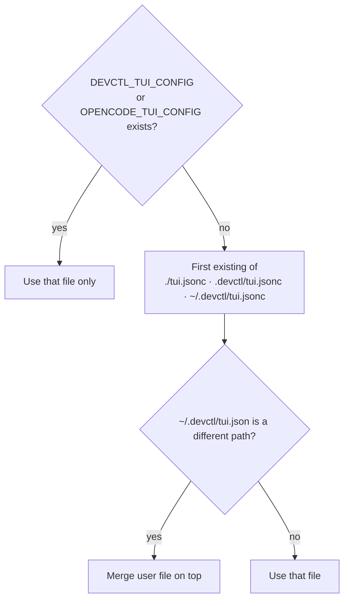

# Building from source

The application lives in `app/`. Runtime is [Bun](https://bun.sh). The TUI is [OpenTUI](https://opentui.com/docs/).

```bash
export PATH="$HOME/.bun/bin:$PATH"
cd app
bun install
bun run src/bin.ts --help
bun test
bunx tsc --noEmit
```

From the repository root (after `bun install` in `app/`):

```bash
bun run app/src/bin.ts
cd app && bun link    # optional: `devctl` on PATH
```

## Layout

| Path | Role |
|------|------|
| `app/src/bin.ts` | Entry |
| `app/src/bootstrap/` | Composition roots (daemon + client) |
| `app/src/presentation/cli/` | Commander CLI |
| `app/src/presentation/tui/` | OpenTUI screens and overlays |
| `app/src/presentation/mcp/` | Streamable HTTP MCP server |
| `app/src/domain/` | Service, identity, config types |
| `app/src/adapters/config/` | Discover, decode, merge, validate |
| `app/src/adapters/process/` | Host process runtime |
| `app/src/adapters/google/` | Google / IAP / tokens |
| `app/src/adapters/daemon/supervisor.ts` | Daemon host (socket, recovery, watch, listeners) |
| `app/src/adapters/rpc/controller.ts` | Local supervisor or socket / named-pipe client |
| `app/tui.json` | Starter TUI preferences |

Layer rules: [architecture.md](architecture.md). Check with `bun run check:architecture`.

There is no separate Go tree.

## TUI preferences

Configuration is **`tui.json` or `tui.jsonc`**: `theme`, `keybinds`, `leader_timeout`, `font_size`, `mouse`, `scroll_speed`, `log_timestamps`, `log_metadata`, `mcp_enabled`, `mcp_port`, `mcp_disabled_tools`.

`mcp_disabled_tools` is a deny-list of MCP tool names (empty means every tool is available). See [MCP](mcp.md).

Search order:



Settings writes go to `~/.devctl/tui.json` unless the env override is set (then changes apply for this session only).

`keybinds` merge with the built-in defaults, so you only override what you change.

```json
{
  "theme": "devctl",
  "leader_timeout": 2000,
  "keybinds": {
    "leader": "ctrl+x",
    "command_list": "ctrl+p"
  },
  "mouse": true,
  "mcp_enabled": false,
  "mcp_disabled_tools": []
}
```

## Tests

```bash
cd app && bun test
```

Integration tests that need Google stay skipped unless credentials are present.

## Related

- [Installation](installation.md)
- [TUI](tui.md)
- [How it fits together](overview.md)
- [Contributing](../CONTRIBUTING.md)
