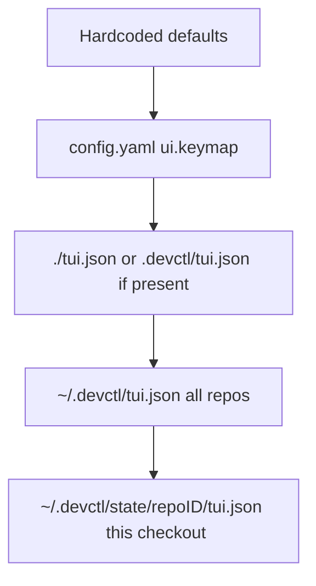

# Building from source

The application lives in `app/`. Runtime is [Bun](https://bun.sh). The TUI is [OpenTUI](https://opentui.com/docs/).

```bash
export PATH="$HOME/.bun/bin:$PATH"
cd app
bun install
bun run src/bin.ts --help
bun test
bun run check:coverage
bun run typecheck
bun run typecheck:web
bun run check:architecture
bun run check:dead
bun run check:dup
```

From the repository root (after `bun install` in `app/`):

```bash
bun run app/src/bin.ts
cd app && bun link    # optional: `devctl` on PATH
```

## Layout

| Path | Role |
|------|------|
| `app/src/bin.ts` | Entry |
| `app/src/bootstrap/` | Composition roots (daemon + client) |
| `app/src/application/client-runtime.ts` | Injected CLI/TUI operations and controller contract |
| `app/src/presentation/cli/` | Commander CLI |
| `app/src/presentation/tui/` | OpenTUI screens and overlays |
| `app/src/presentation/tui/hooks/` | Client queries, command execution, and TUI state |
| `app/src/presentation/tui/helpers/` | Screen-specific formatting, navigation, logs, and plan helpers |
| `app/src/presentation/mcp/` | Streamable HTTP MCP server |
| `app/src/presentation/web/` | Loopback telemetry web UI (SPA is authored in `app/web/` and embedded here) |
| `app/src/domain/` | Service, identity, config, log, session, and preference types and policies |
| `app/src/adapters/config/` | Discover, decode, merge, validate |
| `app/src/adapters/process/` | Host process runtime |
| `app/src/adapters/google/` | Google / IAP / tokens |
| `app/src/adapters/daemon/supervisor.ts` | Daemon host (socket, recovery, watch, listeners) |
| `app/src/adapters/rpc/controller.ts` | Local supervisor or socket / named-pipe client |
| `app/tui.json` | Starter TUI preferences |

Layer rules: [architecture.md](architecture.md). Check with `bun run check:architecture`. Coverage: `bun run check:coverage` (aggregate funcs/lines; OpenTUI screens and hooks are ignored). Unused files and dependencies: `bun run check:dead` ([Knip](https://knip.dev)). Copy-paste clones: `bun run check:dup` ([jscpd](https://jscpd.dev)).

There is no separate Go tree.

## TUI preferences

Configuration is **`tui.json` or `tui.jsonc`**: `theme`, `keybinds`, `leader_timeout`, `font_size`, `mouse`, `scroll_speed`, `log_timestamps`, `log_metadata`, `web_appearance`, `mcp_enabled`, `mcp_port`, `mcp_disabled_tools`, `mcp_enabled_tools`, `dismissed_notifications`.

`mcp_disabled_tools` is a deny-list of MCP tool names that are on by default. `mcp_enabled_tools` opts in tools that are off by default (`exec_service`). See [MCP](mcp.md). `/notify dismiss` appends this version to `dismissed_notifications` so the update banner does not return.

Search order (later sources win). `DEVCTL_TUI_CONFIG` / `OPENCODE_TUI_CONFIG` is exclusive and session-only for writes:



Settings default to **this repository**. Theme, mouse, leader, scroll, log columns, and web appearance follow the Save to toggle. MCP listen / port / tool lists always write the repo overlay. `dismissed_notifications` stay user-global. `DEVCTL_TUI_CONFIG` still wins as the only file when set.

`keybinds` merge with the built-in defaults, so you only override what you change. Defaults use `cmd` on macOS and `ctrl` on Linux/Windows (`command+c` / `ctrl+c` in the TUI).

```json
{
  "theme": "devctl",
  "leader_timeout": 2000,
  "keybinds": {
    "leader": "ctrl+x",
    "command_list": "ctrl+p"
  },
  "mouse": true,
  "mcp_enabled": false,
  "mcp_disabled_tools": [],
  "mcp_enabled_tools": []
}
```

## Tests

```bash
cd app && bun test
```

Integration tests that need Google stay skipped unless credentials are present.

## Related

- [Internals](internals/index.md) — how to read the source, not only the folder names
- [Installation](installation.md)
- [TUI](tui.md)
- [How it fits together](overview.md)
- [Contributing](../CONTRIBUTING.md)
