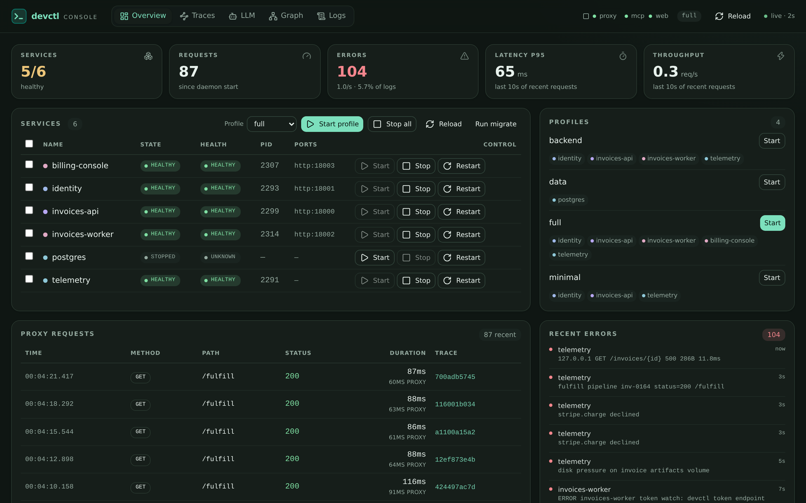
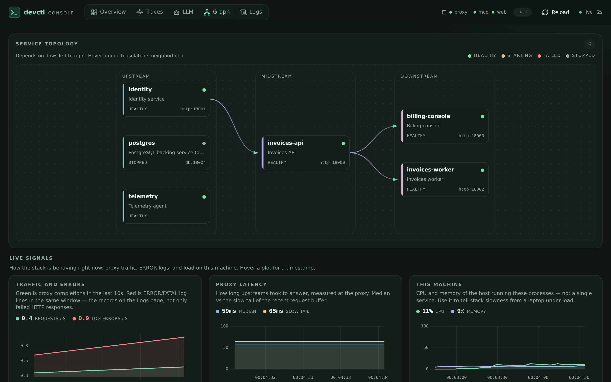
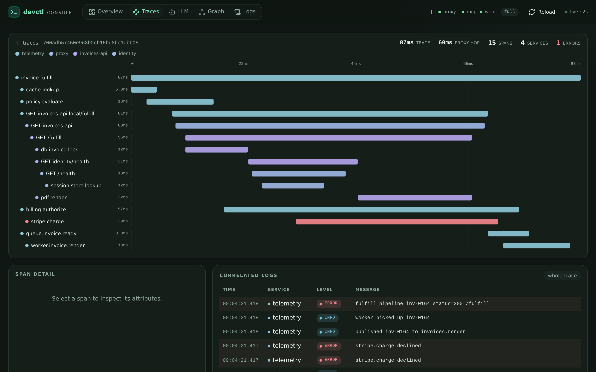
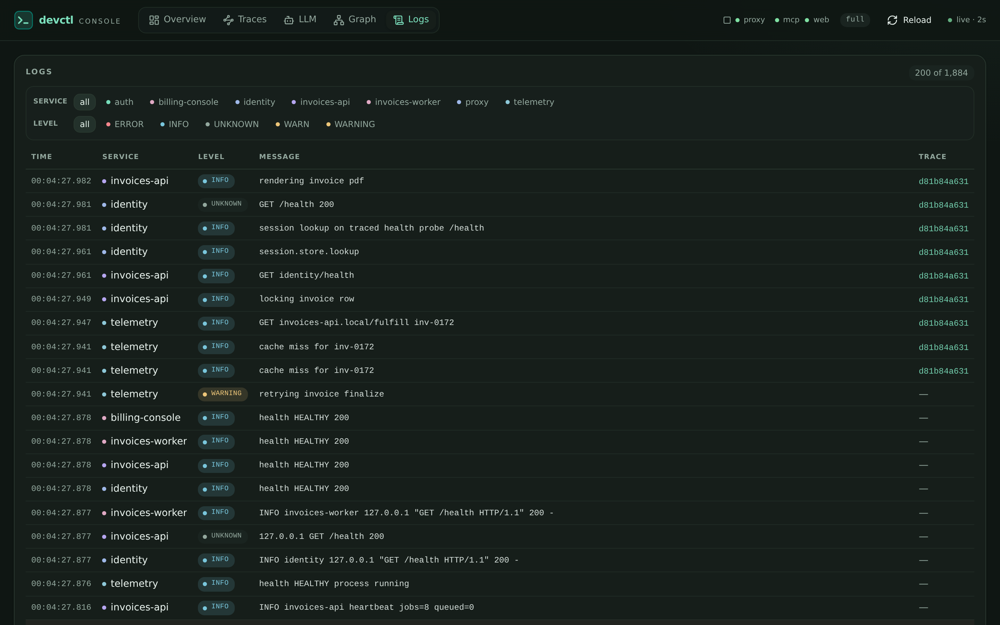

# Web console

Operate your local stack and investigate requests in a browser. The web console shares the supervisor with the TUI, CLI, and MCP, so a service started in one appears in the others.



## Open your session

From a repository with a valid devctl configuration:

```bash
devctl web start --print-url
```

Open the printed link. Its URL fragment carries the control token that lets the console start, stop, and restart services. Keep that link private. The browser stores the token after the first authorized visit (7-day TTL, same as MCP), so closing the tab and opening the same origin again stays authorized. Plain `devctl web start` prints only the origin; it does not print the token. Starting the console does not start a service profile: choose one in the console or use `devctl start --profile <name>`.

The console is off by default and normally listens at `http://127.0.0.1:18900`. You can check or stop its listener independently:

```bash
devctl web status
devctl web stop
```

Stopping the web listener leaves your services running. Use `devctl down` when you want to shut down the session.

**Settings** (`#/settings`, gear in the nav) share the TUI preference model: this-repository overlay by default, or all checkouts. Appearance, scroll, and log columns write `tui.json` layers. **Web console on/off and port** write `web.enabled` / `web.listen.port` into gitignored `.devctl/config.local.yaml` (created if missing) and reload so the listener starts, stops, or rebinds. **Inspect body cap** writes `proxy.inspect_max_bytes` and `llm.capture_max_bytes` (1 / 4 / 8 / 16 MiB) so large request/response bodies are kept; a route or source that sets `max_bytes` still wins. Confirm before turning the console off while this tab is open. You can still enable it from YAML:

```yaml
web:
  enabled: true
  listen:
    host: 127.0.0.1
    port: 18900
```

Run `devctl config validate` after a hand edit, then `devctl reload` if the supervisor is already running. A settings save already reloads. The port must differ from the proxy, token endpoint, OTLP receiver, and gRPC route ports. The listener accepts loopback addresses only. See [Security](security.md) for the access model.

## Control services

The overview combines service status, profiles, recent proxy requests, and errors. Start a profile to bring up a group, or use a service's start, stop, and restart controls. The console also exposes proxy controls, configuration reload, and named tasks.

When a service defines [named environment overlays](environment.md#per-service-named-overlays), use its Env selector in Overview or Graph. The selection becomes pending until you restart the service; the console offers a Restart action to apply it.

Lifecycle rules match the CLI: stopping a service also stops its dependents; restarting a service normally restarts only that service. When dependents exist, Overview and Graph ask **named-only** vs **cascade** (same as TUI `R` / `c`). See [Services](services.md#start-stop-restart) before stopping a shared dependency.

## Explore the dependency graph



Open Graph to see dependencies alongside current service state and runtime signals. Use it to understand which services sit upstream of a failure before deciding what to restart.

The overview **Requests** and **Failed requests** tiles are lifetime proxy totals for this supervisor. A failed request is an HTTP status of 400 or higher, or a proxy error. The subtitle rate is the last 10 seconds of the recent request buffer. **Recent errors** is still ERROR and FATAL log lines, with a lifetime log-error badge.

Graph charts use that same 10-second window: requests against failed requests from the recent proxy buffer, and log lines against ERROR and FATAL lines from the lifetime log counters (`logs.seen` and `logs.seenErrors`). Latency is the recent request buffer. Those windows need not match the lifetime tiles. Open Logs for the live ring (up to `logs.max_memory_events`, default 50,000).

## Follow a request into its trace



1. Find a request in the overview's recent proxy traffic, or open Traces.
2. Open its trace to inspect the span waterfall and identify an error or slow operation.
3. Inspect the correlated logs for the same trace to see what the service reported.
4. Make your change, restart the affected service if needed, and repeat the request.

The proxy emits request spans. Deeper application spans require your services to emit trace data; opening the console alone does not instrument them. The optional receiver accepts **OTLP/HTTP** as JSON or protobuf, not gRPC. See [Telemetry](telemetry.md) for setup, or use the [tracing example](examples.md#follow-a-distributed-trace) to explore a working session.

## Read logs, LLM calls, and traffic



Open Logs to follow the supervisor ring. The page keeps up to `logs.max_memory_events` events (default 50,000), virtualizes the viewport, and polls only new lines with `next_cursor` while the tab is visible and live. Scroll up to backfill older pages (`prev_cursor`, `direction=backward`). Pause freezes follow; **Clear** hides earlier lines in this tab without touching the daemon. Filter chips use `/api/logs/stats` counts, not whatever is on screen.

Search is substring or regex (`f` focuses the box). **ERROR+** (`e`) and the system-source toggle (`auth` / `mcp` / `devctl` / `proxy`) match the TUI. Wrap cycles clip → wrap selected → wrap all (`w`). Split (`\`) opens a second pane on the same buffer with its own service filter and follow/pin. History loads a persisted session; **Export** downloads NDJSON for the active filter. Keys on Logs: `j`/`k` move, `f` search, `p` pause, `g` latest (`pinned · +N new` when you leave the tail), `e` ERROR+, `\` split, `w` wrap. Select a row for the JSON inspector; newer appends do not replace the open record. Service stdout and stderr work without enabling OTLP. See [Logs](logs.md) for retention and export.

The LLM view is a list plus live inspector. Select a call to read the conversation, or switch to JSON for a collapsible tree (path breadcrumb, expand/collapse, copy path or value) and a syntax-colored pretty view. Find highlights matching keys and values. The selected call stays open when newer calls arrive. Search matches prompts and metadata stored on the supervisor. Enable and configure [LLM inspector](llm.md) separately: either pull LiteLLM spend logs or capture traffic on a devctl proxy route. An empty LLM view does not mean the web console is broken; it needs a configured source receiving traffic.

## Inspect proxied HTTP and gRPC bodies

The Traffic view (`#/traffic` and `#/traffic/:id`) is a list plus live inspector for hops captured on `inspect.enabled` proxy routes. The caller dropdown keeps one originating service (or hops with no caller) so a noisy neighbor does not bury the service you are debugging. Click a row to inspect JSON as a navigable tree or syntax-colored pretty text (copy path/value, find, wrap), or switch to raw. Logs and span attributes use the same viewer. The selected hop stays open when newer hops arrive. `j`/`k` moves the list. Overview request paths link here when a captured body exists. Direct sockets that never hit the proxy are not shown. See [Proxy inspect](proxy.md#inspect-bodies).

## Doctor and identity

**Doctor** (`#/doctor`) is in the nav strip. It runs the same checks as `devctl doctor` on visit and on Refresh, with severity, message, and hint. Busy-port **stop stays TUI/CLI-only** — this page shows the holder and the same hint as [Doctor](doctor.md).

**Identity** (`#/identity`) is a read-only view of fields `/api/status` already returns: user, project, `project_source`, ADC, IAP, and service-account probe status. Login stays `devctl auth login` / TUI `/auth login`. The header ADC chip links here so the primary nav does not grow by two full labels.

## If something is missing

| Symptom | Next step |
|---|---|
| Browser cannot connect | Run `devctl web status`, then `devctl web start --print-url`; use the address it prints. |
| Pages load but controls fail | Reopen the access link from `devctl web start --print-url` after the 7-day token TTL, a different repository on the same port, or a missing first-time authorization. |
| Service list is stopped | Start the intended profile; enabling the console does not launch your application. |
| No application traces | Check your instrumentation and OTLP/HTTP exporter configuration in [Telemetry](telemetry.md). |
| Cannot bind the listener | Check for a port conflict with `devctl doctor` or `#/doctor` and choose an unused loopback port. |
| ADC missing | Open Identity from the header chip, then `devctl auth login` or TUI `/auth login`. |

## Related

- [Examples & recipes](examples.md)
- [TUI](tui.md)
- [CLI](cli.md)
- [Telemetry](telemetry.md)
- [LLM inspector](llm.md)
- [Proxy](proxy.md)
- [Doctor](doctor.md)
- [Logs](logs.md)
